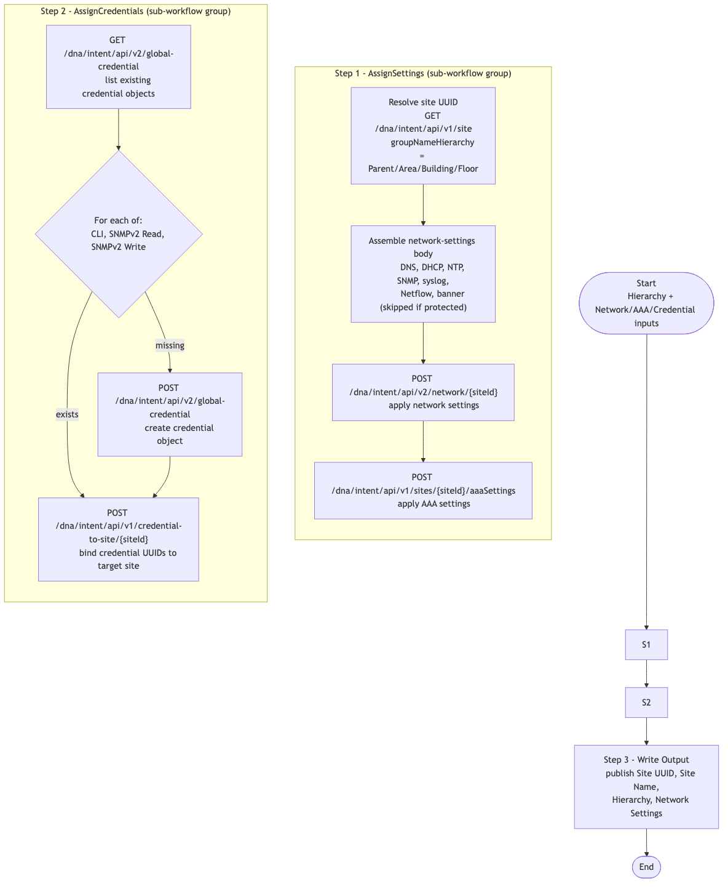

# CATC-AssignSettings-v2 — Settings and Credentials Assigner (Building Block)

> **Workflow:** `CATC-AssignSettings-v2.json`
> **Type:** Cisco Catalyst Center Generic Workflow (Intent API) — reusable building block / subworkflow
> **Subworkflows:** `AssignSettings` (internal sub_workflow), `AssignCredentials` (internal sub_workflow)
> **API Endpoints:**
> &nbsp;&nbsp;`GET /dna/intent/api/v1/site` — resolve site UUID from hierarchy path
> &nbsp;&nbsp;`GET /dna/intent/api/v2/network/{siteId}` — read existing network settings
> &nbsp;&nbsp;`POST /dna/intent/api/v2/network/{siteId}` — apply network settings (DNS, DHCP, NTP, syslog, SNMP, banner, Netflow)
> &nbsp;&nbsp;`POST /dna/intent/api/v1/sites/{siteId}/aaaSettings` — apply AAA settings to a site
> &nbsp;&nbsp;`GET / POST /dna/intent/api/v2/global-credential` — manage CLI / SNMP credential objects
> &nbsp;&nbsp;`POST /dna/intent/api/v1/credential-to-site/{siteId}` — assign credentials to a site
> **Authors:** Keith Baldwin — Solutions Engineer - Automation HyperSpecialist (kebaldwi@cisco.com)
> **Copyright © 2024–2026 Cisco Systems, Inc. All rights reserved.**

---

## Table of Contents

1. [Overview](#overview)
2. [Logical Flow](#logical-flow)
3. [Prerequisites](#prerequisites)
4. [Directory Structure](#directory-structure)
5. [Workflow Input Parameters](#workflow-input-parameters)
6. [Workflow Outputs](#workflow-outputs)
7. [How It Works](#how-it-works)
8. [Use as a Subworkflow](#use-as-a-subworkflow)
9. [Related Workflows](#related-workflows)

---

## Overview

`CATC-AssignSettings-v2` applies a complete **Day-0 site baseline** to a target site in Catalyst Center:

- Network settings: DNS, DHCP, NTP (with time zone), SNMP server destinations, syslog destinations, Netflow collector, banner (with overwrite protection).
- Authentication settings: AAA server (RADIUS or TACACS) — primary, secondary, Admin Node, AAA shared secret, AAA type.
- Credentials: CLI username/password/enable, SNMPv2 read and write community strings (with descriptions), assigned to the site.

It is built as two internal sub-workflow groups — `AssignSettings` and `AssignCredentials` — followed by a `Write Output` step. The level (Area / Building / Floor) at which the settings are applied is selectable through inputs; the workflow resolves the deepest supplied level to a site UUID before applying.

### What it does

| Action | Mechanism |
|--------|-----------|
| Resolve target site | `AssignSettings` group — `GET /dna/intent/api/v1/site?groupNameHierarchy=Parent/Area/Building/Floor` |
| Apply network settings | `POST /dna/intent/api/v2/network/{siteId}` with DNS/DHCP/NTP/SNMP/syslog/Netflow/banner sections |
| Apply AAA settings | `POST /dna/intent/api/v1/sites/{siteId}/aaaSettings` |
| Create / locate credential objects | `GET /dna/intent/api/v2/global-credential` + `POST /dna/intent/api/v2/global-credential` for CLI and SNMPv2 read/write |
| Assign credentials to site | `POST /dna/intent/api/v1/credential-to-site/{siteId}` |
| Publish outputs | `Write Output` — `Set Multiple Variables` |

### What makes this workflow different

1. **Two-phase assignment** — settings and credentials are handled by two distinct sub-workflow groups so each can be reused or wired independently.
2. **Banner protection** — the `Banner Protection` input lets you skip MOTD overwrite to preserve existing operator banners.
3. **AAA flexibility** — `AAA Server Type` selects ISE, AAA, or None; primary, secondary, and Admin Node addresses are independently configurable.
4. **Secure inputs** — CLI password, enable password, and SNMP communities are typed `datatype.secure_string` and stored encrypted.

---

## Logical Flow



> Source: [DIAGRAMS/logical-flow.mmd](DIAGRAMS/logical-flow.mmd) — re-render with:
> ```bash
> npx -y @mermaid-js/mermaid-cli -i DIAGRAMS/logical-flow.mmd -o DIAGRAMS/logical-flow.png -w 1100 -b white
> ```

---

## Prerequisites

| Requirement | Notes |
|-------------|-------|
| Cisco Catalyst Center | Intent API v1/v2 accessible |
| Target site exists | At least `Parent` must resolve; for credential assignment, the deepest selected level must exist |
| Runtime credentials | Permission to read/write network settings, AAA settings, global credentials, and credential-to-site bindings |

---

## Directory Structure

```
CATC-AssignSettings-v2/
├── CATC-AssignSettings-v2.json   # Catalyst Center workflow definition (import via CatC UI)
├── DIAGRAMS/
│   ├── logical-flow.mmd          # Mermaid diagram source
│   └── logical-flow.png          # Rendered flowchart
└── README.md                     # This document
```

---

## Workflow Input Parameters

### Hierarchy / Target Site

| Input | Type | Required | Description |
|-------|------|----------|-------------|
| `Parent` | string | Yes | Parent area path |
| `Area` | string | No | Area name |
| `Building` | string | No | Building name |
| `Floor` | string | No | Floor name |

### Network Settings

| Input | Type | Required | Description |
|-------|------|----------|-------------|
| `Domain Name` | string | No | Domain name suffix |
| `DNS Server Primary` / `DNS Server Secondary` | string | No | DNS server IPs |
| `DHCP Servers` | array | No | DHCP server IPs |
| `NTP Servers` | array | No | NTP server IPs |
| `NTP Time Zone` | string | Yes | Time zone string applied at the site |
| `Syslog Servers` | array | No | Syslog destinations |
| `Syslog send to Catalyst Center` | boolean | No | Include Catalyst Center as a syslog destination |
| `SNMP Servers` | array | No | SNMP server destinations |
| `SNMP send to Catalyst Center` | boolean | No | Include Catalyst Center as an SNMP destination |
| `Netflow Server IP Address` | string | No | Netflow collector |
| `Netflow Port for Server` | integer | No | Netflow port |
| `Netflow send to Catalyst Center` | boolean | No | Include Catalyst Center as a Netflow destination |
| `Banner Message` | string | No | MOTD banner text |
| `Banner Protection` | boolean | No | If true, do not overwrite existing MOTD banner |

### Credentials

| Input | Type | Required | Description |
|-------|------|----------|-------------|
| `CLI Username` | string | Yes | Site CLI username |
| `CLI Password` | secure_string | Yes | Site CLI password |
| `CLI Enable Password` | secure_string | No | Enable password |
| `CLI Description` | string | No | Display description for the CLI credential object |
| `SNMP v2 Read Community` | secure_string | No | SNMPv2 read community |
| `SNMP v2 Read Description` | string | No | SNMPv2 read description |
| `SNMP v2 Write Community` | secure_string | No | SNMPv2 write community |
| `SNMP v2 Write Description` | string | Yes | SNMPv2 write description |

### AAA

| Input | Type | Required | Description |
|-------|------|----------|-------------|
| `AAA Server Type` | string | Yes | `ISE`, `AAA`, or `None` |
| `AAA Protocol` | string | No | `RADIUS` or `TACACS` |
| `Primary AAA Server IP Address` | string | No | Primary AAA server |
| `Secondary AAA Server IP Address` | string | No | Secondary AAA server |
| `Admin Node AAA Server IP Address` | string | No | Admin Node IP |
| `AAA Secret` | string | No | AAA shared secret |

### Run Target

| Input | Type | Required | Description |
|-------|------|----------|-------------|
| Catalyst Center target | endpoint | Yes | Selected on workflow start |

---

## Workflow Outputs

| Output | Type | Description |
|--------|------|-------------|
| `Hierarchy` | string | Catalyst Center site hierarchy path that was targeted |
| `Site UUID` | string | Resolved site UUID for the target site |
| `Site Name` | string | Resolved site name |
| `Network Settings` | string (JSON) | Applied network-settings response |
| `Applied Network Settings` | string (JSON) | Combined response after assignment |

---

## How It Works

### Step 1 — AssignSettings (sub-workflow group)

The `AssignSettings` sub-workflow:

1. Resolves the deepest hierarchy level supplied (Floor → Building → Area → Parent) to a `siteId` via `GET /dna/intent/api/v1/site`.
2. Assembles the network-settings body from DNS, DHCP, NTP, SNMP, syslog, Netflow, and banner inputs. Banner is omitted when `Banner Protection` is true.
3. Calls `POST /dna/intent/api/v2/network/{siteId}` to apply the network settings.
4. Calls `POST /dna/intent/api/v1/sites/{siteId}/aaaSettings` with the assembled AAA payload.

### Step 2 — AssignCredentials (sub-workflow group)

The `AssignCredentials` sub-workflow:

1. Calls `GET /dna/intent/api/v2/global-credential` to enumerate existing credential objects.
2. For each of CLI, SNMPv2 read, and SNMPv2 write, either:
   - Matches an existing object by description, or
   - Calls `POST /dna/intent/api/v2/global-credential` to create a new object.
3. Calls `POST /dna/intent/api/v1/credential-to-site/{siteId}` with the resolved credential UUIDs to bind them to the target site.

### Step 3 — Write Output

`Write Output` (`core.set_multiple_variables`) publishes the hierarchy, site UUID, site name, and network-settings response objects.

---

## Use as a Subworkflow

`GitOps-BuildSettings` reads `settings.json` from GitHub and invokes `CATC-AssignSettings-v2` once per row to apply settings across an entire hierarchy. To embed it elsewhere:

1. Add a `Sub Workflow` step and select `CATC-AssignSettings-v2`.
2. Map your operator inputs to the hierarchy/settings/credentials/AAA inputs above.
3. Bind `Site UUID` if downstream steps need to operate on the same site.

---

## Related Workflows

- [GitOps-BuildSettings](../GitOps-BuildSettings/) — GitHub-driven loop that calls this workflow once per settings row.
- [Workflow 2.0 — Settings and Credentials (EXCHANGE)](../../EXCHANGE/2.0-Cisco-Catalyst-Center-Settings-and-Credentials/) — the `-v3` production successor to this chain.
