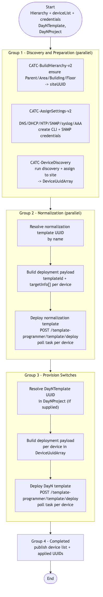

# CATC-BrownFieldOnboarding-v2 — IBNS Brown-field Switch Onboarding

> **Workflow:** `CATC-BrownFieldOnboarding-v2.json`
> **Type:** Cisco Catalyst Center Generic Workflow (Intent API) — end-to-end composite
> **Subworkflows used:** `CATC-BuildHierarchy-v2`, `CATC-AssignSettings-v2`, `CATC-DeviceDiscovery`, `CATC-DeviceInventory`, `CATC-CreateTemplate-v2`, deployment helpers
> **API surface:** Site, Network Settings, Credentials, AAA, Discovery, Inventory, Template Hub, Template Deployment (see [parent README](../README.md#appendix--cross-workflow-api-surface))
> **Authors:** Keith Baldwin — Solutions Engineer - Automation HyperSpecialist (kebaldwi@cisco.com)
> **Copyright © 2024–2026 Cisco Systems, Inc. All rights reserved.**

---

## Table of Contents

1. [Overview](#overview)
2. [Logical Flow](#logical-flow)
3. [Prerequisites](#prerequisites)
4. [Directory Structure](#directory-structure)
5. [Workflow Input Parameters](#workflow-input-parameters)
6. [Internal Working Variables](#internal-working-variables)
7. [How It Works](#how-it-works)
8. [Optimisation Notes (v2 vs. v3)](#optimisation-notes-v2-vs-v3)
9. [Related Workflows](#related-workflows)

---

## Overview

`CATC-BrownFieldOnboarding-v2` is an **end-to-end brown-field onboarding pipeline** for an existing fleet of Catalyst switches that you want to bring under Catalyst Center management with **IBNS 2.0** style security defaults. In one run it:

1. **Discovers and prepares** the target devices: ensures the site hierarchy exists, applies the Day-0 settings baseline (DNS, DHCP, NTP, SNMP, syslog, banner, AAA, CLI / SNMP credentials), and runs the discovery job.
2. **Normalises** the discovered fleet: pushes a normalisation template that brings device configuration to a known IBNS 2.0 baseline.
3. **Provisions switches** with a chosen Day-N template, which becomes the in-service IBNS 2.0 configuration for those devices.

It is opinionated — it assumes IBNS 2.0 templates exist in your Template Hub — but it is also flexible: every step is built on the same `CATC-*` building blocks documented in this folder, so you can fork it for non-IBNS use cases.

### What it does

| Action | Mechanism |
|--------|-----------|
| Discovery & preparation | `Discovery and Preparation` (`logic.parallel`) — calls `CATC-BuildHierarchy-v2`, `CATC-AssignSettings-v2`, and `CATC-DeviceDiscovery` in parallel where dependencies allow |
| Normalisation | `Normalization` (`logic.parallel`) — resolves the normalisation template by name, and pushes it across the discovered device list |
| Provision switches | `Provision Switches` (`logic.group`) — resolves the operator-supplied DayN template, and deploys it per device |
| Completion | `Completed` |

### What makes this workflow different

1. **Designed around IBNS 2.0** — the normalisation step produces a configuration shape that is compatible with the IBNS Day-N template that follows.
2. **Parallel where safe** — discovery, settings, and credential creation overlap to reduce wall time.
3. **One-shot** — a single workflow run takes an arbitrary list of switches from "not in Catalyst Center" to "managed + normalised + Day-N applied".

---

## Logical Flow



> Source: [DIAGRAMS/logical-flow.mmd](DIAGRAMS/logical-flow.mmd) — re-render with:
> ```bash
> npx -y @mermaid-js/mermaid-cli -i DIAGRAMS/logical-flow.mmd -o DIAGRAMS/logical-flow.png -w 1200 -b white
> ```

---

## Prerequisites

| Requirement | Notes |
|-------------|-------|
| Cisco Catalyst Center | Intent API v1/v2 accessible; Template Hub and Discovery both available |
| Normalisation template | An IBNS 2.0 normalisation template must exist in the Template Hub (by name; resolved at run time) |
| Day-N template | The operator-supplied `DayNTemplate` must exist in the Template Hub (project optionally specified via `DayNProject`) |
| Device reachability | Devices in `deviceList` must be reachable via the CLI / SNMP / NETCONF credentials supplied |

---

## Directory Structure

```
CATC-BrownFieldOnboarding-v2/
├── CATC-BrownFieldOnboarding-v2.json   # Catalyst Center workflow definition (import via CatC UI)
├── DIAGRAMS/
│   ├── logical-flow.mmd                # Mermaid diagram source
│   └── logical-flow.png                # Rendered flowchart
└── README.md                           # This document
```

---

## Workflow Input Parameters

### Hierarchy

| Input | Type | Required | Description |
|-------|------|----------|-------------|
| `HierarchyParent` | string | No | Parent area path |
| `HierarchyArea` | string | Yes | Area name |
| `HierarchyBuilding` | string | Yes | Building name |
| `HierarchyBuildingAddress` | string | Yes | Building street address |
| `HierarchyFloor` | string | No | Floor name |

### Devices and credentials

| Input | Type | Required | Description |
|-------|------|----------|-------------|
| `deviceList` | string | Yes | List of device IPs / ranges |
| `cliUsername` | string | Yes | CLI username |
| `cliPassword` | secure_string | Yes | CLI password |
| `enablePassword` | secure_string | Yes | Enable password |
| `snmpV2ReadDescription` | string | Yes | SNMPv2 read description |
| `snmpV2WriteDescription` | string | Yes | SNMPv2 write description |

### Templates

| Input | Type | Required | Description |
|-------|------|----------|-------------|
| `DayNTemplate` | string | Yes | Day-N template name (deployed after normalisation) |
| `DayNProject` | string | No | Day-N project name (required if the template name is ambiguous across projects) |

### Run target

| Input | Type | Required | Description |
|-------|------|----------|-------------|
| Catalyst Center target | endpoint | Yes | Selected on workflow start |

---

## Internal Working Variables

| Variable | Purpose |
|----------|---------|
| `siteUUID` / `SiteUUID` | Resolved site UUID for the target hierarchy |
| `HostnameArray`, `DeviceHostname` | Device hostnames captured from the inventory |
| `DeviceUuidArray` | Devices resolved into `instanceUuid` for deployment |
| `TemplateID` | Template UUID list (normalisation + Day-N) |
| `normalizationTemplate`, `normalizationTemplateUuid` | Resolved normalisation template metadata |
| `DayNTemplateUuid` | Resolved Day-N template UUID |

---

## How It Works

### Group 1 — Discovery and Preparation (`logic.parallel`)

Three preparation tasks are kicked off concurrently where dependencies permit:
- `CATC-BuildHierarchy-v2` — ensures Parent / Area / Building / Floor exist; produces `siteUUID`.
- `CATC-AssignSettings-v2` — applies the Day-0 baseline (DNS / DHCP / NTP / SNMP / syslog / AAA / banner) and creates / binds CLI and SNMP credentials.
- `CATC-DeviceDiscovery` — runs the discovery job against `deviceList`, polls task completion, and assigns devices to the resolved site.

### Group 2 — Normalization (`logic.parallel`)

Resolves the normalisation template UUID by name, builds the deployment payload (`templateId`, `targetInfo[]` with each `DeviceUuidArray` entry), and deploys it. This step pushes the IBNS 2.0 normalisation configuration to every discovered device.

### Group 3 — Provision Switches (`logic.group`)

Resolves the operator-supplied `DayNTemplate` (optionally within `DayNProject`), assembles the deployment payload for each device, and deploys. Deployment status is polled per device.

### Group 4 — Completed

Marks the workflow complete and publishes outputs (device list, applied template UUIDs, site UUID).

---

## Optimisation Notes (v2 vs. v3)

`CATC-BrownFieldOnboarding-v2` was the first version with parallel preparation and explicit provisioning. The follow-on [CATC-BrownFieldOnboarding-v3](../CATC-BrownFieldOnboarding-v3/) refactored further:

- Provisioning was extracted out of the brown-field workflow itself — v3 leaves the fleet *normalised* and ready for the standard Day-N provisioning workflow rather than performing the provisioning step inline.
- Internal grouping was simplified (3 top-level actions instead of 4).
- See [CATC-BrownFieldOnboarding-v3/README.md](../CATC-BrownFieldOnboarding-v3/README.md) for the differences in detail.

For new deployments, prefer v3 plus the EXCHANGE `-v3` provisioning workflow.

---

## Related Workflows

- [CATC-BrownFieldOnboarding-v3](../CATC-BrownFieldOnboarding-v3/) — refactored version of this workflow without inline provisioning.
- [CATC-BuildHierarchy-v2](../CATC-BuildHierarchy-v2/), [CATC-AssignSettings-v2](../CATC-AssignSettings-v2/), [CATC-DeviceDiscovery](../CATC-DeviceDiscovery/) — building blocks reused by this workflow.
- [Workflow 7.0 — Provision Composite (EXCHANGE)](../../EXCHANGE/7.0-Cisco-Catalyst-Center-Provision-Composite/) — production provisioning pipeline.
