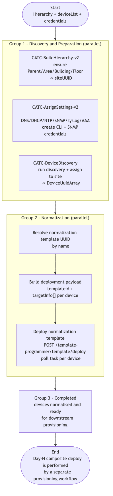

# CATC-BrownFieldOnboarding-v3 — IBNS Brown-field Onboarding (Tuned)

> **Workflow:** `CATC-BrownFieldOnboarding-v3.json`
> **Type:** Cisco Catalyst Center Generic Workflow (Intent API) — end-to-end composite
> **Subworkflows used:** `CATC-BuildHierarchy-v2`, `CATC-AssignSettings-v2`, `CATC-DeviceDiscovery`, `CATC-DeviceInventory`, `CATC-CreateTemplate-v2`
> **API surface:** Site, Network Settings, Credentials, AAA, Discovery, Inventory, Template Hub, Template Deployment (see [parent README](../README.md#appendix--cross-workflow-api-surface))
> **Authors:** Keith Baldwin — Solutions Engineer - Automation HyperSpecialist (kebaldwi@cisco.com)
> **Copyright © 2024–2026 Cisco Systems, Inc. All rights reserved.**

---

## Table of Contents

1. [Overview](#overview)
2. [Logical Flow](#logical-flow)
3. [Prerequisites](#prerequisites)
4. [Directory Structure](#directory-structure)
5. [Workflow Input Parameters](#workflow-input-parameters)
6. [Differences vs. v2](#differences-vs-v2)
7. [How It Works](#how-it-works)
8. [Related Workflows](#related-workflows)

---

## Overview

`CATC-BrownFieldOnboarding-v3` is the **refactored** brown-field onboarding pipeline. It performs the same first-two phases as v2 — Day-0 preparation (hierarchy, settings, credentials) and discovery, then IBNS 2.0 normalisation — but it **stops at "normalised and ready"** rather than continuing inline into Day-N provisioning.

The expectation is that the regular Day-N provisioning workflow (for example [Workflow 7.0 — Provision Composite (EXCHANGE)](../../EXCHANGE/7.0-Cisco-Catalyst-Center-Provision-Composite/)) will pick up the now-managed devices and deploy the operator's chosen composite Day-N template against the matching site profile.

This makes the brown-field workflow:
- **Faster** (fewer inline operations),
- **More composable** (provisioning is decoupled and can use composite templates rather than a single Day-N template), and
- **Easier to recover** (a failed Day-N deploy no longer blocks the onboarding pipeline).

### What it does

| Action | Mechanism |
|--------|-----------|
| Discovery & preparation | `Discovery and Preparation` (`logic.parallel`) — `CATC-BuildHierarchy-v2`, `CATC-AssignSettings-v2`, `CATC-DeviceDiscovery` |
| Normalisation | `Normalization` (`logic.parallel`) — resolve normalisation template UUID and deploy it across the discovered fleet |
| Completion | `Completed` |

---

## Logical Flow



> Source: [DIAGRAMS/logical-flow.mmd](DIAGRAMS/logical-flow.mmd) — re-render with:
> ```bash
> npx -y @mermaid-js/mermaid-cli -i DIAGRAMS/logical-flow.mmd -o DIAGRAMS/logical-flow.png -w 1100 -b white
> ```

---

## Prerequisites

| Requirement | Notes |
|-------------|-------|
| Cisco Catalyst Center | Intent API v1/v2 accessible; Template Hub and Discovery both available |
| Normalisation template | An IBNS 2.0 normalisation template must exist in the Template Hub (by name; resolved at run time) |
| Device reachability | Devices in `deviceList` must be reachable via the CLI / SNMP / NETCONF credentials supplied |
| Down-stream provisioning workflow | After this workflow completes, run `GitOps-DeviceProvisioning` or the EXCHANGE 7.0 workflow to apply Day-N composite content |

---

## Directory Structure

```
CATC-BrownFieldOnboarding-v3/
├── CATC-BrownFieldOnboarding-v3.json   # Catalyst Center workflow definition (import via CatC UI)
├── DIAGRAMS/
│   ├── logical-flow.mmd                # Mermaid diagram source
│   └── logical-flow.png                # Rendered flowchart
└── README.md                           # This document
```

---

## Workflow Input Parameters

The inputs are the same as v2 (see [CATC-BrownFieldOnboarding-v2/README.md#workflow-input-parameters](../CATC-BrownFieldOnboarding-v2/README.md#workflow-input-parameters)), with the following notes:

- `DayNTemplate` is marked **not required** in v3 (it is retained as an input for future development and to keep parameter parity with v2 callers, but the workflow no longer deploys it inline).
- `DayNProject` is also retained but unused at run time in v3.

---

## Differences vs. v2

| Aspect | v2 | v3 |
|--------|----|----|
| Top-level groups | 4 (`Discovery and Preparation`, `Normalization`, `Provision Switches`, `Completed`) | 3 (`Discovery and Preparation`, `Normalization`, `Completed`) |
| Day-N template deploy | Inline | Removed — delegated to a downstream provisioning workflow |
| `DayNTemplate` input | Required | Retained but not required (future development) |
| Recovery story | Failure in Day-N rolls back the onboarding run | Failure in Day-N does not block normalised devices being kept |
| Recommended pairing | Standalone | Pair with a Day-N composite provisioning workflow (for example EXCHANGE 7.0) |

---

## How It Works

### Group 1 — Discovery and Preparation (`logic.parallel`)

Identical to v2: builds hierarchy, applies the Day-0 baseline, runs discovery, and assigns devices to the resolved site UUID.

### Group 2 — Normalization (`logic.parallel`)

Identical to v2: resolves the normalisation template UUID, builds the deployment payload per discovered device, deploys the template, and polls per-device task status.

### Group 3 — Completed

Marks the workflow complete and publishes outputs (device list, normalisation template UUID, site UUID).

---

## Related Workflows

- [CATC-BrownFieldOnboarding-v2](../CATC-BrownFieldOnboarding-v2/) — earlier version that also performs Day-N provisioning inline.
- [CATC-BuildHierarchy-v2](../CATC-BuildHierarchy-v2/), [CATC-AssignSettings-v2](../CATC-AssignSettings-v2/), [CATC-DeviceDiscovery](../CATC-DeviceDiscovery/) — building blocks reused by this workflow.
- [Workflow 7.0 — Provision Composite (EXCHANGE)](../../EXCHANGE/7.0-Cisco-Catalyst-Center-Provision-Composite/) — recommended downstream provisioning pipeline.
