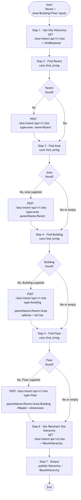

# CATC-BuildHierarchy-v2 — Site Hierarchy Builder (Building Block)

> **Workflow:** `CATC-BuildHierarchy-v2.json`
> **Type:** Cisco Catalyst Center Generic Workflow (Intent API) — reusable building block / subworkflow
> **API Endpoints:**
> &nbsp;&nbsp;`GET /dna/intent/api/v1/site` — snapshot the existing site hierarchy
> &nbsp;&nbsp;`POST /dna/intent/api/v1/site` — create Area, Building, and Floor objects
> &nbsp;&nbsp;`GET /dna/intent/api/v2/site` — return resultant site hierarchy after creates
> **Authors:** Keith Baldwin — Solutions Engineer - Automation HyperSpecialist (kebaldwi@cisco.com)
> **Copyright © 2024–2026 Cisco Systems, Inc. All rights reserved.**

---

## Table of Contents

1. [Overview](#overview)
2. [Logical Flow](#logical-flow)
3. [Prerequisites](#prerequisites)
4. [Directory Structure](#directory-structure)
5. [Workflow Input Parameters](#workflow-input-parameters)
6. [Workflow Outputs](#workflow-outputs)
7. [How It Works](#how-it-works)
8. [Site Creation Payload Reference](#site-creation-payload-reference)
9. [Use as a Subworkflow](#use-as-a-subworkflow)
10. [Related Workflows](#related-workflows)

---

## Overview

`CATC-BuildHierarchy-v2` is the **idempotent Parent → Area → Building → Floor builder**. For a single hierarchy row (one combination of Parent, Area, Building, Floor) it reads the current Catalyst Center hierarchy, checks each level in order, and only creates the levels that are missing.

It is the building block called by `GitOps-BuildHierarchy` to drive bulk hierarchy creation from a `settings.json` file in GitHub.

### What it does

| Action | Mechanism |
|--------|-----------|
| Snapshot current hierarchy | `Get Site Hierarchy` — `GET /dna/intent/api/v1/site` |
| Check Parent presence | `Find Parent` + `Condition Parent Block` (`logic.if_else`) |
| Create Parent if missing | `POST /dna/intent/api/v1/site` (type `area`) |
| Check Area presence | `Find Area` + `Conditional Area Block` |
| Create Area if missing | `POST /dna/intent/api/v1/site` (type `area`) |
| Check Building presence | `Find Building` + `Conditional Building Block` |
| Create Building if missing | `POST /dna/intent/api/v1/site` (type `building`, includes address + parent) |
| Check Floor presence | `Find Floor` + `Conditional Floor Block` |
| Create Floor if missing | `POST /dna/intent/api/v1/site` (type `floor`, default rfModel + dimensions) |
| Refresh hierarchy view | `Get Resultant Site Hierarchy` — `GET /dna/intent/api/v2/site` |
| Publish output | `Output` — `Set Multiple Variables` publishes resultant hierarchy |

### What makes this workflow different

1. **Idempotent** — re-running with the same inputs does not duplicate sites; existing levels are detected via string match on `siteNameHierarchy` and skipped.
2. **Top-down ordering** — Parent → Area → Building → Floor is enforced via four sequential `if_else` blocks. This avoids the "parent not found" error that arises if Building is created before Area exists.
3. **Single-row scope** — one workflow run handles one hierarchy path. Use `GitOps-BuildHierarchy` to drive this workflow once per row from a GitHub data file.

---

## Logical Flow



> Source: [DIAGRAMS/logical-flow.mmd](DIAGRAMS/logical-flow.mmd) — re-render with:
> ```bash
> npx -y @mermaid-js/mermaid-cli -i DIAGRAMS/logical-flow.mmd -o DIAGRAMS/logical-flow.png -w 1000 -b white
> ```

---

## Prerequisites

| Requirement | Notes |
|-------------|-------|
| Cisco Catalyst Center | Intent API v1 / v2 site endpoints accessible |
| Runtime credentials | Permission to read and create site hierarchy objects |
| Parent area | Either pre-existing or supplied so the workflow can create it |

---

## Directory Structure

```
CATC-BuildHierarchy-v2/
├── CATC-BuildHierarchy-v2.json   # Catalyst Center workflow definition (import via CatC UI)
├── DIAGRAMS/
│   ├── logical-flow.mmd          # Mermaid diagram source
│   └── logical-flow.png          # Rendered flowchart
└── README.md                     # This document
```

---

## Workflow Input Parameters

| Input | Type | Required | Description |
|-------|------|----------|-------------|
| `Parent` | string | Yes | Parent area path for the new site (for example `Global/USA`) |
| `HierarchyArea` | string | No | Area name to create or check under `Parent` |
| `HierarchyBuilding` | string | No | Building name to create or check |
| `HierarchyBuildingAddress` | string | No | Building street address — required when creating a Building |
| `Latitude` | number | No | Building latitude (optional, defaults applied) |
| `Longitude` | number | No | Building longitude (optional, defaults applied) |
| `HierarchyFloor` | string | No | Floor name to create or check |
| Catalyst Center target | endpoint | Yes | Selected on workflow start |

---

## Workflow Outputs

| Output | Type | Description |
|--------|------|-------------|
| `Hierarchy` | string (JSON) | Snapshot of the existing site hierarchy taken at Step 1 |
| `ResultHierarchy` | string (JSON) | Resultant hierarchy returned from `GET /dna/intent/api/v2/site` after any creates |

---

## How It Works

### Step 1 — Get Site Hierarchy

`Get Site Hierarchy` (`catalystcenter.invoke_api`) issues `GET /dna/intent/api/v1/site` and stores the response in the local `SiteResponse` variable.

### Step 2 — Find Parent / Condition Parent Block

`Find Parent` (`core.find_string`) searches `SiteResponse` for the `Parent` string. The `Condition Parent Block` proceeds:

- **Not found:** `POST /dna/intent/api/v1/site` with `type=area` to create the Parent area.
- **Found:** continue.

### Step 3 — Find Area / Conditional Area Block

`Find Area` searches `SiteResponse` for the concatenated `Parent/HierarchyArea` path.

- **Not found and `HierarchyArea` supplied:** `POST /dna/intent/api/v1/site` with `type=area`, `parentName=Parent`.
- **Found or empty:** continue.

### Step 4 — Find Building / Conditional Building Block

`Find Building` searches for `Parent/HierarchyArea/HierarchyBuilding`.

- **Not found and `HierarchyBuilding` supplied:** `POST /dna/intent/api/v1/site` with `type=building`, `parentName=Parent/HierarchyArea`, `address`, and optional `latitude`/`longitude`.
- **Found or empty:** continue.

### Step 5 — Find Floor / Conditional Floor Block

`Find Floor` searches for `Parent/HierarchyArea/HierarchyBuilding/HierarchyFloor`.

- **Not found and `HierarchyFloor` supplied:** `POST /dna/intent/api/v1/site` with `type=floor`, `parentName` of the building, and a default `rfModel` and dimensions block.
- **Found or empty:** continue.

### Step 6 — Get Resultant Site Hierarchy

`Get Resultant Site Hierarchy` (`catalystcenter.invoke_api.getSiteV2`) issues `GET /dna/intent/api/v2/site` to retrieve the updated hierarchy view.

### Step 7 — Output

`Output` (`core.set_multiple_variables`) publishes the resulting hierarchy snapshot.

---

## Site Creation Payload Reference

#### Area / Parent

```json
POST /dna/intent/api/v1/site
{
  "type": "area",
  "site": {
    "area": { "name": "<Area>", "parentName": "<Parent>" }
  }
}
```

#### Building

```json
POST /dna/intent/api/v1/site
{
  "type": "building",
  "site": {
    "building": {
      "name": "<Building>",
      "parentName": "<Parent>/<Area>",
      "address": "<Street, City, Country>",
      "latitude":  <Latitude>,
      "longitude": <Longitude>
    }
  }
}
```

#### Floor

```json
POST /dna/intent/api/v1/site
{
  "type": "floor",
  "site": {
    "floor": {
      "name": "<Floor>",
      "parentName": "<Parent>/<Area>/<Building>",
      "rfModel": "Cubes And Walled Offices",
      "width":  100,
      "length": 100,
      "height": 10
    }
  }
}
```

---

## Use as a Subworkflow

`GitOps-BuildHierarchy` iterates over rows of `settings.json` from GitHub and calls `CATC-BuildHierarchy-v2` once per row. To embed it elsewhere:

1. Add a `Sub Workflow` step and select `CATC-BuildHierarchy-v2`.
2. Map your parent variables to `Parent`, `HierarchyArea`, `HierarchyBuilding`, `HierarchyBuildingAddress`, and `HierarchyFloor`.
3. Bind `ResultHierarchy` if you need the post-create hierarchy snapshot.

---

## Related Workflows

- [GitOps-BuildHierarchy](../GitOps-BuildHierarchy/) — GitHub-driven loop that calls this workflow once per hierarchy row.
- [Workflow 1.0 — Site Hierarchy (EXCHANGE)](../../EXCHANGE/1.0-Cisco-Catalyst-Center-Site-Hierarchy/) — the `-v3` production successor to this workflow.
