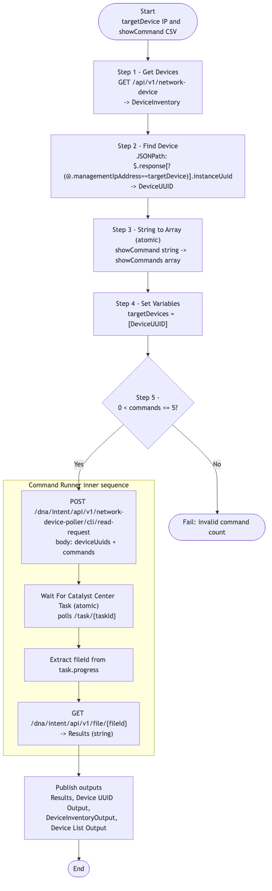

# CATC-CommandRunner — Single-Device Show Command Runner

> **Workflow:** `CATC-CommandRunner.json`
> **Type:** Cisco Catalyst Center Generic Workflow (Intent API) — reusable building block / subworkflow
> **Subworkflows:** `String to Array`, `Wait For Catalyst Center Task`
> **API Endpoints:**
> &nbsp;&nbsp;`GET  /api/v1/network-device` — full device inventory (used to resolve managementIpAddress → instanceUuid)
> &nbsp;&nbsp;`POST /dna/intent/api/v1/network-device-poller/cli/read-request` — submit up to five show commands against one device
> &nbsp;&nbsp;`GET  /dna/intent/api/v1/task/{taskId}` — poll the poller task
> &nbsp;&nbsp;`GET  /dna/intent/api/v1/file/{fileId}` — retrieve the raw command-output file
> **Authors:** Keith Baldwin — Solutions Engineer - Automation HyperSpecialist (kebaldwi@cisco.com)
> **Copyright © 2024–2026 Cisco Systems, Inc. All rights reserved.**

---

## Table of Contents

1. [Overview](#overview)
2. [Logical Flow](#logical-flow)
3. [Prerequisites](#prerequisites)
4. [Directory Structure](#directory-structure)
5. [Workflow Input Parameters](#workflow-input-parameters)
6. [Workflow Outputs](#workflow-outputs)
7. [Internal Working Variables](#internal-working-variables)
8. [How It Works](#how-it-works)
9. [Command Runner API Payload Reference](#command-runner-api-payload-reference)
10. [Use as a Subworkflow](#use-as-a-subworkflow)
11. [Related Workflows](#related-workflows)

---

## Overview

`CATC-CommandRunner` runs up to **five read-only show commands** against a single managed device via the Catalyst Center **CLI Poller API**. It resolves the device by its `managementIpAddress`, submits the command batch, waits for the asynchronous task to complete, and returns the resulting CLI output file as a string. It is the reusable engine behind Workflow 8.0 in [../../EXCHANGE/8.0-Cisco-Catalyst-Center-Command-Runner/](../../EXCHANGE/8.0-Cisco-Catalyst-Center-Command-Runner/) and is the per-batch engine that Workflow 12.0 in [../../EXCHANGE/12.0-Cisco-Catalyst-Center-Bulk-Command-Runner/](../../EXCHANGE/12.0-Cisco-Catalyst-Center-Bulk-Command-Runner/) calls in a loop.

### What it does

| Action | Mechanism |
|--------|-----------|
| Resolve device | `Get Devices` — `GET /api/v1/network-device`, then `Find Device` (`JSONPath`) by `managementIpAddress` to extract `instanceUuid` |
| Normalise commands | `String to Array` (atomic workflow) — accepts quoted CSV / list literal / newline-separated input |
| Validate command count | `Conditional ShowCommand Block` — short-circuits if no commands or more than five are supplied |
| Submit commands | `POST /dna/intent/api/v1/network-device-poller/cli/read-request` with `commands` and `deviceUuids` (one UUID) |
| Wait for task | `Wait For Catalyst Center Task` (atomic workflow) polls `/task/{taskId}` until terminal |
| Retrieve result | `GET /dna/intent/api/v1/file/{fileId}` (file UUID is embedded in the task `progress` JSON) |
| Publish outputs | `Set Variables` — publishes the device UUID, command result, and inventory snapshots |

### What makes this workflow different

1. **Honors the Catalyst Center 5-command-per-call limit** — the conditional block rejects malformed input rather than silently truncating.
2. **Accepts loose input formats** — `String to Array` normalises quoted CSV, JSON/Python list literals, and newline-separated values.
3. **Uses the managed device channel** — no per-device CLI credentials and no SSH session are required; the runtime user only needs Command Runner permission in Catalyst Center.

---

## Logical Flow



> Source: [DIAGRAMS/logical-flow.mmd](DIAGRAMS/logical-flow.mmd) — re-render with:
> ```bash
> npx -y @mermaid-js/mermaid-cli -i DIAGRAMS/logical-flow.mmd -o DIAGRAMS/logical-flow.png -w 1000 -b white
> ```

---

## Prerequisites

| Requirement | Notes |
|-------------|-------|
| Cisco Catalyst Center | Intent API v1 accessible |
| Command Runner enabled | The runtime user must have permission to call `/network-device-poller/cli/read-request` |
| Target device | Discovered, reachable, and managed by Catalyst Center |
| `String to Array` atomic workflow | Bundled with this workflow JSON |
| `Wait For Catalyst Center Task` atomic workflow | Standard Cisco workflow platform catalog atomic |

---

## Directory Structure

```
CATC-CommandRunner/
├── CATC-CommandRunner.json   # Catalyst Center workflow definition (import via CatC UI)
├── DIAGRAMS/
│   ├── logical-flow.mmd      # Mermaid diagram source
│   └── logical-flow.png      # Rendered flowchart
└── README.md                 # This document
```

---

## Workflow Input Parameters

| Input | Type | Required | Description |
|-------|------|----------|-------------|
| `targetDevice` | string | Yes | Management IP address of the device to be targeted |
| `showCommand` | string | Yes | Comma-delimited list of up to five show commands. Example: `"show version | inc INSTALL","show boot system"` |
| Catalyst Center target | endpoint | Yes | Selected on workflow start |

---

## Workflow Outputs

| Output | Type | Description |
|--------|------|-------------|
| `Results` | string | Decoded contents of the result file returned by the CLI Poller — one block per command |
| `Device UUID Output` | string | Resolved `instanceUuid` of the target device |
| `DeviceInventoryOutput` | string (JSON) | Full Catalyst Center inventory used for device lookup |
| `Device List Output` | string (JSON) | Flattened device list extracted from the inventory |

---

## Internal Working Variables

| Variable | Scope | Purpose |
|----------|-------|---------|
| `DevicesList` | local | Flattened device list extracted via JSONPath |
| `DeviceInventory` | local | Raw inventory response |
| `DeviceUUID` | local | `instanceUuid` resolved from `managementIpAddress` |
| `targetDevices` | local | Array form of `[DeviceUUID]` used in the API body |
| `showCommands` | local | Normalised array of commands from `String to Array` |
| `FileURL` | local | File ID resolved from the poller task `progress` JSON |

---

## How It Works

### Step 1 — Get Devices

`Get Devices` (`catalystcenter.invoke_api`) issues `GET /api/v1/network-device` to retrieve the full inventory. The raw response is stored locally as `DeviceInventory`.

### Step 2 — Find Device

`Find Device` (`corejava.jsonpathquery`) runs:

```
$.response[?(@.managementIpAddress=='<targetDevice>')].instanceUuid
```

against the inventory, producing the device's `instanceUuid`.

### Step 3 — String to Array

The `String to Array` atomic workflow normalises the operator's `showCommand` blob into a JSON array.

### Step 4 — Set Variables

Bundles the resolved device UUID into a single-element `targetDevices` array (the API expects `deviceUuids` to be an array even for one device) and prepares the API body.

### Step 5 — Conditional ShowCommand Block

If `0 < |showCommands| <= 5`, the block proceeds to invoke the Command Runner API, poll the task, retrieve the result file, and publish outputs. Otherwise the workflow fails with a clear error.

---

## Command Runner API Payload Reference

```json
POST /dna/intent/api/v1/network-device-poller/cli/read-request
Content-Type: application/json

{
  "name": "CATC-CommandRunner",
  "description": "Catalyst Center Workflow - read-only show commands",
  "deviceUuids": ["<instanceUuid>"],
  "commands": ["show version | inc INSTALL", "show boot system"]
}
```

Response:

```json
{ "response": { "taskId": "<task-uuid>", "url": "/api/v1/task/<task-uuid>" } }
```

The task's `progress` field, once terminal, is itself a JSON document containing the `fileId`:

```json
{ "fileId": "<file-uuid>" }
```

The result file is retrieved with:

```
GET /dna/intent/api/v1/file/<file-uuid>
```

The body is a JSON array of command-result objects; this workflow returns it verbatim in the `Results` output.

---

## Use as a Subworkflow

To call `CATC-CommandRunner` from another workflow:

1. Add a `Sub Workflow` step and select `CATC-CommandRunner`.
2. Map your parent variables to `targetDevice` (management IP) and `showCommand` (CSV of up to five commands).
3. Bind the `Results` output back to a local variable to display or further process.

---

## Related Workflows

- [Workflow 8.0 — Command Runner (EXCHANGE)](../../EXCHANGE/8.0-Cisco-Catalyst-Center-Command-Runner/) — the production-packaged version of this workflow.
- [Workflow 12.0 — Bulk Command Runner (EXCHANGE)](../../EXCHANGE/12.0-Cisco-Catalyst-Center-Bulk-Command-Runner/) — wraps `CATC-CommandRunner` in a per-device, per-batch loop driven by the shared Device SWIM Inventory table.
