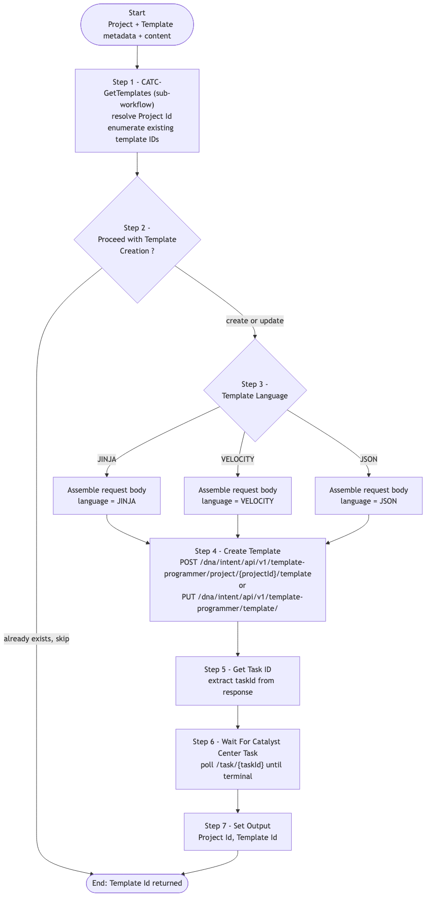

# CATC-CreateTemplate-v2 — Template Hub Member Template Builder (Building Block)

> **Workflow:** `CATC-CreateTemplate-v2.json`
> **Type:** Cisco Catalyst Center Generic Workflow (Intent API) — reusable building block / subworkflow
> **Subworkflows:** `CATC-GetTemplates`, `Get Task ID`, `Wait For Catalyst Center Task`
> **API Endpoints:**
> &nbsp;&nbsp;`GET /dna/intent/api/v2/template-programmer/project?name=...` — locate or create project
> &nbsp;&nbsp;`POST /dna/intent/api/v1/template-programmer/project/{projectId}/template` — create a member template
> &nbsp;&nbsp;`PUT  /dna/intent/api/v1/template-programmer/template/` — update existing template content
> **Authors:** Keith Baldwin — Solutions Engineer - Automation HyperSpecialist (kebaldwi@cisco.com)
> **Copyright © 2024–2026 Cisco Systems, Inc. All rights reserved.**

---

## Table of Contents

1. [Overview](#overview)
2. [Logical Flow](#logical-flow)
3. [Prerequisites](#prerequisites)
4. [Directory Structure](#directory-structure)
5. [Workflow Input Parameters](#workflow-input-parameters)
6. [Workflow Outputs](#workflow-outputs)
7. [How It Works](#how-it-works)
8. [Use as a Subworkflow](#use-as-a-subworkflow)
9. [Related Workflows](#related-workflows)

---

## Overview

`CATC-CreateTemplate-v2` creates (or updates) **one Day-N member template** inside a Catalyst Center Template Hub project, then polls the asynchronous task to confirm success. The workflow targets a specific product family, series, and software, supports JINJA / VELOCITY / JSON template languages, and accepts the template content as a string parameter.

It is intended to be called as a subworkflow once per template — typically inside a `For Each` loop driven by a directory listing from GitHub.

### What it does

| Action | Mechanism |
|--------|-----------|
| Look up existing template | `CATC-GetTemplates` (sub-workflow) — finds the template by project + name |
| Decide create vs. skip | `Proceed with Template Creation ?` (`logic.if_else`) — skip when template already exists and update is not desired |
| Branch by template language | `Template Language` (`logic.if_else`) — assembles `JINJA`, `VELOCITY`, or `JSON` request body |
| Create or update template | `Create Template` (`catalystcenter.invoke_api`) — `POST` (create) or `PUT` (update) |
| Capture task ID | `Get Task ID` (atomic) — extracts `taskId` from the API response |
| Wait for task | `Wait For Catalyst Center Task` (atomic) — polls until terminal |
| Publish output | `Set Output` — `Template Id` and `Project Id` |

### What makes this workflow different

1. **Project resolution and template lookup** are delegated to `CATC-GetTemplates` so this workflow is small and focused.
2. **Three template languages** are supported (JINJA, VELOCITY, JSON) and the request body is assembled accordingly.
3. **Task-aware** — the workflow waits for the underlying task to finish before publishing the `Template Id`, so callers know the template is committed-ready.

---

## Logical Flow



> Source: [DIAGRAMS/logical-flow.mmd](DIAGRAMS/logical-flow.mmd) — re-render with:
> ```bash
> npx -y @mermaid-js/mermaid-cli -i DIAGRAMS/logical-flow.mmd -o DIAGRAMS/logical-flow.png -w 1100 -b white
> ```

---

## Prerequisites

| Requirement | Notes |
|-------------|-------|
| Cisco Catalyst Center | Template Hub Intent API accessible |
| Target project | Will be created if it does not exist (via `CATC-GetTemplates`) |
| `CATC-GetTemplates` subworkflow | Bundled in this workflow's JSON |
| `Get Task ID` and `Wait For Catalyst Center Task` atomic workflows | Standard Cisco platform catalog atomics |

---

## Directory Structure

```
CATC-CreateTemplate-v2/
├── CATC-CreateTemplate-v2.json   # Catalyst Center workflow definition (import via CatC UI)
├── DIAGRAMS/
│   ├── logical-flow.mmd          # Mermaid diagram source
│   └── logical-flow.png          # Rendered flowchart
└── README.md                     # This document
```

---

## Workflow Input Parameters

| Input | Type | Required | Description |
|-------|------|----------|-------------|
| `Project Name` | string | Yes | Template Hub project name |
| `Template Name` | string | Yes | Template name within the project |
| `Template Language` | string | Yes | One of: `JINJA`, `VELOCITY`, `JSON` |
| `Template Software` | string | Yes | Target software family: `IOS-XE` or `IOS` |
| `Product Series` | string | Yes | Catalyst series, for example `Cisco Catalyst 9300 Series Switches` |
| `Template Content` | string | Yes | Raw template body to commit |
| Catalyst Center target | endpoint | Yes | Selected on workflow start |

---

## Workflow Outputs

| Output | Type | Description |
|--------|------|-------------|
| `Project Id` | string | Resolved or created project UUID |
| `Template Id` | string | Resolved or created template UUID |

---

## How It Works

### Step 1 — CATC-GetTemplates (sub-workflow)

Looks up the project by name and returns:
- `Project Id` of the matching or newly created project,
- existing template IDs (so this workflow can detect duplicates).

### Step 2 — Proceed with Template Creation ?

`logic.if_else` block — if the template already exists with matching name, the workflow can short-circuit (or proceed to `PUT` to update content, depending on the configuration).

### Step 3 — Template Language

`logic.if_else` branches on `JINJA` / `VELOCITY` / `JSON` and assembles the `Request Body`, including:
- `name`, `description`, `language`,
- `softwareType` (resolved from `Template Software`),
- `productFamily` (derived from `Product Series`),
- `softwareVariant`,
- `templateContent`.

### Step 4 — Create Template

`Create Template` (`catalystcenter.invoke_api`) calls:

- `POST /dna/intent/api/v1/template-programmer/project/{projectId}/template` to create, or
- `PUT /dna/intent/api/v1/template-programmer/template/` to update.

### Step 5 — Get Task ID

Extracts the asynchronous `taskId` from the response.

### Step 6 — Wait For Catalyst Center Task

Polls `/dna/intent/api/v1/task/{taskId}` until the task reaches a terminal state.

### Step 7 — Set Output

Publishes `Project Id` and `Template Id`.

---

## Use as a Subworkflow

`CATC-GitHubIntegration-v2`, `GitOps-ImportTemplates`, and `GitOps-BuildCompositeTemplate` all call this workflow inside a `For Each` loop driven by a GitHub directory listing. To embed it:

1. Add a `Sub Workflow` step and select `CATC-CreateTemplate-v2`.
2. Map `Template Content` to the decoded GitHub file content.
3. Bind `Template Id` to a list variable so member IDs can be collected for downstream composite construction or profile binding.

---

## Related Workflows

- [CATC-GitHubIntegration-v2](../CATC-GithubIntegration-v2/) — older GitHub→Template Hub importer that calls this workflow.
- [GitOps-ImportTemplates](../GitOps-ImportTemplates/) — full GitHub→Template Hub importer with dependency mapping that also calls this workflow.
- [Workflow 4.0 — Templates GitHub Integration (EXCHANGE)](../../EXCHANGE/4.0-Cisco-Catalyst-Center-Templates-Github-integration/) — `-v3` production successor.
