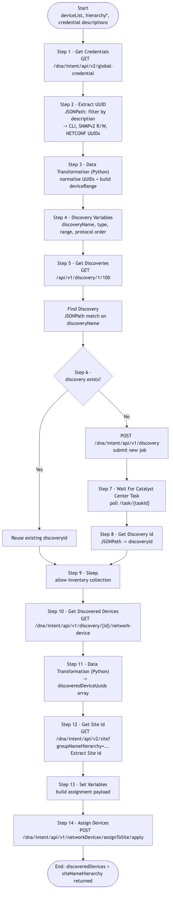

# CATC-DeviceDiscovery — Discovery and Site Assignment (Building Block)

> **Workflow:** `CATC-DeviceDiscovery.json`
> **Type:** Cisco Catalyst Center Generic Workflow (Intent API) — reusable building block / subworkflow
> **Subworkflows:** `Wait For Catalyst Center Task`
> **API Endpoints:**
> &nbsp;&nbsp;`GET  /dna/intent/api/v2/global-credential` — enumerate global credential objects (CLI / SNMPv2 / NETCONF)
> &nbsp;&nbsp;`GET  /api/v1/discovery/1/100` — list existing discoveries (paginated)
> &nbsp;&nbsp;`POST /dna/intent/api/v1/discovery` — submit a new discovery job
> &nbsp;&nbsp;`GET  /dna/intent/api/v1/task/{taskId}` — poll discovery task
> &nbsp;&nbsp;`GET  /dna/intent/api/v1/discovery/{id}/network-device` — list discovered devices
> &nbsp;&nbsp;`GET  /dna/intent/api/v2/site?groupNameHierarchy=...` — resolve site UUID for assignment
> &nbsp;&nbsp;`POST /dna/intent/api/v1/networkDevices/assignToSite/apply` — assign devices to a site
> **Authors:** Keith Baldwin — Solutions Engineer - Automation HyperSpecialist (kebaldwi@cisco.com)
> **Copyright © 2024–2026 Cisco Systems, Inc. All rights reserved.**

---

## Table of Contents

1. [Overview](#overview)
2. [Logical Flow](#logical-flow)
3. [Prerequisites](#prerequisites)
4. [Directory Structure](#directory-structure)
5. [Workflow Input Parameters](#workflow-input-parameters)
6. [Workflow Outputs](#workflow-outputs)
7. [Internal Working Variables](#internal-working-variables)
8. [How It Works](#how-it-works)
9. [Discovery Payload Reference](#discovery-payload-reference)
10. [Use as a Subworkflow](#use-as-a-subworkflow)
11. [Related Workflows](#related-workflows)

---

## Overview

`CATC-DeviceDiscovery` runs a Catalyst Center **discovery job** against an operator-supplied device list and assigns every discovered device to a target site. It resolves the credential object UUIDs (CLI, SNMP read/write, NETCONF) by description match, submits the discovery, polls the task, retrieves the discovered devices, and assigns them to the resolved site UUID.

It is the building block called by `GitOps-DeviceDiscovery` to drive bulk discovery from `settings.json` in GitHub.

### What it does

| Action | Mechanism |
|--------|-----------|
| List credentials | `Get Credentials` — `GET /dna/intent/api/v2/global-credential` |
| Resolve credential UUIDs | `Extract UUID` + Python `Data Transformation` — match CLI, SNMPv2 read/write, NETCONF by description |
| Prepare discovery variables | `Discovery Variables` — discovery name, IP range, protocol order, etc. |
| Avoid duplicate runs | `Get Discoveries` + `Find Discovery` — list existing discovery jobs and detect matches by name |
| Conditional discovery branch | `Discovery Process` (`logic.if_else`) — run new discovery or short-circuit |
| Run discovery | `POST /dna/intent/api/v1/discovery` |
| Wait for task | `Wait For Catalyst Center Task` (atomic) |
| Capture discovery ID | `Get Discovery Id` + `Extract Discovery Id` + `Set Discovery Id` |
| Allow inventory settling | `Sleep` |
| Read discovered devices | `Get Discovered Devices` — `GET /dna/intent/api/v1/discovery/{id}/network-device` |
| Build device UUID list | `Data Transformation` (Python) |
| Resolve site UUID | `Get Site Id` (`getSiteV2`) + `Extract Site Id` |
| Assign to site | `POST /dna/intent/api/v1/networkDevices/assignToSite/apply` |

### What makes this workflow different

1. **Credential resolution by description** — operator supplies `snmpV2ReadDescription` and `snmpV2WriteDescription`, and the workflow resolves these into UUIDs at run time. This decouples discovery scripts from credential identifiers.
2. **Idempotent on discovery name** — duplicate runs against the same `discoveryName` short-circuit and do not re-discover.
3. **Inline site assignment** — the workflow does not stop at "discovered"; it goes all the way to "assigned to site" so downstream provisioning has site-scoped device lists immediately.

---

## Logical Flow



> Source: [DIAGRAMS/logical-flow.mmd](DIAGRAMS/logical-flow.mmd) — re-render with:
> ```bash
> npx -y @mermaid-js/mermaid-cli -i DIAGRAMS/logical-flow.mmd -o DIAGRAMS/logical-flow.png -w 1200 -b white
> ```

---

## Prerequisites

| Requirement | Notes |
|-------------|-------|
| Cisco Catalyst Center | Discovery and Site Intent APIs accessible |
| Global credentials | CLI, SNMPv2 Read, SNMPv2 Write objects must already exist (typically created by `CATC-AssignSettings-v2`) |
| Target site | Must exist in the hierarchy so devices can be assigned |
| `Wait For Catalyst Center Task` atomic workflow | Standard Cisco platform catalog atomic |

---

## Directory Structure

```
CATC-DeviceDiscovery/
├── CATC-DeviceDiscovery.json   # Catalyst Center workflow definition (import via CatC UI)
├── DIAGRAMS/
│   ├── logical-flow.mmd        # Mermaid diagram source
│   └── logical-flow.png        # Rendered flowchart
└── README.md                   # This document
```

---

## Workflow Input Parameters

| Input | Type | Required | Description |
|-------|------|----------|-------------|
| `deviceList` | string | Yes | Device IPs / ranges to discover (CSV or range form) |
| `hierarchyParent` | string | Yes | Parent hierarchy path for the site |
| `hierarchyArea` | string | Yes | Area name |
| `HierarchyBuilding` | string | Yes | Building name |
| `HierarchyBuildingAddress` | string | Yes | Building street address |
| `HierarchyFloor` | string | Yes | Floor name |
| `snmpV2ReadDescription` | string | Yes | Description used to look up the SNMPv2 read credential UUID |
| `snmpV2WriteDescription` | string | Yes | Description used to look up the SNMPv2 write credential UUID |
| `cliUsername` | string | Yes | CLI username — used to match the CLI credential object |
| `netconfPort` | string | Yes | NETCONF port (typically `830`) |
| Catalyst Center target | endpoint | Yes | Selected on workflow start |

---

## Workflow Outputs

| Output | Type | Description |
|--------|------|-------------|
| `discoveredDevices` | string (JSON) | Devices reported by `GET /discovery/{id}/network-device` |
| `siteNameHierarchy` | string | Hierarchy path the discovered devices were assigned to |

---

## Internal Working Variables

| Variable | Purpose |
|----------|---------|
| `uuidCLI`, `uuidSNMPv2READ`, `uuidSNMPv2WRITE`, `uuidNETCONF` | Resolved credential object UUIDs |
| `discoveryName`, `discoveryType`, `deviceRange`, `discoveryJson`, `apiBody` | Discovery payload assembly variables |
| `taskId`, `discoveryId` | Discovery task and result identifiers |
| `discoveredDeviceUuids` | Flat list of device UUIDs to assign |
| `siteId` | Resolved target site UUID |
| `inventoryCollectionStatus` | Collection state used for gating |

---

## How It Works

### Step 1 — Get Credentials

`GET /dna/intent/api/v2/global-credential` returns every credential object. The response is held locally.

### Step 2 — Extract UUID

`corejava.jsonpathquery` runs filtered JSONPath expressions to extract the CLI, SNMPv2 read, SNMPv2 write, and NETCONF UUIDs by matching `description` (and `username` for CLI).

### Step 3 — Data Transformation (Python)

Normalises the extracted UUIDs into individual local variables and assembles the device range / protocol order strings.

### Step 4 — Discovery Variables

Sets `discoveryName`, `discoveryType`, `deviceRange`, etc., into well-known names for downstream use.

### Step 5 — Get Discoveries + Find Discovery

`GET /api/v1/discovery/1/100` lists existing discoveries; a JSONPath query checks for a name match.

### Step 6 — Discovery Process (conditional)

`logic.if_else`:
- **No match:** `POST /dna/intent/api/v1/discovery` with the assembled body and proceed.
- **Match exists:** skip discovery submission and reuse the existing discovery ID.

### Step 7 — Wait For Catalyst Center Task

Polls until the discovery task reaches a terminal state.

### Step 8 — Get Discovery Id

Reads back the discovery ID for the run that just completed.

### Step 9 — Sleep

A short sleep gives Catalyst Center time to finish inventory collection.

### Step 10 — Get Discovered Devices

`GET /dna/intent/api/v1/discovery/{id}/network-device` returns the device list.

### Step 11 — Data Transformation (Python)

Flattens the discovered device list into a UUID array suitable for the site-assign body.

### Step 12 — Get Site Id + Extract Site Id

`GET /dna/intent/api/v2/site?groupNameHierarchy=...` returns the target site; JSONPath extracts `siteId`.

### Step 13 — Set Variables

Assembles the assignment payload (`deviceIds` + `siteId`).

### Step 14 — Assign Devices

`POST /dna/intent/api/v1/networkDevices/assignToSite/apply` performs the assignment.

---

## Discovery Payload Reference

```json
POST /dna/intent/api/v1/discovery
{
  "name": "<discoveryName>",
  "discoveryType": "<RANGE|MULTI RANGE|CDP|LLDP|CIDR>",
  "ipAddressList": "<deviceRange>",
  "protocolOrder": "ssh",
  "preferredMgmtIPMethod": "None",
  "globalCredentialIdList": [
    "<uuidCLI>", "<uuidSNMPv2READ>", "<uuidSNMPv2WRITE>", "<uuidNETCONF>"
  ],
  "netconfPort": "<netconfPort>"
}
```

---

## Use as a Subworkflow

`GitOps-DeviceDiscovery` iterates `settings.json` and calls this workflow once per row. To embed it elsewhere:

1. Add a `Sub Workflow` step and select `CATC-DeviceDiscovery`.
2. Map the inputs above to parent variables.
3. Bind `discoveredDevices` if the parent workflow needs the resulting device list.

---

## Related Workflows

- [GitOps-DeviceDiscovery](../GitOps-DeviceDiscovery/) — GitHub-driven loop that calls this workflow.
- [Workflow 3.0 — Device Discovery and Assign (EXCHANGE)](../../EXCHANGE/3.0-Cisco-Catalyst-Center-Device-Discovery-and-Assign/) — `-v3` production successor.
