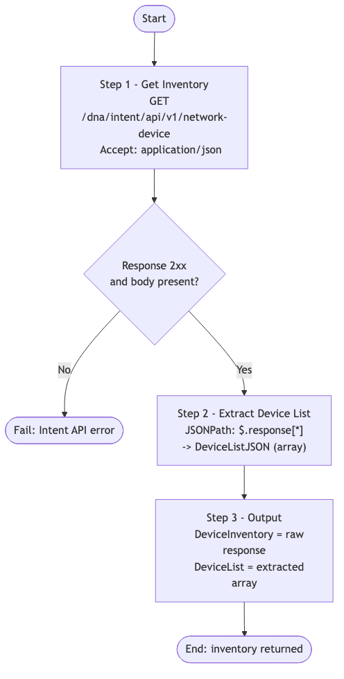

# CATC-DeviceInventory — Catalyst Center Device Inventory Reader

> **Workflow:** `CATC-DeviceInventory.json`
> **Type:** Cisco Catalyst Center Generic Workflow (Intent API) — reusable building block / subworkflow
> **API Endpoints:**
> &nbsp;&nbsp;`GET /dna/intent/api/v1/network-device` — retrieve the full managed device inventory
> **Authors:** Keith Baldwin — Solutions Engineer - Automation HyperSpecialist (kebaldwi@cisco.com)
> **Copyright © 2024–2026 Cisco Systems, Inc. All rights reserved.**

---

## Table of Contents

1. [Overview](#overview)
2. [Logical Flow](#logical-flow)
3. [Prerequisites](#prerequisites)
4. [Directory Structure](#directory-structure)
5. [Workflow Input Parameters](#workflow-input-parameters)
6. [Workflow Outputs](#workflow-outputs)
7. [How It Works](#how-it-works)
8. [Use as a Subworkflow](#use-as-a-subworkflow)

---

## Overview

`CATC-DeviceInventory` is a small read-only helper that returns the **full Catalyst Center managed device inventory** as a JSON string and a flattened device array. It is the simplest possible inventory accessor — no filtering, no pagination, no transformation beyond extracting the top-level device list.

It is intended to be used as a subworkflow by larger workflows that need to resolve a hostname or management IP into an `instanceUuid`, or that want to iterate over every managed device. It is the precursor to the paginated inventory utility shipped as Workflow 10.0 in [../../EXCHANGE/10.0-Cisco-Catayst-Center-Paginated-Device-Inventory/](../../EXCHANGE/10.0-Cisco-Catayst-Center-Paginated-Device-Inventory/).

### What it does

| Action | Mechanism |
|--------|-----------|
| Read inventory | `Get Inventory` — `GET /dna/intent/api/v1/network-device` |
| Extract device list | `Extract Device List` — `JSONPath $.response[*]` flattens the response to a device array |
| Publish output | `Output` — `Set Multiple Variables` publishes both the raw response and the extracted list |

### What makes this workflow different

- **Single, lightweight call** — for small inventories (under the default page size). For large environments, use the paginated equivalent in EXCHANGE 10.0.
- **Two output shapes** — `DeviceInventory` (raw response) and `DeviceList` (extracted `response[*]` array) so callers can consume whichever shape is easier to traverse.

---

## Logical Flow



> Source: [DIAGRAMS/logical-flow.mmd](DIAGRAMS/logical-flow.mmd) — re-render with:
> ```bash
> npx -y @mermaid-js/mermaid-cli -i DIAGRAMS/logical-flow.mmd -o DIAGRAMS/logical-flow.png -w 900 -b white
> ```

---

## Prerequisites

| Requirement | Notes |
|-------------|-------|
| Cisco Catalyst Center | Intent API v1 accessible |
| Runtime credentials | User/service account able to call `/dna/intent/api/v1/network-device` (read) |
| Catalyst Center target | Selected on workflow start |

---

## Directory Structure

```
CATC-DeviceInventory/
├── CATC-DeviceInventory.json   # Catalyst Center workflow definition (import via CatC UI)
├── DIAGRAMS/
│   ├── logical-flow.mmd        # Mermaid diagram source
│   └── logical-flow.png        # Rendered flowchart
└── README.md                   # This document
```

---

## Workflow Input Parameters

| Input | Type | Required | Description |
|-------|------|----------|-------------|
| Catalyst Center target | endpoint | Yes | Selected on workflow start |

This workflow does not take any user-supplied input variables.

---

## Workflow Outputs

| Output | Type | Description |
|--------|------|-------------|
| `DeviceInventory` | string (JSON) | Raw response body from `GET /dna/intent/api/v1/network-device` |
| `DeviceList` | string (JSON array) | `response[*]` extracted as a flat array of device objects |

---

## How It Works

### Step 1 — Get Inventory

`Get Inventory` (`catalystcenter.invoke_api`) issues:

```
GET /dna/intent/api/v1/network-device
Accept: application/json
```

The response is the standard Catalyst Center network device payload (`{ "response": [ ... ], "version": "..." }`).

### Step 2 — Extract Device List

`Extract Device List` (`corejava.jsonpathquery`) runs:

```
$.response[*]
```

against the response and stores the flattened array in the local working variable `DeviceListJSON`.

### Step 3 — Output

`Output` (`core.set_multiple_variables`) assigns:

- `DeviceInventory` ← raw API response
- `DeviceList` ← extracted device array

These are made available to any parent workflow that calls this one.

---

## Use as a Subworkflow

`CATC-CommandRunner` and the v2 brown-field onboarding workflows use this same pattern. To consume it elsewhere:

1. Add a `Sub Workflow` action and select `CATC-DeviceInventory`.
2. Bind `DeviceList` (or `DeviceInventory`) to a local variable.
3. Run JSONPath against the bound array to resolve a `managementIpAddress` to an `instanceUuid`, for example:

   ```
   $.[?(@.managementIpAddress=='10.10.10.1')].instanceUuid
   ```
