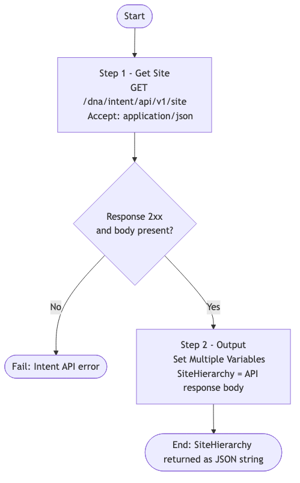

# CATC-GetHierarchy — Catalyst Center Site Hierarchy Reader

> **Workflow:** `CATC-GetHierarchy.json`
> **Type:** Cisco Catalyst Center Generic Workflow (Intent API) — reusable building block / subworkflow
> **API Endpoints:**
> &nbsp;&nbsp;`GET /dna/intent/api/v1/site` — retrieve the full Catalyst Center site hierarchy
> **Authors:** Keith Baldwin — Solutions Engineer - Automation HyperSpecialist (kebaldwi@cisco.com)
> **Copyright © 2024–2026 Cisco Systems, Inc. All rights reserved.**

---

## Table of Contents

1. [Overview](#overview)
2. [Logical Flow](#logical-flow)
3. [Prerequisites](#prerequisites)
4. [Directory Structure](#directory-structure)
5. [Workflow Input Parameters](#workflow-input-parameters)
6. [Workflow Outputs](#workflow-outputs)
7. [How It Works](#how-it-works)
8. [Use as a Subworkflow](#use-as-a-subworkflow)

---

## Overview

`CATC-GetHierarchy` is the smallest possible read-only helper in the CATC library. It calls the Catalyst Center site API once and returns the entire site hierarchy JSON as a single output string variable.

It is intended to be used either:
- **Interactively**, to inspect what hierarchy exists on a given Catalyst Center instance before running a build or discovery workflow, or
- **As a subworkflow**, called by larger workflows that need an authoritative snapshot of the current hierarchy to make decisions against.

### What it does

| Action | Mechanism |
|--------|-----------|
| Read full hierarchy | `Get Site` — `GET /dna/intent/api/v1/site` (Catalyst Center Intent API) |
| Publish output | `Output` — `Set Multiple Variables` writes the response into the workflow's `SiteHierarchy` output variable |

### What makes this workflow different

- **One call, one output** — no filtering, no transformation; the full Intent API response is returned verbatim.
- **Reusable** — designed to be invoked as a subworkflow from any workflow that needs site state.

---

## Logical Flow



> Source: [DIAGRAMS/logical-flow.mmd](DIAGRAMS/logical-flow.mmd) — re-render with:
> ```bash
> npx -y @mermaid-js/mermaid-cli -i DIAGRAMS/logical-flow.mmd -o DIAGRAMS/logical-flow.png -w 900 -b white
> ```

---

## Prerequisites

| Requirement | Notes |
|-------------|-------|
| Cisco Catalyst Center | Intent API v1 accessible |
| Runtime credentials | User/service account able to call `/dna/intent/api/v1/site` (read) |
| Catalyst Center target | Selected on workflow start |

---

## Directory Structure

```
CATC-GetHierarchy/
├── CATC-GetHierarchy.json     # Catalyst Center workflow definition (import via CatC UI)
├── DIAGRAMS/
│   ├── logical-flow.mmd       # Mermaid diagram source
│   └── logical-flow.png       # Rendered flowchart (referenced by this README)
└── README.md                  # This document
```

---

## Workflow Input Parameters

| Input | Type | Required | Description |
|-------|------|----------|-------------|
| Catalyst Center target | endpoint | Yes | Selected on workflow start |

This workflow does not take any user-supplied input variables.

---

## Workflow Outputs

| Output | Type | Description |
|--------|------|-------------|
| `SiteHierarchy` | string (JSON) | Raw response from `GET /dna/intent/api/v1/site` — full list of sites including type, parent, name, additionalInfo, and ID |

---

## How It Works

### Step 1 — Get Site

`Get Site` (`catalystcenter.invoke_api`) issues:

```
GET /dna/intent/api/v1/site
Accept: application/json
```

The response body is the complete Catalyst Center site hierarchy as a JSON array.

### Step 2 — Output

The `Output` step (`core.set_multiple_variables`) assigns the API response to the `SiteHierarchy` output variable so calling workflows or operators can consume the result.

---

## Use as a Subworkflow

Any parent workflow that needs an authoritative hierarchy snapshot can call this workflow and consume its `SiteHierarchy` output:

1. Add a `Sub Workflow` action and select `CATC-GetHierarchy`.
2. Bind the output variable `SiteHierarchy` to a local variable in the parent workflow.
3. Run `JSONPath` queries against the bound string (for example `$..siteNameHierarchy` to extract all hierarchy paths).
