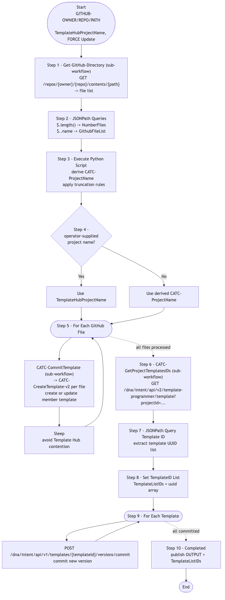

# CATC-GitHubIntegration-v2 — GitHub → Template Hub Importer (v2)

> **Workflow:** `CATC-GitHubIntegration-v2.json`
> **Type:** Cisco Catalyst Center Generic Workflow (Intent API)
> **Subworkflows:** `Get-GitHub-Directory`, `CATC-GetProjectTemplatesIDs`, `CATC-CreateTemplate-v2` (called from inside the `For Each` loop), `CATC-CommitTemplate` (per template)
> **API Endpoints:**
> &nbsp;&nbsp;`GET api.github.com/repos/{owner}/{repo}/contents/{path}` — list templates in a GitHub directory
> &nbsp;&nbsp;`GET api.github.com/repos/{owner}/{repo}/contents/{path}/{file}` — fetch and decode template content
> &nbsp;&nbsp;`GET /dna/intent/api/v2/template-programmer/project?name=...` — locate/create project
> &nbsp;&nbsp;`POST /dna/intent/api/v1/template-programmer/project/{projectId}/template` — create templates
> &nbsp;&nbsp;`POST /dna/intent/api/v1/templates/{templateId}/versions/commit` — commit each template version
> **Authors:** Keith Baldwin — Solutions Engineer - Automation HyperSpecialist (kebaldwi@cisco.com)
> **Copyright © 2024–2026 Cisco Systems, Inc. All rights reserved.**

---

## Table of Contents

1. [Overview](#overview)
2. [Logical Flow](#logical-flow)
3. [Prerequisites](#prerequisites)
4. [Directory Structure](#directory-structure)
5. [Workflow Input Parameters](#workflow-input-parameters)
6. [Workflow Outputs](#workflow-outputs)
7. [How It Works](#how-it-works)
8. [Related Workflows](#related-workflows)

---

## Overview

`CATC-GitHubIntegration-v2` is the **first-generation bulk importer** for Jinja2 (or Velocity / JSON) templates from a GitHub directory into a Catalyst Center Template Hub project. For every file in the target GitHub path the workflow creates a corresponding member template in the named project, then commits a version of each created template.

It is superseded by [GitOps-ImportTemplates](../GitOps-ImportTemplates/) (which adds dependency mapping) and by [Workflow 4.0 — Templates GitHub Integration (EXCHANGE)](../../EXCHANGE/4.0-Cisco-Catalyst-Center-Templates-Github-integration/) (`GitOps-BuildTemplates-v3`). It is retained here as a simpler reference implementation.

### What it does

| Action | Mechanism |
|--------|-----------|
| List GitHub directory | `Get-GitHub-Directory` (sub-workflow) — `GET /repos/{owner}/{repo}/contents/{path}` |
| Parse file list | `JSONPath Queries` — `$.length()` and `$..name` |
| Compute project name | `Execute Python Script` — derives `CATC-ProjectName` from `TemplateHubProjectName` (truncation rules) |
| Conditional project name block | `Condition Project Name Block` (`logic.if_else`) — chooses operator-supplied vs. derived |
| Iterate files | `For Each GitHub File` — calls `CATC-CreateTemplate-v2` (via `CATC-CommitTemplate`) per file |
| Throttle | `Sleep` — small delay between iterations to avoid Template Hub contention |
| Retrieve final ID list | `CATC-GetProjectTemplatesIDs` (sub-workflow) + `JSONPath` — collect all template IDs in the project |
| Commit versions | `For Each Template` — commits a version of each created/updated template via `POST /dna/intent/api/v1/templates/{templateId}/versions/commit` |
| Mark complete | `Completed` |

### What makes this workflow different

1. **GitHub as source of truth** — adding a template file to the configured directory and running the workflow imports it into Catalyst Center.
2. **`FORCE Update` flag** — when set, existing templates are updated with the latest GitHub content; otherwise unchanged templates are skipped.
3. **Two-phase: create then commit** — templates are created first, then every template in the project gets a commit so they are versioned and ready for deployment.

---

## Logical Flow



> Source: [DIAGRAMS/logical-flow.mmd](DIAGRAMS/logical-flow.mmd) — re-render with:
> ```bash
> npx -y @mermaid-js/mermaid-cli -i DIAGRAMS/logical-flow.mmd -o DIAGRAMS/logical-flow.png -w 1100 -b white
> ```

---

## Prerequisites

| Requirement | Notes |
|-------------|-------|
| Cisco Catalyst Center | Template Hub Intent API accessible |
| GitHub access | CatC reachable to `api.github.com` (or GitHub Enterprise host) |
| GitHub directory | Contains the template files to import |
| Subworkflows | `Get-GitHub-Directory`, `CATC-GetProjectTemplatesIDs`, `CATC-CreateTemplate-v2`, `CATC-CommitTemplate` |

---

## Directory Structure

```
CATC-GithubIntegration-v2/
├── CATC-GitHubIntegration-v2.json   # Catalyst Center workflow definition (import via CatC UI)
├── DIAGRAMS/
│   ├── logical-flow.mmd             # Mermaid diagram source
│   └── logical-flow.png             # Rendered flowchart
└── README.md                        # This document
```

---

## Workflow Input Parameters

| Input | Type | Required | Description |
|-------|------|----------|-------------|
| `GITHUB-OWNER` | string | Yes | GitHub repository owner |
| `GITHUB-REPO` | string | Yes | GitHub repository name |
| `GITHUB-PATH` | string | Yes | Path inside the repository containing templates |
| `TemplateHubProjectName` | string | No | Overrides the auto-derived project name; if blank, the directory name is used |
| `FORCE Update` | string | Yes | If `true`, update existing templates with current GitHub content |
| Catalyst Center target | endpoint | Yes | Selected on workflow start |

---

## Workflow Outputs

| Output | Type | Description |
|--------|------|-------------|
| `OUTPUT` | string | Summary of import / commit results |
| `TemplateListIDs` | array | Final list of template UUIDs in the target project |

---

## How It Works

### Step 1 — Get-GitHub-Directory

The `Get-GitHub-Directory` sub-workflow URL-encodes `path` and calls the GitHub Contents API to list files.

### Step 2 — JSONPath Queries

`$.length()` and `$..name` extract `NumberFiles` and `GithubFileList`.

### Step 3 — Execute Python Script

A small Python step derives `CATC-ProjectName` from the operator-supplied or auto-derived value, applying truncation and sanitisation rules.

### Step 4 — Condition Project Name Block

Picks the final project name — operator-supplied if provided, otherwise the derived value.

### Step 5 — For Each GitHub File

For every file in `GithubFileList`:
- Calls `CATC-CreateTemplate-v2` (via the internal `CATC-CommitTemplate` wrapper) to create or update the corresponding member template.
- Applies a short `Sleep` to avoid Template Hub contention.

### Step 6 — CATC-GetProjectTemplatesIDs

Once all files are processed, fetches the complete list of template UUIDs for the project.

### Step 7 — JSONPath Query Template ID

Extracts the template UUIDs into a list.

### Step 8 — Set TemplateID List

Stores the list in `TemplateListIDs`.

### Step 9 — For Each Template

For every template UUID just resolved, commits a new version via `POST /dna/intent/api/v1/templates/{templateId}/versions/commit`.

### Step 10 — Completed

Marks the workflow complete and publishes outputs.

---

## Related Workflows

- [CATC-CreateTemplate-v2](../CATC-CreateTemplate-v2/) — per-template engine called by this workflow.
- [GitOps-ImportTemplates](../GitOps-ImportTemplates/) — newer importer with dependency mapping.
- [Workflow 4.0 — Templates GitHub Integration (EXCHANGE)](../../EXCHANGE/4.0-Cisco-Catalyst-Center-Templates-Github-integration/) — `-v3` production successor.
