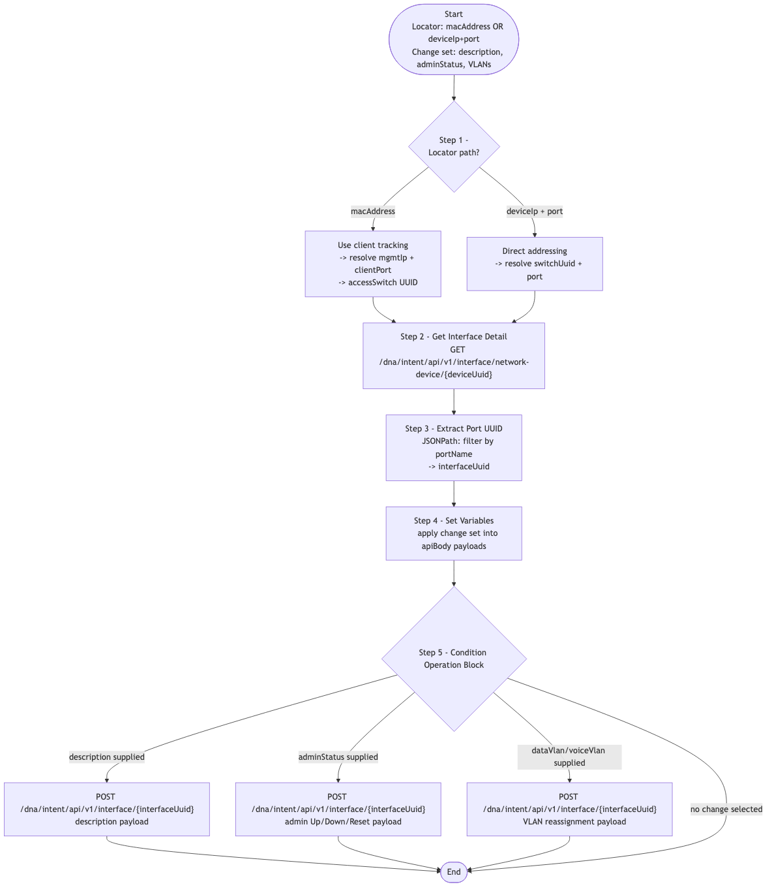

# CATC-PortConfiguration — Switchport Locator and Modifier

> **Workflow:** `CATC-PortConfiguration.json`
> **Type:** Cisco Catalyst Center Generic Workflow (Intent API)
> **API Endpoints:**
> &nbsp;&nbsp;`GET  /api/v1/network-device` — full device inventory (to resolve a switch by management IP)
> &nbsp;&nbsp;`GET  /dna/intent/api/v1/interface/network-device/{deviceUuid}` — list interfaces of a managed device
> &nbsp;&nbsp;`POST /dna/intent/api/v1/interface/{interfaceUuid}` — apply description, admin state, or VLAN changes to a port
> &nbsp;&nbsp;Client-tracking endpoints (for MAC-based location resolution)
> **Authors:** Keith Baldwin — Solutions Engineer - Automation HyperSpecialist (kebaldwi@cisco.com)
> **Copyright © 2024–2026 Cisco Systems, Inc. All rights reserved.**

---

## Table of Contents

1. [Overview](#overview)
2. [Logical Flow](#logical-flow)
3. [Prerequisites](#prerequisites)
4. [Directory Structure](#directory-structure)
5. [Workflow Input Parameters](#workflow-input-parameters)
6. [Workflow Outputs](#workflow-outputs)
7. [Internal Working Variables](#internal-working-variables)
8. [How It Works](#how-it-works)
9. [Notes and Limits](#notes-and-limits)

---

## Overview

`CATC-PortConfiguration` is an **interactive port-operations workflow**. The operator chooses how to locate the target switchport — either by **MAC address** (Catalyst Center resolves where the client is connected) or by **device IP + port** (direct addressing) — and then optionally applies one or more of the following changes:

- Update interface **description**,
- Change **admin status** (Up / Down / Reset),
- Reassign **data VLAN** and **voice VLAN**.

It is a single-port operations tool; for bulk port templating, use a Day-N template applied via `GitOps-DeviceProvisioning` or the EXCHANGE `-v3` chain.

### What it does

| Action | Mechanism |
|--------|-----------|
| Resolve target port | `Conditional Port Information Block` (`logic.if_else`) — branches on MAC vs. IP+port input |
| Get interface details | `GET /dna/intent/api/v1/interface/network-device/{deviceUuid}` |
| Extract port UUID | `Extract Port UUID` (`corejava.jsonpathquery`) |
| Apply changes | `Condition Operation Block` (`logic.if_else`) — runs description / admin / VLAN operations |

### What makes this workflow different

1. **Two locator paths** — MAC-based and direct IP+port. The MAC path saves an operator from having to know the upstream access switch.
2. **Optional change sections** — the operator can submit just a description change, or just an admin state change, or just VLAN updates, or any combination.

---

## Logical Flow



> Source: [DIAGRAMS/logical-flow.mmd](DIAGRAMS/logical-flow.mmd) — re-render with:
> ```bash
> npx -y @mermaid-js/mermaid-cli -i DIAGRAMS/logical-flow.mmd -o DIAGRAMS/logical-flow.png -w 1100 -b white
> ```

---

## Prerequisites

| Requirement | Notes |
|-------------|-------|
| Cisco Catalyst Center | Intent API v1 (interface and inventory) accessible |
| Runtime credentials | Permission to read inventory/interfaces and modify port configuration |
| Target device | Discovered, reachable, and managed |
| Client tracking (MAC path) | The client MAC must be visible in Catalyst Center's client tracking data |

---

## Directory Structure

```
CATC-PortConfiguration/
├── CATC-PortConfiguration.json   # Catalyst Center workflow definition (import via CatC UI)
├── DIAGRAMS/
│   ├── logical-flow.mmd          # Mermaid diagram source
│   └── logical-flow.png          # Rendered flowchart
└── README.md                     # This document
```

---

## Workflow Input Parameters

### Locator (one of two paths required)

| Input | Type | Description |
|-------|------|-------------|
| `macAddress` | string | Client MAC address — workflow resolves the connected switchport via Catalyst Center client tracking |
| `deviceIp` | string | Management IP of the access switch (used together with `port`) |
| `port` | string | Interface name (for example `GigabitEthernet1/0/12`) |

### Change set (any combination)

| Input | Type | Description |
|-------|------|-------------|
| `description` | string | New interface description |
| `adminStatus` | string | `Up`, `Down`, or `Reset` |
| `dataVlan` | string | Access (data) VLAN |
| `voiceVlan` | string | Voice VLAN |

### Run target

| Input | Type | Required | Description |
|-------|------|----------|-------------|
| Catalyst Center target | endpoint | Yes | Selected on workflow start |

---

## Workflow Outputs

The workflow returns the resulting interface state and the IDs it resolved (`interfaceUuid`, `switchUuid`, `mgmtIp`, `clientPort`) so the caller can verify the change.

---

## Internal Working Variables

| Variable | Purpose |
|----------|---------|
| `deviceList` | Inventory snapshot for IP/MAC lookup |
| `accessSwitch`, `mgmtIp` | Hostname / management IP of the access switch hosting the port |
| `clientPort` | Port the client is connected to (when MAC path is used) |
| `switchUuid` | UUID of the access switch |
| `interfaceUuid` | UUID of the target interface |
| `interfaces`, `interfaceStatus` | Interface list and resolved interface state |
| `apiBody`, `taskId` | Outbound payload and asynchronous task ID |

---

## How It Works

### Step 1 — Conditional Port Information Block

`logic.if_else` selects between:

- **MAC-based locator:** uses Catalyst Center client tracking to find the access switch and connected port for `macAddress`, then resolves `mgmtIp` and `clientPort` into `switchUuid` and the target interface name.
- **Direct locator:** uses `deviceIp` + `port` to resolve the same `switchUuid` / interface name.

### Step 2 — Get Interface Detail

`GET /dna/intent/api/v1/interface/network-device/{deviceUuid}` returns every interface on the access switch.

### Step 3 — Extract Port UUID

`corejava.jsonpathquery` filters the interface list to find the one matching the resolved port name and stores its `interfaceUuid`.

### Step 4 — Set Variables

Captures the operator-supplied change set and assembles the appropriate request payload(s).

### Step 5 — Condition Operation Block

`logic.if_else` runs only the change operations the operator requested:

- Description update — `POST /dna/intent/api/v1/interface/{interfaceUuid}` with a description payload.
- Admin status — same endpoint with an admin-state payload.
- VLAN reassignment — same endpoint with a VLAN payload covering data and voice VLAN.

Each operation returns a task; the workflow polls for terminal status before continuing.

---

## Notes and Limits

- **One port per run** — to operate on many ports, run this workflow once per port or build a custom wrapper.
- **No rollback** — failures may leave a partial change applied; verify by re-reading the interface detail after the run.
- **MAC visibility** — the MAC path depends on Catalyst Center having recently observed the client; offline or never-seen MACs will fail to resolve.
