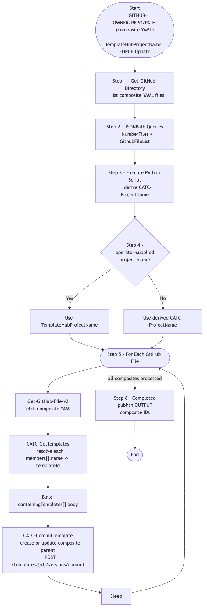

# GitOps-BuildCompositeTemplate — Composite Templates from YAML (v1)

> **Workflow:** `GitOps-BuildCompositeTemplate.json`
> **Type:** Cisco Catalyst Center Generic Workflow (Intent API) — GitOps v1 chain
> **Subworkflows used:** `Get-GitHub-Directory`, `Get-GitHub-File-v2`, `CATC-GetTemplates`, `CATC-CreateCompositeTemplate`, `CATC-CommitTemplate`
> **API Endpoints:** GitHub Contents API; Template Hub Intent API (`project`, `template`, `versions/commit`)
> **Authors:** Keith Baldwin — Solutions Engineer - Automation HyperSpecialist (kebaldwi@cisco.com)
> **Copyright © 2024–2026 Cisco Systems, Inc. All rights reserved.**

---

## Table of Contents

1. [Overview](#overview)
2. [Logical Flow](#logical-flow)
3. [Prerequisites](#prerequisites)
4. [Directory Structure](#directory-structure)
5. [Workflow Input Parameters](#workflow-input-parameters)
6. [Input Data Structure — Composite YAML](#input-data-structure--composite-yaml)
7. [How It Works](#how-it-works)
8. [Related Workflows](#related-workflows)

---

## Overview

`GitOps-BuildCompositeTemplate` reads YAML **composite template definitions** from GitHub and builds (or updates) the corresponding composite templates in Catalyst Center. A composite template is a parent template whose `containingTemplates[]` list references already-imported Day-N member templates; deploying the composite deploys all of its members in declared order.

This workflow is the v1 ancestor of [Workflow 5.0 — Templates Composite (EXCHANGE)](../../EXCHANGE/5.0-Cisco-Catalyst-Center-Templates-Composite/) (`GitOps-BuildCompositeTemplate-v3`).

### What it does

| Action | Mechanism |
|--------|-----------|
| List GitHub directory | `Get-GitHub-Directory` |
| Parse file list | `JSONPath Queries` |
| Compute project name | `Execute Python Script` |
| Pick final project name | `Condition Project Name Block` (`logic.if_else`) |
| Iterate composite YAML files | `For Each GitHub File` |
| Build/update composite | `CATC-CommitTemplate` (sub-workflow) — assembles `containingTemplates[]` and creates / updates the composite |
| Throttle | `Sleep` |
| Mark complete | `Completed` |

### What makes this workflow different

1. **YAML as composite source** — operators express composite intent (which members, in what order, with what parameters) in YAML rather than crafting Intent API JSON by hand.
2. **Reuses existing member templates** — composites assume members were already imported by `GitOps-ImportTemplates`; this workflow only assembles and commits the composite parent.
3. **Per-row commit** — each composite is committed after assembly so downstream profile binding immediately sees a versioned composite ID.

---

## Logical Flow



> Source: [DIAGRAMS/logical-flow.mmd](DIAGRAMS/logical-flow.mmd) — re-render with:
> ```bash
> npx -y @mermaid-js/mermaid-cli -i DIAGRAMS/logical-flow.mmd -o DIAGRAMS/logical-flow.png -w 1100 -b white
> ```

---

## Prerequisites

| Requirement | Notes |
|-------------|-------|
| Cisco Catalyst Center | Template Hub Intent API accessible |
| Member templates exist | Run `GitOps-ImportTemplates` first |
| GitHub access | YAML composite definitions in the target path |
| Subworkflows | `Get-GitHub-Directory`, `CATC-CommitTemplate`, supporting helpers |

---

## Directory Structure

```
GitOps-BuildCompositeTemplate/
├── GitOps-BuildCompositeTemplate.json   # Catalyst Center workflow definition (import via CatC UI)
├── DIAGRAMS/
│   ├── logical-flow.mmd                 # Mermaid diagram source
│   └── logical-flow.png                 # Rendered flowchart
└── README.md                            # This document
```

---

## Workflow Input Parameters

| Input | Type | Required | Description |
|-------|------|----------|-------------|
| `GITHUB-OWNER` | string | Yes | GitHub repository owner |
| `GITHUB-REPO` | string | Yes | GitHub repository name |
| `GITHUB-PATH` | string | Yes | Path inside the repository containing composite YAML files |
| `TemplateHubProjectName` | string | No | Overrides the auto-derived project name |
| `FORCE Update` | string | Yes | `true` to update existing composites; `false` to skip unchanged |
| Catalyst Center target | endpoint | Yes | Selected on workflow start |

---

## Input Data Structure — Composite YAML

```yaml
composite:
  name: SwitchAccessComposite
  description: "DayN access switch composite"
  language: JINJA
  softwareType: IOS-XE
  productSeries:
    - "Cisco Catalyst 9300 Series Switches"
  members:
    - name: AAA-Config
    - name: Banner-Config
    - name: QoS-Access
```

Each `members[].name` is resolved against the project's existing member templates to produce a `containingTemplates[]` array on the composite.

---

## How It Works

1. **Get-GitHub-Directory** lists composite YAML files.
2. **JSONPath Queries** extract `NumberFiles` and `GithubFileList`.
3. **Execute Python Script** derives the project name.
4. **Condition Project Name Block** picks the final project name.
5. **For Each GitHub File** — for every composite YAML in the directory:
   - Fetch with `Get-GitHub-File-v2`.
   - Resolve every `members[].name` to a `templateId` via `CATC-GetTemplates`.
   - Build the `containingTemplates[]` body.
   - Create or update the composite via `CATC-CommitTemplate` (which wraps the Template Hub create/update endpoints and commits a new version).
   - `Sleep` between rows.
6. **Completed** publishes `OUTPUT` and the resulting composite IDs.

---

## Related Workflows

- [GitOps-ImportTemplates](../GitOps-ImportTemplates/) — imports the member templates that this workflow references.
- [Workflow 5.0 — Templates Composite (EXCHANGE)](../../EXCHANGE/5.0-Cisco-Catalyst-Center-Templates-Composite/) — `-v3` production successor.
