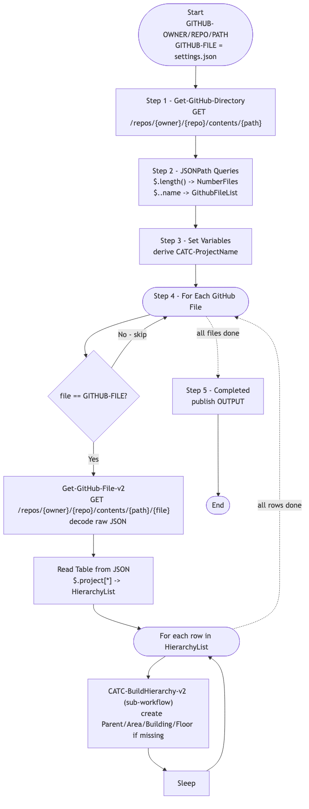

# GitOps-BuildHierarchy — GitHub-Driven Site Hierarchy Builder (v1)

> **Workflow:** `GitOps-BuildHierarchy.json`
> **Type:** Cisco Catalyst Center Generic Workflow (Intent API) — GitOps v1 chain
> **Subworkflows used:** `Get-GitHub-Directory`, `Get-GitHub-File-v2`, `CATC-BuildHierarchy-v2`
> **API Endpoints:**
> &nbsp;&nbsp;`GET api.github.com/repos/{owner}/{repo}/contents/{path}` — list settings files
> &nbsp;&nbsp;`GET api.github.com/repos/{owner}/{repo}/contents/{path}/{file}` — fetch a settings file
> &nbsp;&nbsp;`GET /dna/intent/api/v1/site` and `POST /dna/intent/api/v1/site` (via `CATC-BuildHierarchy-v2`)
> **Authors:** Keith Baldwin — Solutions Engineer - Automation HyperSpecialist (kebaldwi@cisco.com)
> **Copyright © 2024–2026 Cisco Systems, Inc. All rights reserved.**

---

## Table of Contents

1. [Overview](#overview)
2. [Logical Flow](#logical-flow)
3. [Prerequisites](#prerequisites)
4. [Directory Structure](#directory-structure)
5. [Workflow Input Parameters](#workflow-input-parameters)
6. [Input Data Structure — `settings.json`](#input-data-structure--settingsjson)
7. [How It Works](#how-it-works)
8. [Related Workflows](#related-workflows)

---

## Overview

`GitOps-BuildHierarchy` is the **GitHub-driven driver** that reads `settings.json` from a GitHub repository, parses the hierarchy table inside, and calls [CATC-BuildHierarchy-v2](../CATC-BuildHierarchy-v2/) once per row to create the corresponding Parent / Area / Building / Floor in Catalyst Center.

It is the v1 ancestor of [Workflow 1.0 — Site Hierarchy (EXCHANGE)](../../EXCHANGE/1.0-Cisco-Catalyst-Center-Site-Hierarchy/).

### What it does

| Action | Mechanism |
|--------|-----------|
| List GitHub directory | `Get-GitHub-Directory` — `GET /repos/{owner}/{repo}/contents/{path}` |
| Parse file list | `JSONPath Queries` — `$.length()` + `$..name` |
| Set working variables | `Set Variables` — `CATC-ProjectName`, derived names |
| Iterate target file | `For Each GitHub File` — match on `GITHUB-FILE` |
| Fetch and parse settings | inside loop: `Get-GitHub-File-v2`, build `HierarchyList` table |
| Build each row | inside loop: `CATC-BuildHierarchy-v2` per hierarchy row |
| Throttle | `Sleep` between rows |
| Mark complete | `Completed` |

### What makes this workflow different

1. **GitHub is the source of truth** — hierarchy intent lives in `settings.json` under version control.
2. **Idempotent** — `CATC-BuildHierarchy-v2` only creates missing levels, so re-runs do not duplicate sites.
3. **Multi-row** — one `settings.json` can describe many hierarchy paths; this workflow iterates them all.

---

## Logical Flow



> Source: [DIAGRAMS/logical-flow.mmd](DIAGRAMS/logical-flow.mmd) — re-render with:
> ```bash
> npx -y @mermaid-js/mermaid-cli -i DIAGRAMS/logical-flow.mmd -o DIAGRAMS/logical-flow.png -w 1100 -b white
> ```

---

## Prerequisites

| Requirement | Notes |
|-------------|-------|
| Cisco Catalyst Center | Intent API v1 site endpoints accessible |
| GitHub access | CatC reachable to `api.github.com` (or GitHub Enterprise host) |
| GitHub directory | Contains `settings.json` with a `project[]` array describing the hierarchy |
| `CATC-BuildHierarchy-v2` workflow | Imported in advance (this workflow calls it as a subworkflow) |

---

## Directory Structure

```
GitOps-BuildHierarchy/
├── GitOps-BuildHierarchy.json   # Catalyst Center workflow definition (import via CatC UI)
├── DIAGRAMS/
│   ├── logical-flow.mmd         # Mermaid diagram source
│   └── logical-flow.png         # Rendered flowchart
└── README.md                    # This document
```

---

## Workflow Input Parameters

| Input | Type | Required | Description |
|-------|------|----------|-------------|
| `GITHUB-OWNER` | string | Yes | GitHub repository owner |
| `GITHUB-REPO` | string | Yes | GitHub repository name |
| `GITHUB-PATH` | string | Yes | Path inside the repository |
| `GITHUB-FILE` | string | No | Target file name (defaults to `settings.json`) |
| `TemplateHubProjectName` | string | No | Project name carried through to downstream workflows |
| `FORCE Update` | string | Yes | Update flag (passed through to `CATC-BuildHierarchy-v2`) |
| Catalyst Center target | endpoint | Yes | Selected on workflow start |

---

## Input Data Structure — `settings.json`

```json
{
  "project": [
    {
      "HierarchyParent": "Global/USA",
      "HierarchyArea": "Eastern Region",
      "HierarchyBldg": "Office01",
      "HierarchyFloor": "Floor1",
      "HierarchyBldgAddress": "300 Walnut St, Philadelphia, PA, USA"
    }
  ]
}
```

Each row is mapped to the input parameters of `CATC-BuildHierarchy-v2`.

---

## How It Works

### Step 1 — Get-GitHub-Directory

Calls the GitHub Contents API to list every file in `GITHUB-PATH`.

### Step 2 — JSONPath Queries

Extracts `NumberFiles` and `GithubFileList` from the directory response.

### Step 3 — Set Variables

Computes `CATC-ProjectName` and other working variables.

### Step 4 — For Each GitHub File

For every file in the directory:
- Skip unless `file == GITHUB-FILE` (when `GITHUB-FILE` is supplied).
- Fetch with `Get-GitHub-File-v2` and decode.
- Build `HierarchyList` table via `Read Table from JSON`.
- For each row in `HierarchyList`, call `CATC-BuildHierarchy-v2` with the row's Parent / Area / Building / Floor / Address.
- Apply a short `Sleep` between rows to avoid API contention.

### Step 5 — Completed

Publishes `OUTPUT` and ends.

---

## Related Workflows

- [CATC-BuildHierarchy-v2](../CATC-BuildHierarchy-v2/) — per-row engine called by this workflow.
- [Workflow 1.0 — Site Hierarchy (EXCHANGE)](../../EXCHANGE/1.0-Cisco-Catalyst-Center-Site-Hierarchy/) — `-v3` production successor.
