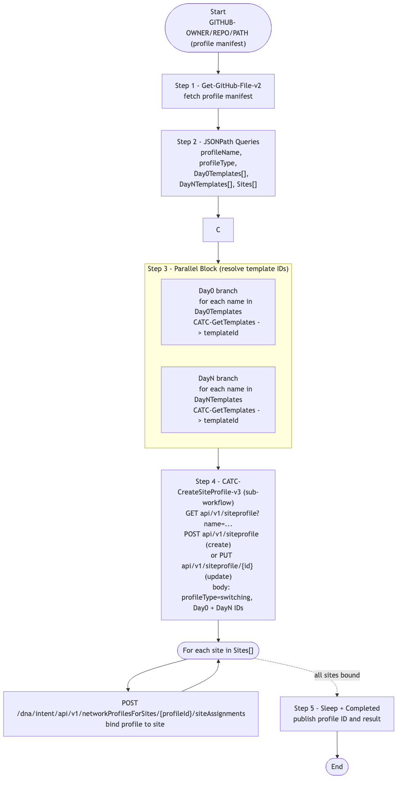

# GitOps-BuildNetworkProfile — Switching Site Profile Builder (v1)

> **Workflow:** `GitOps-BuildNetworkProfile.json`
> **Type:** Cisco Catalyst Center Generic Workflow (Intent API) — GitOps v1 chain
> **Subworkflows used:** `Get-GitHub-File-v2`, `CATC-GetTemplates`, `CATC-CreateSiteProfile-v3`
> **API Endpoints:**
> &nbsp;&nbsp;`GET api.github.com/repos/{owner}/{repo}/contents/{path}/{file}` — fetch the profile manifest
> &nbsp;&nbsp;`GET /dna/intent/api/v2/template-programmer/template?projectId=...&name=...` — resolve Day0 / DayN template IDs
> &nbsp;&nbsp;`GET / POST / PUT api/v1/siteprofile` — create or update the switching network profile
> &nbsp;&nbsp;`POST /dna/intent/api/v1/networkProfilesForSites/{profileId}/siteAssignments` — bind profile to a site
> **Authors:** Keith Baldwin — Solutions Engineer - Automation HyperSpecialist (kebaldwi@cisco.com)
> **Copyright © 2024–2026 Cisco Systems, Inc. All rights reserved.**

---

## Table of Contents

1. [Overview](#overview)
2. [Logical Flow](#logical-flow)
3. [Prerequisites](#prerequisites)
4. [Directory Structure](#directory-structure)
5. [Workflow Input Parameters](#workflow-input-parameters)
6. [Input Data Structure](#input-data-structure)
7. [How It Works](#how-it-works)
8. [Related Workflows](#related-workflows)

---

## Overview

`GitOps-BuildNetworkProfile` reads a profile manifest from GitHub (Day0 template list, DayN template list, site list, profile type), resolves every template name to a Catalyst Center `templateId`, creates or updates a **switching network profile** with those IDs, and assigns the profile to the named sites.

It is the v1 ancestor of [Workflow 6.0 — Network Profile (EXCHANGE)](../../EXCHANGE/6.0-Cisco-Catalyst-Center-Network-Profile/) (`GitOps-BuildNetworkProfile-v3`).

### What it does

| Action | Mechanism |
|--------|-----------|
| Fetch profile manifest | `Get-GitHub-File-v2` |
| Parse profile manifest | `JSONPath Queries` |
| Resolve template IDs (parallel) | `Parallel Block` and `Get Template ID's from Catalyst Center Block` — `CATC-GetTemplates` for Day0 names and DayN names concurrently |
| Build site profile | `CATC-CreateSiteProfile-v3` (sub-workflow) — create or update the profile and bind Day0/DayN template IDs |
| Throttle | `Sleep` |
| Mark complete | `Completed` |

### What makes this workflow different

1. **Profile from a manifest** — site, profile type, Day0 templates, and DayN templates are all defined in one JSON file in GitHub.
2. **Parallel template resolution** — Day0 and DayN template IDs are resolved in parallel branches to shorten wall time.
3. **`switching` profile type focus** — current support is for switching profiles; the data shape is extensible for other profile types.

---

## Logical Flow



> Source: [DIAGRAMS/logical-flow.mmd](DIAGRAMS/logical-flow.mmd) — re-render with:
> ```bash
> npx -y @mermaid-js/mermaid-cli -i DIAGRAMS/logical-flow.mmd -o DIAGRAMS/logical-flow.png -w 1200 -b white
> ```

---

## Prerequisites

| Requirement | Notes |
|-------------|-------|
| Cisco Catalyst Center | Site profile, Template Hub, and Site Intent APIs accessible |
| Hierarchy in place | Run `GitOps-BuildHierarchy` first |
| Member and composite templates exist | Run `GitOps-ImportTemplates` and `GitOps-BuildCompositeTemplate` first |
| Subworkflows | `Get-GitHub-File-v2`, `CATC-GetTemplates`, `CATC-CreateSiteProfile-v3` |

---

## Directory Structure

```
GitOps-BuildNetworkProfile/
├── GitOps-BuildNetworkProfile.json   # Catalyst Center workflow definition (import via CatC UI)
├── DIAGRAMS/
│   ├── logical-flow.mmd              # Mermaid diagram source
│   └── logical-flow.png              # Rendered flowchart
└── README.md                         # This document
```

---

## Workflow Input Parameters

| Input | Type | Required | Description |
|-------|------|----------|-------------|
| `GITHUB-OWNER` | string | Yes | GitHub repository owner |
| `GITHUB-REPO` | string | Yes | GitHub repository name |
| `GITHUB-PATH` | string | Yes | Path to the profile manifest |
| `GITHUB-FILE` | string | No | File name (defaults to a known profile manifest) |
| Catalyst Center target | endpoint | Yes | Selected on workflow start |

The profile name, type, Day0 template names, DayN template names, and target site paths are all read from the manifest body.

---

## Input Data Structure

```json
{
  "profileName": "SwitchingProfile-EastRegion",
  "profileType": "switching",
  "Day0Templates": ["Day0-Bootstrap"],
  "DayNTemplates": ["AccessSwitch-Day1", "QoS-Access"],
  "Sites": ["Global/USA/Eastern Region/Office01"]
}
```

---

## How It Works

### Step 1 — Get-GitHub-File-v2

Fetches the profile manifest and decodes the raw JSON.

### Step 2 — JSONPath Queries

Extracts `profileName`, `profileType`, `Day0Templates`, `DayNTemplates`, and `Sites` from the manifest.

### Step 3 — Parallel Block (Get Template IDs)

`logic.parallel` runs two branches concurrently:

- **Day0 branch:** for every name in `Day0Templates`, call `CATC-GetTemplates` to resolve a `templateId`. Concatenate into `Day0TemplateID's`.
- **DayN branch:** same for `DayNTemplates`. Concatenate into `DayNTemplateID's`.

### Step 4 — CATC-CreateSiteProfile-v3

The sub-workflow:
- Queries `GET api/v1/siteprofile?name=...` to determine create vs. update.
- Builds the profile body, setting `profileType = switching` and embedding Day0 / DayN template IDs.
- Calls `POST api/v1/siteprofile` (create) or `PUT api/v1/siteprofile/{siteProfileUuid}` (update).
- For each site path in `Sites`, calls `POST /dna/intent/api/v1/networkProfilesForSites/{profileId}/siteAssignments` to bind the profile.

### Step 5 — Sleep / Completed

A short throttle between operations and a final `Completed` to publish outputs.

---

## Related Workflows

- [GitOps-ImportTemplates](../GitOps-ImportTemplates/) and [GitOps-BuildCompositeTemplate](../GitOps-BuildCompositeTemplate/) — must run first to populate the templates this profile references.
- [Workflow 6.0 — Network Profile (EXCHANGE)](../../EXCHANGE/6.0-Cisco-Catalyst-Center-Network-Profile/) — `-v3` production successor.
