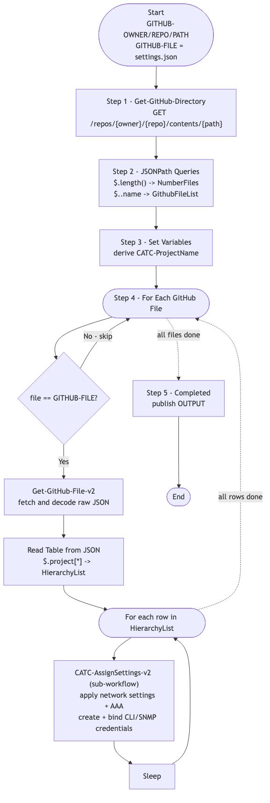

# GitOps-BuildSettings — GitHub-Driven Settings and Credentials (v1)

> **Workflow:** `GitOps-BuildSettings.json`
> **Type:** Cisco Catalyst Center Generic Workflow (Intent API) — GitOps v1 chain
> **Subworkflows used:** `Get-GitHub-Directory`, `Get-GitHub-File-v2`, `CATC-AssignSettings-v2`
> **API Endpoints:** GitHub Contents API; Catalyst Center Network Settings, Credentials, AAA endpoints (via `CATC-AssignSettings-v2`)
> **Authors:** Keith Baldwin — Solutions Engineer - Automation HyperSpecialist (kebaldwi@cisco.com)
> **Copyright © 2024–2026 Cisco Systems, Inc. All rights reserved.**

---

## Table of Contents

1. [Overview](#overview)
2. [Logical Flow](#logical-flow)
3. [Prerequisites](#prerequisites)
4. [Directory Structure](#directory-structure)
5. [Workflow Input Parameters](#workflow-input-parameters)
6. [Input Data Structure — `settings.json`](#input-data-structure--settingsjson)
7. [How It Works](#how-it-works)
8. [Related Workflows](#related-workflows)

---

## Overview

`GitOps-BuildSettings` is the **GitHub-driven driver** that applies the Day-0 baseline (DNS, DHCP, NTP, syslog, SNMP, banner, AAA, CLI / SNMP credentials) across an entire hierarchy from a single `settings.json` source. For every row in the GitHub file, the workflow calls [CATC-AssignSettings-v2](../CATC-AssignSettings-v2/) with the row's site path and settings values.

It is the v1 ancestor of [Workflow 2.0 — Settings and Credentials (EXCHANGE)](../../EXCHANGE/2.0-Cisco-Catalyst-Center-Settings-and-Credentials/).

### What it does

| Action | Mechanism |
|--------|-----------|
| List GitHub directory | `Get-GitHub-Directory` |
| Parse file list | `JSONPath Queries` |
| Set working variables | `Set Variables` |
| Iterate target file | `For Each GitHub File` |
| Apply settings per row | inside loop: `Get-GitHub-File-v2`, `Read Table from JSON`, `CATC-AssignSettings-v2` per row |
| Throttle | `Sleep` |
| Mark complete | `Completed` |

### What makes this workflow different

1. **One file, many sites** — `settings.json` can describe Day-0 settings for many sites; the workflow iterates them in order.
2. **Reusable engine** — every row delegates the heavy lifting (settings + AAA + credential resolution + binding) to `CATC-AssignSettings-v2`.
3. **GitOps semantics** — settings live in version control; running this workflow reconciles Catalyst Center with that intent.

---

## Logical Flow



> Source: [DIAGRAMS/logical-flow.mmd](DIAGRAMS/logical-flow.mmd) — re-render with:
> ```bash
> npx -y @mermaid-js/mermaid-cli -i DIAGRAMS/logical-flow.mmd -o DIAGRAMS/logical-flow.png -w 1100 -b white
> ```

---

## Prerequisites

| Requirement | Notes |
|-------------|-------|
| Cisco Catalyst Center | Network settings, credential, and AAA Intent APIs accessible |
| Hierarchy in place | Run `GitOps-BuildHierarchy` first |
| GitHub access | Settings JSON file reachable via `api.github.com` |
| `CATC-AssignSettings-v2` workflow | Imported in advance |

---

## Directory Structure

```
GitOps-BuildSettings/
├── GitOps-BuildSettings.json   # Catalyst Center workflow definition (import via CatC UI)
├── DIAGRAMS/
│   ├── logical-flow.mmd        # Mermaid diagram source
│   └── logical-flow.png        # Rendered flowchart
└── README.md                   # This document
```

---

## Workflow Input Parameters

| Input | Type | Required | Description |
|-------|------|----------|-------------|
| `GITHUB-OWNER` | string | Yes | GitHub repository owner |
| `GITHUB-REPO` | string | Yes | GitHub repository name |
| `GITHUB-PATH` | string | Yes | Path inside the repository |
| `GITHUB-FILE` | string | No | Target file name (defaults to `settings.json`) |
| `TemplateHubProjectName` | string | No | Project name carried through to downstream workflows |
| `FORCE Update` | string | Yes | Update flag |
| Catalyst Center target | endpoint | Yes | Selected on workflow start |

---

## Input Data Structure — `settings.json`

```json
{
  "project": [
    {
      "HierarchyParent": "Global/USA",
      "HierarchyArea": "Eastern Region",
      "HierarchyBldg": "Office01",
      "HierarchyFloor": "Floor1",
      "DNSPrimary": "208.67.222.222",
      "DNSSecondary": "208.67.220.220",
      "NTPServers": ["10.0.0.10"],
      "NTPTimeZone": "America/New_York",
      "SyslogServers": ["10.0.0.20"],
      "SNMPServers": ["10.0.0.20"],
      "BannerMessage": "Authorised use only",
      "BannerProtection": false,
      "AAAServerType": "ISE",
      "AAAProtocol": "RADIUS",
      "PrimaryAAA": "10.0.0.50",
      "SecondaryAAA": "10.0.0.51",
      "AAASecret": "<shared>",
      "CLIUsername": "admin",
      "CLIPassword": "<secure>",
      "EnablePassword": "<secure>",
      "SNMPv2Read":  "<secure>",
      "SNMPv2Write": "<secure>"
    }
  ]
}
```

---

## How It Works

The pipeline is identical in shape to `GitOps-BuildHierarchy`:

1. **Get-GitHub-Directory** lists files in the path.
2. **JSONPath Queries** extract `NumberFiles` and `GithubFileList`.
3. **Set Variables** computes `CATC-ProjectName`.
4. **For Each GitHub File**: filter by `GITHUB-FILE`, fetch and decode, build `HierarchyList`, and for each row call **`CATC-AssignSettings-v2`** with the row's settings inputs. A `Sleep` step throttles between rows.
5. **Completed** publishes `OUTPUT`.

---

## Related Workflows

- [CATC-AssignSettings-v2](../CATC-AssignSettings-v2/) — per-row engine called by this workflow.
- [Workflow 2.0 — Settings and Credentials (EXCHANGE)](../../EXCHANGE/2.0-Cisco-Catalyst-Center-Settings-and-Credentials/) — `-v3` production successor.
