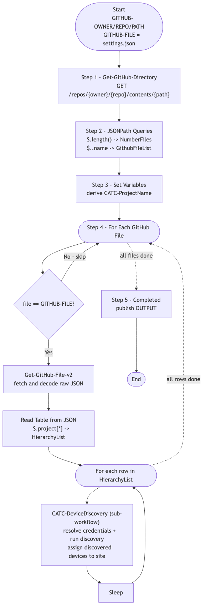

# GitOps-DeviceDiscovery — GitHub-Driven Device Discovery and Assignment (v1)

> **Workflow:** `GitOps-DeviceDiscovery.json`
> **Type:** Cisco Catalyst Center Generic Workflow (Intent API) — GitOps v1 chain
> **Subworkflows used:** `Get-GitHub-Directory`, `Get-GitHub-File-v2`, `CATC-DeviceDiscovery`
> **API Endpoints:** GitHub Contents API; Catalyst Center Discovery / Inventory / Site Intent APIs (via `CATC-DeviceDiscovery`)
> **Authors:** Keith Baldwin — Solutions Engineer - Automation HyperSpecialist (kebaldwi@cisco.com)
> **Copyright © 2024–2026 Cisco Systems, Inc. All rights reserved.**

---

## Table of Contents

1. [Overview](#overview)
2. [Logical Flow](#logical-flow)
3. [Prerequisites](#prerequisites)
4. [Directory Structure](#directory-structure)
5. [Workflow Input Parameters](#workflow-input-parameters)
6. [Input Data Structure — `settings.json`](#input-data-structure--settingsjson)
7. [How It Works](#how-it-works)
8. [Related Workflows](#related-workflows)

---

## Overview

`GitOps-DeviceDiscovery` is the **GitHub-driven driver** for the v1 discovery chain. For each row in `settings.json` it calls [CATC-DeviceDiscovery](../CATC-DeviceDiscovery/) with the discovery target (device list / range), credential lookup descriptions, and target site path. The result is a fully discovered, site-assigned fleet ready for template provisioning.

It is the v1 ancestor of [Workflow 3.0 — Device Discovery and Assign (EXCHANGE)](../../EXCHANGE/3.0-Cisco-Catalyst-Center-Device-Discovery-and-Assign/).

### What it does

The structure is the same five-step GitOps loop used elsewhere in this folder:

| Action | Mechanism |
|--------|-----------|
| List GitHub directory | `Get-GitHub-Directory` |
| Parse file list | `JSONPath Queries` |
| Set working variables | `Set Variables` |
| Iterate target file | `For Each GitHub File` — fetch, parse hierarchy table, call `CATC-DeviceDiscovery` per row |
| Throttle | `Sleep` |
| Mark complete | `Completed` |

---

## Logical Flow



> Source: [DIAGRAMS/logical-flow.mmd](DIAGRAMS/logical-flow.mmd) — re-render with:
> ```bash
> npx -y @mermaid-js/mermaid-cli -i DIAGRAMS/logical-flow.mmd -o DIAGRAMS/logical-flow.png -w 1100 -b white
> ```

---

## Prerequisites

| Requirement | Notes |
|-------------|-------|
| Cisco Catalyst Center | Discovery, Inventory, and Site Intent APIs accessible |
| Hierarchy and credentials | Run `GitOps-BuildHierarchy` and `GitOps-BuildSettings` first |
| Reachable devices | Devices in the device list must be reachable from the Catalyst Center management network |
| `CATC-DeviceDiscovery` workflow | Imported in advance |

---

## Directory Structure

```
GitOps-DeviceDiscovery/
├── GitOps-DeviceDiscovery.json   # Catalyst Center workflow definition (import via CatC UI)
├── DIAGRAMS/
│   ├── logical-flow.mmd          # Mermaid diagram source
│   └── logical-flow.png          # Rendered flowchart
└── README.md                     # This document
```

---

## Workflow Input Parameters

| Input | Type | Required | Description |
|-------|------|----------|-------------|
| `GITHUB-OWNER` | string | Yes | GitHub repository owner |
| `GITHUB-REPO` | string | Yes | GitHub repository name |
| `GITHUB-PATH` | string | Yes | Path inside the repository |
| `GITHUB-FILE` | string | No | Target file name (defaults to `settings.json`) |
| `TemplateHubProjectName` | string | No | Project name carried through to downstream workflows |
| `FORCE Update` | string | Yes | Update flag |
| Catalyst Center target | endpoint | Yes | Selected on workflow start |

---

## Input Data Structure — `settings.json`

```json
{
  "project": [
    {
      "HierarchyParent": "Global/USA",
      "HierarchyArea": "Eastern Region",
      "HierarchyBldg": "Office01",
      "HierarchyBldgAddress": "300 Walnut St, Philadelphia, PA, USA",
      "HierarchyFloor": "Floor1",
      "DeviceList": "10.0.10.1-10.0.10.10",
      "SNMPv2ReadDescription":  "Read-Only Community",
      "SNMPv2WriteDescription": "Read-Write Community",
      "CLIUsername": "admin",
      "NetconfPort": "830"
    }
  ]
}
```

Each row is mapped to the input parameters of `CATC-DeviceDiscovery`.

---

## How It Works

1. **Get-GitHub-Directory** lists every file in `GITHUB-PATH`.
2. **JSONPath Queries** extract `NumberFiles` and `GithubFileList`.
3. **Set Variables** computes `CATC-ProjectName`.
4. **For Each GitHub File** with matching name:
   - `Get-GitHub-File-v2` fetches the file.
   - `Read Table from JSON` builds the row table.
   - For each row, `CATC-DeviceDiscovery` is called with the device list and hierarchy path.
   - `Sleep` between rows.
5. **Completed** publishes `OUTPUT`.

---

## Related Workflows

- [CATC-DeviceDiscovery](../CATC-DeviceDiscovery/) — per-row engine called by this workflow.
- [Workflow 3.0 — Device Discovery and Assign (EXCHANGE)](../../EXCHANGE/3.0-Cisco-Catalyst-Center-Device-Discovery-and-Assign/) — `-v3` production successor.
