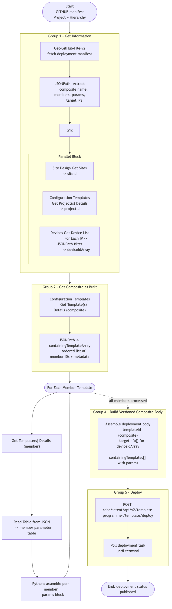

# GitOps-DeviceProvisioning — Composite Template Deployment per Device (v1)

> **Workflow:** `GitOps-DeviceProvisioning.json`
> **Type:** Cisco Catalyst Center Generic Workflow (Intent API) — GitOps v1 chain
> **Subworkflows used:** `Get-GitHub-File-v2`, Site Design and Configuration Templates Intent API helpers, Devices Get Device List helpers
> **API Endpoints:**
> &nbsp;&nbsp;`GET api.github.com/...` — fetch the deployment manifest (sites, project, templates, target IPs)
> &nbsp;&nbsp;`GET /dna/intent/api/v1/sites` — resolve target site UUID
> &nbsp;&nbsp;`GET /dna/intent/api/v1/template-programmer/project` (`getProjectsDetails`) — resolve project UUID
> &nbsp;&nbsp;`GET /dna/intent/api/v1/network-device` (`getDeviceList`) — resolve target devices
> &nbsp;&nbsp;`GET /dna/intent/api/v1/template-programmer/template/{id}` (`getTemplatesDetails`) — read composite + member metadata
> &nbsp;&nbsp;`POST /dna/intent/api/v2/template-programmer/template/deploy` — deploy the composite template
> **Authors:** Keith Baldwin — Solutions Engineer - Automation HyperSpecialist (kebaldwi@cisco.com)
> **Copyright © 2024–2026 Cisco Systems, Inc. All rights reserved.**

---

## Table of Contents

1. [Overview](#overview)
2. [Logical Flow](#logical-flow)
3. [Prerequisites](#prerequisites)
4. [Directory Structure](#directory-structure)
5. [Workflow Input Parameters](#workflow-input-parameters)
6. [How It Works](#how-it-works)
7. [Related Workflows](#related-workflows)

---

## Overview

`GitOps-DeviceProvisioning` reads a deployment manifest from GitHub, resolves the target **site**, **project**, **composite template**, and **target devices**, and deploys the composite template per device. It walks the composite's member-template list, builds a parameter block per member from the manifest, and submits a single composite-aware deployment request.

It is the v1 ancestor of [Workflow 7.0 — Provision Composite (EXCHANGE)](../../EXCHANGE/7.0-Cisco-Catalyst-Center-Provision-Composite/) (`GitOps-Provisioning-v3`).

### What it does

| Group | Mechanism |
|-------|-----------|
| `Get Information` (`logic.group`) | Fetches the deployment manifest from GitHub and, in parallel, resolves the **site UUID**, **project UUID**, and the **target device UUID list** (from CSV / line-delimited IP input) |
| `Get Composite as Built` (`logic.group`) | Reads the composite template definition (`getTemplatesDetails`), extracts the ordered `containingTemplates[]` list, and prepares the member template array |
| `For Each Member Template` (`logic.for_each`) | For each member template: fetches member detail, reads each member's parameter table, and builds the per-member parameter object used in the composite body |
| `Build Versioned Composite Body` (`logic.group`) | Assembles the composite deployment body — `templateId`, ordered `containingTemplates[]` with member `templateId` + per-member `params`, and the target device list |
| `Deploy` (`logic.group`) | Submits `POST /dna/intent/api/v2/template-programmer/template/deploy` and polls the deployment task |

### What makes this workflow different

1. **Composite-aware** — does not just deploy a single template; it walks the composite's member graph and constructs a parameter-rich body that drives the composite deployer to push every member in order.
2. **Single-request deploy** — one composite deploy per device covers all members, which is faster and more atomic than deploying members individually.
3. **GitHub-driven inputs** — sites, project, composite name, and target device IPs are all read from the manifest in GitHub.

---

## Logical Flow



> Source: [DIAGRAMS/logical-flow.mmd](DIAGRAMS/logical-flow.mmd) — re-render with:
> ```bash
> npx -y @mermaid-js/mermaid-cli -i DIAGRAMS/logical-flow.mmd -o DIAGRAMS/logical-flow.png -w 1200 -b white
> ```

---

## Prerequisites

| Requirement | Notes |
|-------------|-------|
| Cisco Catalyst Center | Site, Template Hub, Inventory, and Template Deploy Intent APIs accessible |
| Hierarchy, settings, discovery in place | Run the earlier GitOps chain first |
| Member and composite templates exist | Run `GitOps-ImportTemplates` and `GitOps-BuildCompositeTemplate` first |
| Network profile bound | Run `GitOps-BuildNetworkProfile` first |
| Subworkflows / atomics | `Get-GitHub-File-v2` plus standard Catalyst Center Intent API helpers |

---

## Directory Structure

```
GitOps-DeviceProvisioning/
├── GitOps-DeviceProvisioning.json   # Catalyst Center workflow definition (import via CatC UI)
├── DIAGRAMS/
│   ├── logical-flow.mmd             # Mermaid diagram source
│   └── logical-flow.png             # Rendered flowchart
└── README.md                        # This document
```

---

## Workflow Input Parameters

| Input | Type | Required | Description |
|-------|------|----------|-------------|
| `GITHUB_USER` | string | No | GitHub repository owner |
| `GITHUB_REPO` | string | No | GitHub repository name |
| `GITHUB_PATH` | string | No | Path to the deployment manifest |
| `GITHUB_FILE` | string | No | File name of the manifest |
| `Project Name` | string | No | Template Hub project name on Catalyst Center |
| `HierarchyParent` | string | No | Parent area path (used when resolving the target site) |
| `HierarchyArea` | string | No | Area name |
| `HierarchyBldg` | string | No | Building name |
| `HierarchyFloor` | string | No | Floor name |
| Catalyst Center target | endpoint | Yes | Selected on workflow start |

The deployment manifest in GitHub provides additional inputs: composite template name, member parameter values, and the target device IP list.

---

## How It Works

### Group 1 — Get Information

Inside this group the workflow:
1. Fetches the deployment manifest with `Get-GitHub-File-v2`.
2. Runs a `Parallel Block` with three branches:
   - **Site Design Get Sites** — resolves the target hierarchy path into a `siteId`.
   - **Configuration Templates Get Project(s) Details** — resolves the target project into a `projectId`.
   - **Devices Get Device List** — resolves the manifest's device IP list into `deviceIdArray` (looping with `For Each` and `JSONPath` to filter by `managementIpAddress`).

### Group 2 — Get Composite as Built

1. Calls `Configuration Templates Get Template(s) Details` for the composite template.
2. JSONPath against the result populates the `containingTemplateArray` (ordered list of member template IDs and metadata).

### `For Each Member Template`

For every member in `containingTemplateArray`:
1. Calls `Configuration Templates Get Template(s) Details` for the member to read its parameter schema.
2. Extracts parameters with `Read Table from JSON` and a Python step.
3. Builds the per-member `params` block to be embedded in the composite deploy body.

### Group 4 — Build Versioned Composite Body

Assembles the final deployment body:
- `templateId` (composite)
- `targetInfo[]` (one entry per device with `id`, `type=MANAGED_DEVICE_UUID`)
- `containingTemplates[]` (ordered member list with per-member `templateId` + `params`)

### Group 5 — Deploy

Submits `POST /dna/intent/api/v2/template-programmer/template/deploy` and polls the deployment task until terminal. The result is published as the workflow output.

---

## Related Workflows

- [GitOps-BuildCompositeTemplate](../GitOps-BuildCompositeTemplate/) — must build the composite template referenced here.
- [GitOps-BuildNetworkProfile](../GitOps-BuildNetworkProfile/) — must bind the composite to the target site.
- [Workflow 7.0 — Provision Composite (EXCHANGE)](../../EXCHANGE/7.0-Cisco-Catalyst-Center-Provision-Composite/) — `-v3` production successor.
