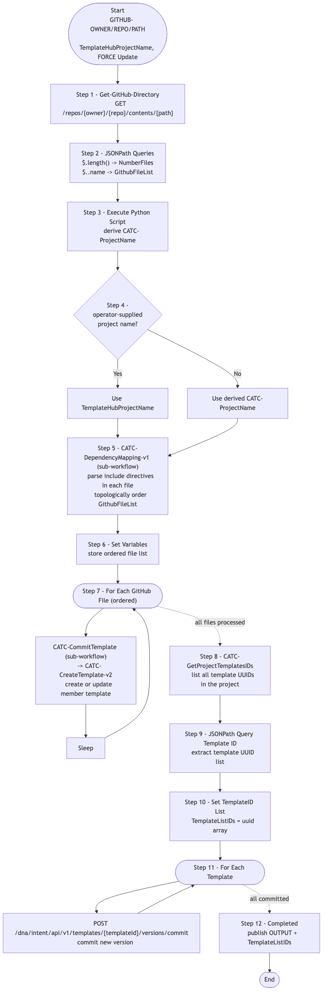

# GitOps-ImportTemplates — GitHub → Template Hub Importer (with Dependency Mapping)

> **Workflow:** `GitOps-ImportTemplates.json`
> **Type:** Cisco Catalyst Center Generic Workflow (Intent API) — GitOps v1 chain
> **Subworkflows used:** `Get-GitHub-Directory`, `Get-GitHub-File-v2`, `CATC-DependencyMapping-v1`, `CATC-CreateTemplate-v2`, `CATC-CommitTemplate`, `CATC-GetProjectTemplatesIDs`
> **API Endpoints:** GitHub Contents API; Template Hub Intent API (`project`, `template`, `versions/commit`)
> **Authors:** Keith Baldwin — Solutions Engineer - Automation HyperSpecialist (kebaldwi@cisco.com)
> **Copyright © 2024–2026 Cisco Systems, Inc. All rights reserved.**

---

## Table of Contents

1. [Overview](#overview)
2. [Logical Flow](#logical-flow)
3. [Prerequisites](#prerequisites)
4. [Directory Structure](#directory-structure)
5. [Workflow Input Parameters](#workflow-input-parameters)
6. [How It Works](#how-it-works)
7. [Related Workflows](#related-workflows)

---

## Overview

`GitOps-ImportTemplates` is the **dependency-aware bulk importer** of Jinja2 templates from a GitHub directory into a Catalyst Center Template Hub project. It improves on [CATC-GitHubIntegration-v2](../CATC-GithubIntegration-v2/) by adding an explicit dependency-mapping pass (`CATC-DependencyMapping-v1`) that orders templates so that `include` relationships resolve correctly at create time.

It is the v1 ancestor of [Workflow 4.0 — Templates GitHub Integration (EXCHANGE)](../../EXCHANGE/4.0-Cisco-Catalyst-Center-Templates-Github-integration/) (`GitOps-BuildTemplates-v3`).

### What it does

| Action | Mechanism |
|--------|-----------|
| List GitHub directory | `Get-GitHub-Directory` |
| Parse file list | `JSONPath Queries` |
| Compute project name | `Execute Python Script` |
| Pick final project name | `Condition Project Name Block` (`logic.if_else`) |
| Order templates | `CATC-DependencyMapping-v1` (sub-workflow) — sorts files so includes precede includers |
| Set variables | `Set Variables` |
| Create/update each template | `For Each GitHub File` — calls `CATC-CreateTemplate-v2` (via `CATC-CommitTemplate`) |
| Throttle | `Sleep` |
| Retrieve project template IDs | `CATC-GetProjectTemplatesIDs` (sub-workflow) |
| Commit each version | `For Each Template` — `POST /dna/intent/api/v1/templates/{templateId}/versions/commit` |
| Mark complete | `Completed` |

### What makes this workflow different

1. **Dependency ordering** — `CATC-DependencyMapping-v1` parses each template's content for `include` directives and topologically sorts the file list before creation, so referenced templates exist by the time including templates are committed.
2. **Two-phase create-then-commit** — every template is created first, then every template in the project is committed in a second loop.
3. **`FORCE Update` flag** — when true, updates content of existing templates with the latest GitHub version.

---

## Logical Flow



> Source: [DIAGRAMS/logical-flow.mmd](DIAGRAMS/logical-flow.mmd) — re-render with:
> ```bash
> npx -y @mermaid-js/mermaid-cli -i DIAGRAMS/logical-flow.mmd -o DIAGRAMS/logical-flow.png -w 1100 -b white
> ```

---

## Prerequisites

| Requirement | Notes |
|-------------|-------|
| Cisco Catalyst Center | Template Hub Intent API accessible |
| GitHub access | CatC reachable to `api.github.com` |
| GitHub directory | Contains the template files to import |
| Subworkflows | `Get-GitHub-Directory`, `CATC-DependencyMapping-v1`, `CATC-CreateTemplate-v2`, `CATC-CommitTemplate`, `CATC-GetProjectTemplatesIDs` |

---

## Directory Structure

```
GitOps-ImportTemplates/
├── GitOps-ImportTemplates.json   # Catalyst Center workflow definition (import via CatC UI)
├── DIAGRAMS/
│   ├── logical-flow.mmd          # Mermaid diagram source
│   └── logical-flow.png          # Rendered flowchart
└── README.md                     # This document
```

---

## Workflow Input Parameters

| Input | Type | Required | Description |
|-------|------|----------|-------------|
| `GITHUB-OWNER` | string | Yes | GitHub repository owner |
| `GITHUB-REPO` | string | Yes | GitHub repository name |
| `GITHUB-PATH` | string | Yes | Path inside the repository containing the templates |
| `TemplateHubProjectName` | string | No | Overrides the auto-derived project name |
| `FORCE Update` | string | Yes | `true` to update existing template content; `false` to skip unchanged templates |
| Catalyst Center target | endpoint | Yes | Selected on workflow start |

---

## How It Works

### Step 1 — Get-GitHub-Directory

Lists every file in the target path.

### Step 2 — JSONPath Queries

Extracts `NumberFiles` and `GithubFileList`.

### Step 3 — Execute Python Script

Derives a sanitised `CATC-ProjectName` from the operator-supplied or default value.

### Step 4 — Condition Project Name Block

Selects between operator-supplied and derived project names.

### Step 5 — CATC-DependencyMapping-v1

Reads every template file's content (raw via `Get-GitHub-File-v2`) and parses `include` directives. Topologically orders the file list so includes appear before includers, then publishes the ordered list back.

### Step 6 — Set Variables

Stores the ordered file list for the `For Each GitHub File` loop.

### Step 7 — For Each GitHub File

For every file (in dependency order):
- Fetch raw content.
- Call `CATC-CreateTemplate-v2` (via `CATC-CommitTemplate`) to create or update the corresponding member template.
- `Sleep` between iterations.

### Step 8 — CATC-GetProjectTemplatesIDs

Fetches the final list of templates in the project.

### Step 9 — JSONPath Query Template ID

Extracts the template UUIDs into a list.

### Step 10 — Set TemplateID List

Stores `TemplateListIDs`.

### Step 11 — For Each Template

For each template UUID, commit a new version via `POST /dna/intent/api/v1/templates/{templateId}/versions/commit`.

### Step 12 — Completed

Publishes `OUTPUT` and `TemplateListIDs`.

---

## Related Workflows

- [CATC-CreateTemplate-v2](../CATC-CreateTemplate-v2/) — per-template engine.
- [CATC-GitHubIntegration-v2](../CATC-GithubIntegration-v2/) — earlier importer without dependency mapping.
- [Workflow 4.0 — Templates GitHub Integration (EXCHANGE)](../../EXCHANGE/4.0-Cisco-Catalyst-Center-Templates-Github-integration/) — `-v3` production successor.
