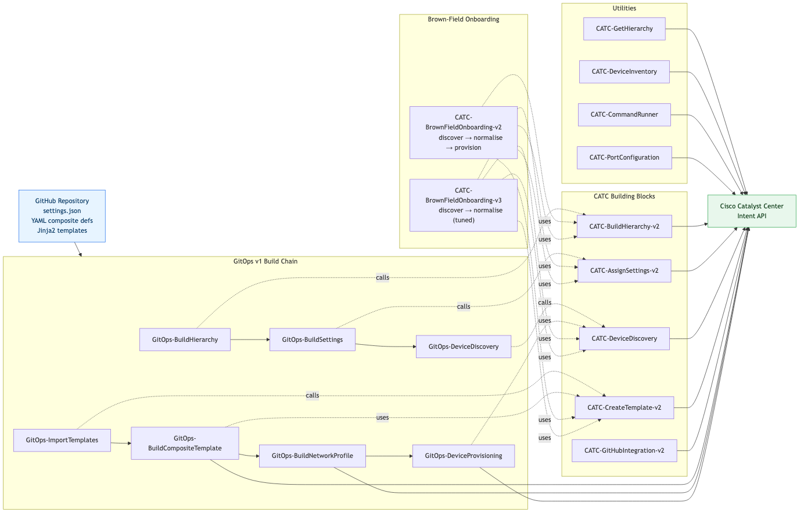

# Cisco Catalyst Center — Workflow Library (CATC)

> As-Built Documentation
> Authors: Keith Baldwin — Solutions Engineer - Automation HyperSpecialist (kebaldwi@cisco.com)
> Copyright © 2024–2026 Cisco Systems, Inc. All rights reserved.

This folder is the **workflow library** for Catalyst Center. It contains the original `CATC-*` building-block workflows and the first-generation `GitOps-*` build chain. The polished, currently-recommended end-to-end suite (`-v3.json` workflows) lives in [../EXCHANGE/](../EXCHANGE/) — many of those workflows reuse or are evolved from the workflows in this folder.

The contents here fall into four functional groups:

1. **CATC building blocks** — small, reusable Catalyst Center workflows (`CATC-*`) that wrap one or a few Intent API calls (hierarchy build, settings assignment, discovery, template creation, GitHub→template import, port configuration, command runner, inventory, get hierarchy).
2. **CATC brown-field onboarding** — opinionated end-to-end IBNS-based switch onboarding workflows (`CATC-BrownFieldOnboarding-v2/v3`) that compose the building blocks above.
3. **GitOps build chain (v1)** — the first generation of the `GitOps-*` build-and-deploy chain that reads a GitHub repository and drives Catalyst Center (`GitOps-BuildHierarchy`, `GitOps-BuildSettings`, `GitOps-DeviceDiscovery`, `GitOps-ImportTemplates`, `GitOps-BuildCompositeTemplate`, `GitOps-BuildNetworkProfile`, `GitOps-DeviceProvisioning`).
4. **Utilities** — small read-only helpers such as `CATC-DeviceInventory`, `CATC-GetHierarchy`, and `CATC-CommandRunner` used as subworkflows.

> The recommended production suite is the `-v3` chain in [../EXCHANGE/](../EXCHANGE/). The workflows in this folder are retained for reference, reuse as subworkflows, and to support customers still running the earlier chain.

---

## Table of Contents

1. [Workflow Catalog](#workflow-catalog)
2. [Functional Grouping](#functional-grouping)
3. [Suite Diagram](#suite-diagram)
4. [GitOps v1 Build Chain — Ordering](#gitops-v1-build-chain--ordering)
5. [Relationship to the EXCHANGE Suite](#relationship-to-the-exchange-suite)
6. [Installation](#installation)
7. [Appendix — Cross-Workflow API Surface](#appendix--cross-workflow-api-surface)

---

## Workflow Catalog

| # | Workflow | Folder | Type | Outcome |
|---|----------|--------|------|---------|
| 1 | `CATC-GetHierarchy` | [CATC-GetHierarchy/](CATC-GetHierarchy/) | Utility (read) | Returns the full Catalyst Center site hierarchy as JSON |
| 2 | `CATC-BuildHierarchy-v2` | [CATC-BuildHierarchy-v2/](CATC-BuildHierarchy-v2/) | Building block | Creates Parent / Area / Building / Floor sites with idempotent checks |
| 3 | `CATC-AssignSettings-v2` | [CATC-AssignSettings-v2/](CATC-AssignSettings-v2/) | Building block | Applies network settings (DNS, DHCP, NTP, SNMP, syslog, banner, AAA, Netflow) and assigns CLI/SNMP credentials to a site |
| 4 | `CATC-CreateTemplate-v2` | [CATC-CreateTemplate-v2/](CATC-CreateTemplate-v2/) | Building block | Creates and commits a member template in a Template Hub project |
| 5 | `CATC-GitHubIntegration-v2` | [CATC-GithubIntegration-v2/](CATC-GithubIntegration-v2/) | Composite | Synchronises a GitHub directory of Jinja2 templates into a Template Hub project (v2 importer) |
| 6 | `CATC-DeviceDiscovery` | [CATC-DeviceDiscovery/](CATC-DeviceDiscovery/) | Building block | Runs a Catalyst Center discovery job and assigns discovered devices to a site |
| 7 | `CATC-DeviceInventory` | [CATC-DeviceInventory/](CATC-DeviceInventory/) | Utility (read) | Returns the Catalyst Center device inventory as a JSON list |
| 8 | `CATC-CommandRunner` | [CATC-CommandRunner/](CATC-CommandRunner/) | Utility (read) | Runs up to five read-only show commands on a managed device via the CLI Poller API |
| 9 | `CATC-PortConfiguration` | [CATC-PortConfiguration/](CATC-PortConfiguration/) | Operations | Locates a switchport by MAC or device IP/port and modifies description, admin state, or VLAN assignment |
| 10 | `CATC-BrownFieldOnboarding-v2` | [CATC-BrownFieldOnboarding-v2/](CATC-BrownFieldOnboarding-v2/) | Composite | IBNS-based brown-field switch onboarding (discovery → normalisation → provisioning) |
| 11 | `CATC-BrownFieldOnboarding-v3` | [CATC-BrownFieldOnboarding-v3/](CATC-BrownFieldOnboarding-v3/) | Composite | IBNS-based brown-field switch onboarding (discovery → normalisation), refactored and tuned |
| 12 | `GitOps-BuildHierarchy` | [GitOps-BuildHierarchy/](GitOps-BuildHierarchy/) | GitOps v1 | Builds the site hierarchy from `settings.json` in GitHub |
| 13 | `GitOps-BuildSettings` | [GitOps-BuildSettings/](GitOps-BuildSettings/) | GitOps v1 | Applies network settings and credentials from `settings.json` in GitHub |
| 14 | `GitOps-DeviceDiscovery` | [GitOps-DeviceDiscovery/](GitOps-DeviceDiscovery/) | GitOps v1 | Drives discovery and site assignment from `settings.json` in GitHub |
| 15 | `GitOps-ImportTemplates` | [GitOps-ImportTemplates/](GitOps-ImportTemplates/) | GitOps v1 | Imports member templates from GitHub into the Template Hub with dependency ordering |
| 16 | `GitOps-BuildCompositeTemplate` | [GitOps-BuildCompositeTemplate/](GitOps-BuildCompositeTemplate/) | GitOps v1 | Builds composite templates from YAML definitions in GitHub |
| 17 | `GitOps-BuildNetworkProfile` | [GitOps-BuildNetworkProfile/](GitOps-BuildNetworkProfile/) | GitOps v1 | Resolves template IDs and builds the switching network profile bound to a site |
| 18 | `GitOps-DeviceProvisioning` | [GitOps-DeviceProvisioning/](GitOps-DeviceProvisioning/) | GitOps v1 | Provisions managed devices and deploys the composite template at a site |

---

## Functional Grouping

```
CATC building blocks                    GitOps v1 build chain
─────────────────────                   ─────────────────────
CATC-GetHierarchy            (read)     GitOps-BuildHierarchy        ──► CATC-BuildHierarchy-v2
CATC-BuildHierarchy-v2                  GitOps-BuildSettings         ──► CATC-AssignSettings-v2
CATC-AssignSettings-v2                  GitOps-DeviceDiscovery       ──► CATC-DeviceDiscovery
CATC-CreateTemplate-v2                  GitOps-ImportTemplates       ──► CATC-CreateTemplate-v2
CATC-GitHubIntegration-v2               GitOps-BuildCompositeTemplate
CATC-DeviceDiscovery                    GitOps-BuildNetworkProfile
CATC-DeviceInventory         (read)     GitOps-DeviceProvisioning
CATC-CommandRunner           (read)
CATC-PortConfiguration       (ops)      Brown-field onboarding
                                        ─────────────────────
                                        CATC-BrownFieldOnboarding-v2
                                        CATC-BrownFieldOnboarding-v3
```

The right column shows that each first-generation `GitOps-*` workflow is a GitHub-driven wrapper that internally calls one of the `CATC-*` building blocks on the left.

---

## Suite Diagram

The diagram below shows the GitOps v1 build chain, the underlying CATC building blocks each stage reuses, and the brown-field onboarding composites that consume the same building blocks.



> Source: [DIAGRAMS/catc-suite.mmd](DIAGRAMS/catc-suite.mmd) — re-render with:
> ```bash
> npx -y @mermaid-js/mermaid-cli -i DIAGRAMS/catc-suite.mmd -o DIAGRAMS/catc-suite.png -w 1400 -b white
> ```

---

## GitOps v1 Build Chain — Ordering

```text
GitOps-BuildHierarchy
  -> foundation for all site-scoped operations
  -> calls CATC-BuildHierarchy-v2

GitOps-BuildSettings
  -> requires hierarchy
  -> calls CATC-AssignSettings-v2

GitOps-DeviceDiscovery
  -> requires settings/credentials and a valid hierarchy
  -> calls CATC-DeviceDiscovery

GitOps-ImportTemplates
  -> can run once GitHub template content is available
  -> calls CATC-CreateTemplate-v2

GitOps-BuildCompositeTemplate
  -> requires member templates from GitOps-ImportTemplates
  -> uses CATC-CommitTemplate (subworkflow)

GitOps-BuildNetworkProfile
  -> requires hierarchy and template artifacts
  -> binds Day0/DayN template IDs to a switching site profile

GitOps-DeviceProvisioning
  -> requires managed site-assigned devices, composite templates, and profile binding
  -> deploys the composite template per device at the site
```

The brown-field onboarding workflows (`CATC-BrownFieldOnboarding-v2/v3`) are end-to-end pipelines that perform their own discovery, normalisation, and (in v2) provisioning. They consume the same hierarchy that `GitOps-BuildHierarchy` produces.

---

## Relationship to the EXCHANGE Suite

The workflows in this folder are the **predecessors** of the production `-v3` suite in [../EXCHANGE/](../EXCHANGE/). The mapping is:

| This folder (v1/v2) | EXCHANGE folder (v3) |
|---|---|
| `GitOps-BuildHierarchy` | [1.0 — Site Hierarchy](../EXCHANGE/1.0-Cisco-Catalyst-Center-Site-Hierarchy/) (`GitOps-BuildHierarchy-v3.json`) |
| `GitOps-BuildSettings` | [2.0 — Settings and Credentials](../EXCHANGE/2.0-Cisco-Catalyst-Center-Settings-and-Credentials/) (`GitOps-BuildSettings-v3.json`) |
| `GitOps-DeviceDiscovery` | [3.0 — Device Discovery and Assign](../EXCHANGE/3.0-Cisco-Catalyst-Center-Device-Discovery-and-Assign/) (`GitOps-DeviceDiscovery-v3.json`) |
| `GitOps-ImportTemplates` | [4.0 — Templates GitHub Integration](../EXCHANGE/4.0-Cisco-Catalyst-Center-Templates-Github-integration/) (`GitOps-BuildTemplates-v3.json`) |
| `GitOps-BuildCompositeTemplate` | [5.0 — Templates Composite](../EXCHANGE/5.0-Cisco-Catalyst-Center-Templates-Composite/) (`GitOps-BuildCompositeTemplate-v3.json`) |
| `GitOps-BuildNetworkProfile` | [6.0 — Network Profile](../EXCHANGE/6.0-Cisco-Catalyst-Center-Network-Profile/) (`GitOps-BuildNetworkProfile-v3.json`) |
| `GitOps-DeviceProvisioning` | [7.0 — Provision Composite](../EXCHANGE/7.0-Cisco-Catalyst-Center-Provision-Composite/) (`GitOps-Provisioning-v3.json`) |
| `CATC-CommandRunner` | [8.0 — Command Runner](../EXCHANGE/8.0-Cisco-Catalyst-Center-Command-Runner/) (same workflow, refreshed) |

For any **new** deployment, prefer the EXCHANGE `-v3` workflows. Use the workflows in this folder when an existing customer is already running the v1/v2 chain or when reusing the small `CATC-*` building blocks inside a new workflow.

---

## Installation

To import any workflow:

1. Open Catalyst Center → **Platform** → **Workflow Manager**.
2. Select **Import**.
3. Choose the matching JSON file from the workflow's folder (e.g. [CATC-BuildHierarchy-v2/CATC-BuildHierarchy-v2.json](CATC-BuildHierarchy-v2/CATC-BuildHierarchy-v2.json)).
4. Verify the workflow appears with the expected name and version.
5. For composite workflows (brown-field onboarding, GitOps build chain), import all referenced subworkflows first.

---

## Appendix — Cross-Workflow API Surface

The workflows in this folder collectively use the following Catalyst Center and GitHub Intent APIs. See each subfolder README for the exact endpoints that workflow uses.

#### GitHub API (`api.github.com`)

| Method | Endpoint | Used by |
|---|---|---|
| `GET` | `/repos/{owner}/{repo}/contents/{path}` | All `GitOps-*` workflows, `CATC-GitHubIntegration-v2` |
| `GET` | `/repos/{owner}/{repo}/contents/{path}/{file}` | All `GitOps-*` workflows, `CATC-GitHubIntegration-v2` |

#### Catalyst Center — Site and Hierarchy

| Method | Endpoint | Used by |
|---|---|---|
| `GET` / `POST` | `/dna/intent/api/v1/site` | `CATC-BuildHierarchy-v2`, `CATC-GetHierarchy`, all `GitOps-*` site users |
| `GET` | `/dna/intent/api/v2/site` | `CATC-BuildHierarchy-v2` (resultant view), `GitOps-DeviceProvisioning` |

#### Catalyst Center — Network Settings and Credentials

| Method | Endpoint | Used by |
|---|---|---|
| `GET` / `POST` | `/dna/intent/api/v2/network/{siteId}` | `CATC-AssignSettings-v2`, `GitOps-BuildSettings` |
| `GET` / `POST` | `/dna/intent/api/v2/global-credential` | `CATC-AssignSettings-v2`, `GitOps-BuildSettings` |
| `POST` | `/dna/intent/api/v1/credential-to-site/{siteId}` | `CATC-AssignSettings-v2`, `GitOps-BuildSettings` |
| `POST` | `/dna/intent/api/v1/sites/{siteId}/aaaSettings` | `CATC-AssignSettings-v2`, `GitOps-BuildSettings` |

#### Catalyst Center — Discovery and Inventory

| Method | Endpoint | Used by |
|---|---|---|
| `GET` | `/dna/intent/api/v2/global-credential` | `CATC-DeviceDiscovery`, `GitOps-DeviceDiscovery` |
| `POST` | `/dna/intent/api/v1/discovery` | `CATC-DeviceDiscovery`, `GitOps-DeviceDiscovery` |
| `GET` | `/api/v1/discovery/1/100` | `CATC-DeviceDiscovery`, `GitOps-DeviceDiscovery` |
| `GET` | `/dna/intent/api/v1/discovery/{id}/network-device` | `CATC-DeviceDiscovery`, `GitOps-DeviceDiscovery` |
| `GET` | `/dna/intent/api/v1/network-device` | `CATC-DeviceInventory`, `CATC-CommandRunner`, `CATC-PortConfiguration`, brown-field onboarding |
| `POST` | `/dna/intent/api/v1/networkDevices/assignToSite/apply` | `CATC-DeviceDiscovery`, brown-field onboarding |

#### Catalyst Center — Template Hub

| Method | Endpoint | Used by |
|---|---|---|
| `GET` / `POST` | `/dna/intent/api/v1/template-programmer/project` | All template-related workflows |
| `POST` | `/dna/intent/api/v1/template-programmer/project/{projectId}/template` | `CATC-CreateTemplate-v2`, `GitOps-ImportTemplates`, `CATC-GitHubIntegration-v2` |
| `PUT` | `/dna/intent/api/v1/template-programmer/template/` | `CATC-CreateTemplate-v2`, `GitOps-ImportTemplates` |
| `POST` | `/dna/intent/api/v1/templates/{templateId}/versions/commit` | `CATC-CreateTemplate-v2`, `GitOps-BuildCompositeTemplate`, `GitOps-ImportTemplates` |
| `GET` | `/dna/intent/api/v2/template-programmer/template` | `GitOps-BuildNetworkProfile`, `GitOps-BuildCompositeTemplate` |
| `POST` | `/dna/intent/api/v2/template-programmer/template/deploy` | `GitOps-DeviceProvisioning` |

#### Catalyst Center — Network Profiles

| Method | Endpoint | Used by |
|---|---|---|
| `GET` / `POST` | `api/v1/siteprofile` | `GitOps-BuildNetworkProfile` |
| `PUT` | `api/v1/siteprofile/{siteProfileUuid}` | `GitOps-BuildNetworkProfile` |
| `POST` | `/dna/intent/api/v1/networkProfilesForSites/{profileId}/siteAssignments` | `GitOps-BuildNetworkProfile` |

#### Catalyst Center — CLI Command Runner

| Method | Endpoint | Used by |
|---|---|---|
| `POST` | `/dna/intent/api/v1/network-device-poller/cli/read-request` | `CATC-CommandRunner` |
| `GET` | `/dna/intent/api/v1/task/{taskId}` | `CATC-CommandRunner` (and any workflow that polls asynchronous tasks) |
| `GET` | `/dna/intent/api/v1/file/{fileId}` | `CATC-CommandRunner` |

#### Catalyst Center — Interface and Port Operations

| Method | Endpoint | Used by |
|---|---|---|
| `GET` | `/dna/intent/api/v1/interface/network-device/{deviceUuid}` | `CATC-PortConfiguration` |
| `POST` | `/dna/intent/api/v1/interface/{interfaceUuid}` (admin/description/VLAN updates) | `CATC-PortConfiguration` |

---

For per-workflow details, mermaid flow diagrams, and full input/output reference tables, follow the links in the [Workflow Catalog](#workflow-catalog).
