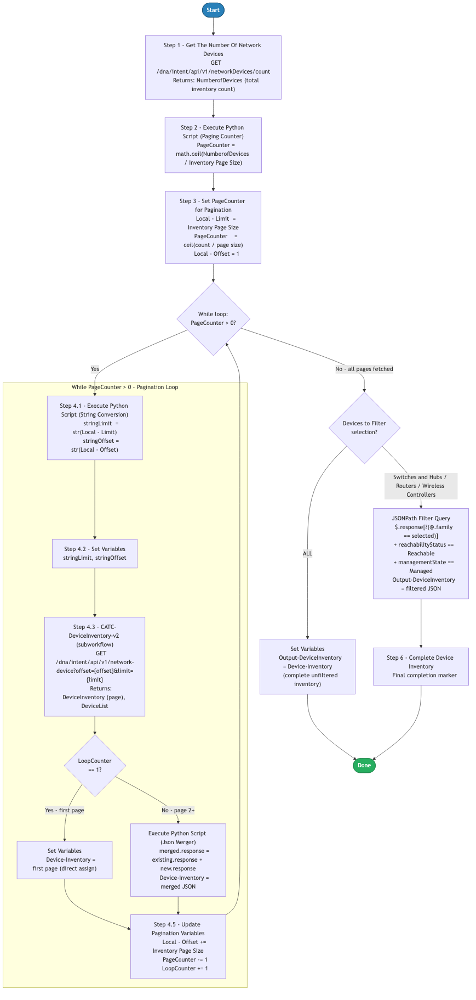

# 10.0 — Cisco Catalyst Center: Paginated Device Inventory

> **Workflow:** `CATC-PaginatedDeviceInventory.json`
> **Type:** Cisco Catalyst Center Generic Workflow (Intent API)
> **Subworkflows:** `CATC-DeviceInventory-v2`
> **API Endpoints:**
> &nbsp;&nbsp;`GET  /dna/intent/api/v1/networkDevices/count` — count total devices to size pagination
> &nbsp;&nbsp;`GET  /dna/intent/api/v1/network-device?offset={offset}&limit={limit}` — retrieve one page of the device inventory
> **Minimum Catalyst Center version:** 2.3.7.9
> **Authors:** Keith Baldwin — Solutions Engineer - Automation HyperSpecialist (kebaldwi@cisco.com)
> **Copyright © 2024–2026 Cisco Systems, Inc. All rights reserved.**

---

## Table of Contents

1. [Overview](#overview)
   - [What it does](#what-it-does)
   - [What makes this workflow different](#what-makes-this-workflow-different)
   - [Logical Flow](#logical-flow)
2. [Prerequisites](#prerequisites)
3. [Directory Structure](#directory-structure)
4. [Workflow Input Parameters](#workflow-input-parameters)
5. [Internal Working Variables](#internal-working-variables)
6. [How It Works](#how-it-works)
   - [Step 1 — Count Network Devices](#step-1--count-network-devices)
   - [Step 2 — Calculate Page Count](#step-2--calculate-page-count)
   - [Step 3 — Initialize Pagination Variables](#step-3--initialize-pagination-variables)
   - [Step 4 — Pagination While Loop](#step-4--pagination-while-loop)
   - [Step 5 — Apply Device Type Filter](#step-5--apply-device-type-filter)
   - [Step 6 — Complete Device Inventory](#step-6--complete-device-inventory)
7. [Subworkflow — CATC-DeviceInventory-v2](#subworkflow--catc-deviceinventory-v2)
8. [Output Data Structure](#output-data-structure)
9. [Running the Workflow](#running-the-workflow)
10. [Expected Output](#expected-output)
11. [Workflow Ordering Dependency](#workflow-ordering-dependency)
12. [Troubleshooting](#troubleshooting)
13. [Additional Notes](#additional-notes)

---

## Overview

This Cisco Catalyst Center workflow retrieves the **complete device inventory** from Catalyst Center by **paginating** through the Network Device API and merging every page into a single consolidated result. It is designed to be called as a reusable building block by higher-level workflows (such as Workflow 9.0 — Site Based Upgrade) that need a full, optionally filtered device list without being limited by API page-size constraints.

The workflow first counts the total number of devices, calculates how many pages are required for the configured page size, then loops — page by page — calling the `CATC-DeviceInventory-v2` subworkflow with the current `offset`/`limit` and concatenating each page's `response` array into a running accumulator. After all pages are retrieved, it applies an optional device-type filter and returns the final inventory as JSON.

### What it does

| Action | Mechanism |
|--------|-----------|
| Count total devices | `catalystcenter.invoke_api.countTheNumberOfNetworkDevices` — `GET /dna/intent/api/v1/networkDevices/count` |
| Calculate page count | `Execute Python Script` — `PageCounter = math.ceil(NumberofDevices / Inventory Page Size)` |
| Initialize pagination | `Set Variables` — `Local - Limit`, `PageCounter`, `Local - Offset = 1` |
| Loop through pages | `While` loop — condition `PageCounter > 0` |
| Stringify pagination params | `Execute Python Script` — `stringOffset`, `stringLimit` for URL construction |
| Retrieve one page | `CATC-DeviceInventory-v2` — `GET /dna/intent/api/v1/network-device?offset={o}&limit={l}` |
| Accumulate pages | `Condition` — first page assigns directly; pages 2+ merge via Python JSON concatenation |
| Advance pagination | `Set Variables` — `Offset += pageSize`, `PageCounter -= 1`, `LoopCounter += 1` |
| Apply device filter | `Condition` + `JSONPath Query` — `ALL` passthrough, or `family` + `reachabilityStatus` + `managementState` filter |
| Return inventory | `Set Variables` — `Output-DeviceInventory` (JSON) |

### What makes this workflow different

Unlike a single unpaginated `GET /dna/intent/api/v1/network-device` call, this workflow:

1. **Scales to any inventory size** — by counting devices first and computing the exact number of pages, it retrieves the full inventory regardless of total device count, avoiding truncated single-call responses.
2. **Configurable page size** — the `Inventory Page Size` input controls how many devices are requested per API call, allowing tuning between fewer large requests and more small requests.
3. **Deterministic merge logic** — the first page is assigned directly to the accumulator, and every subsequent page is merged by concatenating the `response` arrays, preserving a valid Catalyst Center response envelope (`{ "response": [...], "version": "1.0" }`).
4. **Built-in filtering** — an optional device-type filter is applied after retrieval, returning either the full inventory (`ALL`) or only devices of a selected `family` that are also `Reachable` and `Managed`.
5. **Reusable building block** — it is a self-contained subworkflow-style utility, consumed by other workflows (notably Workflow 9.0) that require a complete device list.
6. **Resilient API calls** — the `CATC-DeviceInventory-v2` subworkflow uses `continue_on_failure: true` so transient API issues on a single page do not abort the whole run.

### Logical Flow

The diagram below shows the count-then-paginate strategy, the `While PageCounter > 0` loop with its first-page-vs-merge branch, the pagination variable updates, and the final device-type filter branch:



> Source: [`DIAGRAMS/logical-flow.mmd`](DIAGRAMS/logical-flow.mmd) — re-render with:
> ```bash
> npx -y @mermaid-js/mermaid-cli -i DIAGRAMS/logical-flow.mmd -o DIAGRAMS/logical-flow.png -w 885 -b white
> ```

---

## Prerequisites

| Requirement | Notes |
|-------------|-------|
| Cisco Catalyst Center | >= 2.3.7.9 |
| `CATC-DeviceInventory-v2` subworkflow | Must be imported into the same Catalyst Center; this workflow calls it once per page |
| Catalyst Center API access | The Network Device and device count Intent API endpoints must be accessible and authenticated |
| Devices in inventory | One or more devices should be present for a meaningful result (an empty inventory returns an empty `response` array) |
| Sufficient privileges in CatC | User/service account must have permission to read the device inventory |

---

## Directory Structure

```
10.0 Cisco Catalyst Center: Paginated Device Inventory/
├── CATC-PaginatedDeviceInventory.json  # Catalyst Center workflow definition (import via CatC UI)
├── DIAGRAMS/
│   ├── logical-flow.mmd                # Mermaid diagram source — re-render with npx mermaid-cli
│   └── logical-flow.png                # Rendered flowchart (referenced by this README)
└── README.md                           # This document
```

---

## Workflow Input Parameters

These parameters are entered when the workflow is launched from the Catalyst Center UI, or passed in when it is called as a subworkflow.

| Parameter | Type | Default | Description |
|-----------|------|---------|-------------|
| `Inventory Page Size` | integer | `5` | Number of devices requested per API call (the pagination `limit`). Smaller values produce more, smaller requests; larger values produce fewer, larger requests. |
| `Devices to Filter` | table (enum) | `Switches and Hubs` | Device-type filter applied after retrieval. Options: `Switches and Hubs`, `Routers`, `Wireless Controllers`, `ALL`. `ALL` returns the complete inventory unfiltered. |

---

## Internal Working Variables

These variables are managed automatically by the workflow and are not entered by the user.

| Variable | Type | Initial | Purpose |
|----------|------|---------|---------|
| `PageCounter` | integer | `0` | Remaining pages to fetch; initialized to `ceil(count / pageSize)` and decremented each loop iteration. Loop exits at `0`. |
| `Local - Offset` | integer | `1` | Current pagination offset (1-based); incremented by `Inventory Page Size` each iteration. |
| `Local - Limit` | integer | `500` | Pagination limit per request; set from `Inventory Page Size` during initialization. |
| `LoopCounter` | integer | `1` | Iteration counter; `== 1` selects direct assignment, `> 1` selects JSON merge. |
| `stringOffset` | string | `""` | String form of the offset used to build the API query string. |
| `stringLimit` | string | `""` | String form of the limit used to build the API query string. |
| `Device-Inventory` | string (JSON) | `"[]"` | Accumulator holding the merged inventory across all pages. |
| `Output-DeviceInventory` | string (JSON) | `""` | **Final output** — complete (optionally filtered) device inventory returned to the caller. |

---

## How It Works

### Step 1 — Count Network Devices

The built-in action `countTheNumberOfNetworkDevices` calls the device count endpoint:

```
GET /dna/intent/api/v1/networkDevices/count
```

The returned total (`NumberofDevices`) is used to size the pagination loop. Timeout is 180 seconds.

---

### Step 2 — Calculate Page Count

A Python script computes the number of pages required using ceiling division:

```python
import math
PageCounter = math.ceil(NumberofDevices / Paging)   # Paging = Inventory Page Size
```

Example: 127 devices with a page size of 5 → `ceil(127 / 5)` = 26 pages.

---

### Step 3 — Initialize Pagination Variables

A `Set Variables` activity seeds the loop control variables:

| Variable | Value |
|----------|-------|
| `Local - Limit` | `Inventory Page Size` |
| `PageCounter` | calculated page count from Step 2 |
| `Local - Offset` | `1` |

---

### Step 4 — Pagination While Loop

A `While` loop runs while `PageCounter > 0`. Each iteration:

#### Activity 4.1 — Stringify Pagination Parameters

```python
stringLimit  = str(numericLimit)
stringOffset = str(numericOffset)
```

The Network Device API query string requires string values; this converts the integer `Local - Limit` and `Local - Offset` accordingly.

#### Activity 4.2 — Set Variables

Stores `stringLimit` and `stringOffset` for use by the subworkflow.

#### Activity 4.3 — CATC-DeviceInventory-v2 (Subworkflow)

```
GET /dna/intent/api/v1/network-device?offset={stringOffset}&limit={stringLimit}
```

Returns one page of devices as `DeviceInventory` (full envelope) and `DeviceList` (response array). See [Subworkflow — CATC-DeviceInventory-v2](#subworkflow--catc-deviceinventory-v2).

#### Activity 4.4 — Accumulate (First Page vs Merge)

A condition checks `LoopCounter`:

| Branch | Condition | Action |
|--------|-----------|--------|
| First page | `LoopCounter == 1` | `Device-Inventory` = current page (direct assignment) |
| Subsequent pages | `LoopCounter > 1` | JSON Merger Python script concatenates arrays |

The Json Merger script:

```python
import json
existing_json = json.loads(existing_inventory)
new_json      = json.loads(current_page)
merged = {
    "response": existing_json["response"] + new_json["response"],
    "version":  existing_json.get("version", "1.0"),
}
output_param = json.dumps(merged)
```

The result is stored back into `Device-Inventory`.

#### Activity 4.5 — Update Pagination Variables

```
Local - Offset += Inventory Page Size   # advance to next page
PageCounter    -= 1                      # one fewer page remaining
LoopCounter    += 1                      # track iteration
```

The loop repeats until `PageCounter` reaches `0`.

---

### Step 5 — Apply Device Type Filter

After all pages are merged, a condition evaluates the `Devices to Filter` input:

| Branch | Condition | Action |
|--------|-----------|--------|
| All devices | `Devices to Filter == "ALL"` | `Output-DeviceInventory = Device-Inventory` (unfiltered) |
| Filtered | `Devices to Filter in [Switches and Hubs, Routers, Wireless Controllers]` | JSONPath filter on `family`, then wrap in a response envelope |

The filtering JSONPath queries:

```
$.response.length()                                            → FullDeviceLength
$.response[?(@.family == '<selected>')]                        → FilteredDevices
$.response[?(@.family == '<selected>'
            && @.reachabilityStatus == 'Reachable'
            && @.managementState == 'Managed')]                → ReachableFilteredDevices
```

The filtered devices are assembled into the output envelope:

```json
{
  "response": [ /* filtered devices */ ],
  "version": "1.0"
}
```

---

### Step 6 — Complete Device Inventory

A final `Set Variables` activity acts as a completion marker. `Output-DeviceInventory` now holds the complete (or filtered) inventory and is returned to the caller.

---

## Subworkflow — CATC-DeviceInventory-v2

This subworkflow performs a single, pagination-aware device inventory request.

**Inputs**

| Name | Type | Default | Purpose |
|------|------|---------|---------|
| `Offset` | string | `"1"` | Starting position (1-based) |
| `Limit` | string | `"500"` | Maximum devices per request |

**Outputs**

| Name | Type | Purpose |
|------|------|---------|
| `DeviceInventory` | string (JSON) | Complete raw API response envelope |
| `DeviceList` | string (JSON) | Extracted `$.response` device array |

**Activities**

1. **Condition Block for API URI** — selects the endpoint form:
   - **Without pagination** (`Offset == 0/""` or `Limit == 0/""`): `/dna/intent/api/v1/network-device`
   - **With pagination** (`Offset` and `Limit` present): `/dna/intent/api/v1/network-device?offset={Offset}&limit={Limit}`
2. **Get Inventory** — `catalystcenter.invoke_api` `GET` against the resolved URI. Headers: `Accept: application/json`, `Content-Type: application/json`. `continue_on_failure: true`.
3. **Extract Device List** — JSONPath `$.response` → `Inventory`.
4. **Output** — sets `DeviceInventory` (full response) and `DeviceList` (`$.response`).

---

## Output Data Structure

The workflow returns `Output-DeviceInventory` as a JSON string with a standard Catalyst Center response envelope:

```json
{
  "response": [
    {
      "hostname": "C9300-ACCESS-01",
      "managementIpAddress": "10.10.10.11",
      "instanceUuid": "a1b2c3d4-0001-0001-0001-000000000001",
      "family": "Switches and Hubs",
      "series": "Cisco Catalyst 9300 Series Switches",
      "platformId": "C9300-48U",
      "softwareType": "IOS-XE",
      "softwareVersion": "17.9.4",
      "reachabilityStatus": "Reachable",
      "managementState": "Managed"
    }
  ],
  "version": "1.0"
}
```

**Key field notes:**

| Field | Notes |
|-------|-------|
| `response` | Array of device objects accumulated across all paginated calls. |
| `family` | Device family used by the optional filter (`Switches and Hubs`, `Routers`, `Wireless Controllers`). |
| `reachabilityStatus` | Filtered to `Reachable` when a device-type filter is applied. |
| `managementState` | Filtered to `Managed` when a device-type filter is applied. |
| `version` | Response envelope version, preserved/defaulted to `1.0` during merge. |

---

## Running the Workflow

### Import the Workflow

1. In Catalyst Center, navigate to **Platform → Workflow Manager**.
2. Click **Import** and upload `CATC-PaginatedDeviceInventory.json`.
3. Ensure the `CATC-DeviceInventory-v2` subworkflow is also imported.
4. The workflow appears as **CATC-PaginatedDeviceInventory** in the workflow list.

### Execute the Workflow

1. Click **Run** on the imported workflow.
2. Select the **Catalyst Center target** when prompted.
3. Fill in the input parameters:
   - **Inventory Page Size:** `5` (adjust for tuning)
   - **Devices to Filter:** `Switches and Hubs` (or `Routers`, `Wireless Controllers`, `ALL`)
4. Click **Execute**.
5. Monitor progress in **Workflow Executions** → **Execution Details**.

### Call as a Subworkflow

This workflow is most commonly invoked by another workflow (e.g., Workflow 9.0 — Site Based Upgrade) that passes a page size and device-type filter and consumes the returned `Output-DeviceInventory`.

---

## Expected Output

A successful run produces the following sequence in the workflow execution log:

```
Step 1       Device count retrieved: NumberofDevices = 127
Step 2       Python script: PageCounter = ceil(127 / 5) = 26
Step 3       Pagination initialized: Limit = 5, Offset = 1, PageCounter = 26
Step 4       While loop start (PageCounter > 0)
             Iteration 1:  offset=1,  limit=5  → 5 devices  (first page, direct assign)
             Iteration 2:  offset=6,  limit=5  → 5 devices  (merged)
             Iteration 3:  offset=11, limit=5  → 5 devices  (merged)
             ...
             Iteration 26: offset=126,limit=5  → 2 devices  (merged)
             Loop exit: PageCounter = 0
             Device-Inventory: 127 devices accumulated
Step 5       Devices to Filter = Switches and Hubs
             JSONPath filter applied: family == 'Switches and Hubs'
                                      && reachabilityStatus == 'Reachable'
                                      && managementState == 'Managed'
             Filtered result: 84 devices
Step 6       Output-DeviceInventory populated ✓
Completed    Paginated device inventory retrieved successfully
```

---

## Workflow Ordering Dependency

This workflow is a **reusable inventory utility**. It has no site/template prerequisites of its own, but it is consumed by higher-level workflows that need a complete device list.

| Workflow | Purpose | Depends on | Consumed by |
|----------|---------|------------|-------------|
| `CATC-DeviceInventory-v2` | Single pagination-aware device request | — | **This workflow** |
| **10.0 — This workflow** | Full paginated, filtered device inventory | `CATC-DeviceInventory-v2` | Workflow 9.0 — Site Based Upgrade |
| 9.0 — Site Based Upgrade | Site/device software upgrade orchestration | 10.0 (and others) | — |

---

## Troubleshooting

| Symptom | Likely Cause | Resolution |
|---------|-------------|------------|
| `Device count returns 0 — loop never runs` | No devices in inventory, or count endpoint unreachable | Verify devices exist in Catalyst Center and that `GET /dna/intent/api/v1/networkDevices/count` is reachable. |
| `Workflow runs but only the first page is returned` | `CATC-DeviceInventory-v2` not imported, or merge branch failing | Confirm the subworkflow is imported. Check the Json Merger script step for JSON parse errors in the execution log. |
| `Output contains duplicate or missing devices` | Inventory changed mid-run (devices added/removed) | Re-run the workflow. Pagination is a point-in-time snapshot; concurrent inventory changes can shift offsets. |
| `Filter returns empty result` | Selected `Devices to Filter` family has no `Reachable`/`Managed` devices | Verify devices of the selected family are reachable and managed, or select `ALL` to bypass the filter. |
| `JSON merge fails — invalid response` | A page response lacked a `response` key (API error on that page) | The subworkflow uses `continue_on_failure: true`; inspect the failing page in the log and verify API stability. |
| `Run is slow with large inventories` | Page size too small produces many sequential requests | Increase `Inventory Page Size` to reduce the number of API round-trips. |

---

## Additional Notes

- **Page size vs request count tradeoff:** A larger `Inventory Page Size` reduces the number of API calls (fewer loop iterations) at the cost of larger individual responses; a smaller size does the opposite. Tune to your environment.
- **1-based offset:** The pagination offset starts at `1` and advances by the page size each iteration, matching the Catalyst Center Network Device API convention.
- **Response envelope preserved:** The merge logic always emits a `{ "response": [...], "version": "1.0" }` envelope so downstream consumers can parse the output consistently.
- **Filter is post-retrieval:** All devices are fetched first, then filtered. The full inventory is always assembled in `Device-Inventory` before the `Devices to Filter` branch runs.
- **Reusable design:** Keep this workflow and `CATC-DeviceInventory-v2` imported together so any consuming workflow (such as 9.0) can call it without modification.
