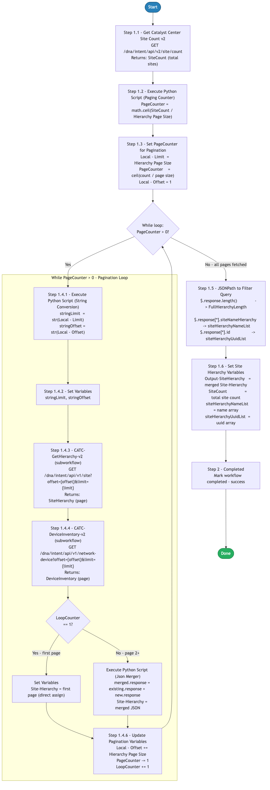

# 11.0 — Cisco Catalyst Center: Paginated Site Hierarchy

> **Workflow:** `CATC-PaginatedSiteHierarchy.json`
> **Type:** Cisco Catalyst Center Generic Workflow (Intent API)
> **Subworkflows:** `CATC-GetHierarchy-v2`, `CATC-DeviceInventory-v2`
> **API Endpoints:**
> &nbsp;&nbsp;`GET  /dna/intent/api/v2/site/count` — count total sites to size pagination
> &nbsp;&nbsp;`GET  /dna/intent/api/v1/site?offset={offset}&limit={limit}` — retrieve one page of the site hierarchy
> &nbsp;&nbsp;`GET  /dna/intent/api/v1/network-device?offset={offset}&limit={limit}` — retrieve one page of the device inventory
> **Minimum Catalyst Center version:** 2.3.7.9
> **Authors:** Keith Baldwin — Solutions Engineer - Automation HyperSpecialist (kebaldwi@cisco.com)
> **Copyright © 2024–2026 Cisco Systems, Inc. All rights reserved.**

---

## Table of Contents

1. [Overview](#overview)
   - [What it does](#what-it-does)
   - [What makes this workflow different](#what-makes-this-workflow-different)
   - [Logical Flow](#logical-flow)
2. [Prerequisites](#prerequisites)
3. [Directory Structure](#directory-structure)
4. [Workflow Input Parameters](#workflow-input-parameters)
5. [Output Parameters](#output-parameters)
6. [Internal Working Variables](#internal-working-variables)
7. [How It Works](#how-it-works)
   - [Step 1 — Get Site Count](#step-1--get-site-count)
   - [Step 2 — Calculate Page Count](#step-2--calculate-page-count)
   - [Step 3 — Initialize Pagination Variables](#step-3--initialize-pagination-variables)
   - [Step 4 — Pagination While Loop](#step-4--pagination-while-loop)
   - [Step 5 — Extract Hierarchy Fields](#step-5--extract-hierarchy-fields)
   - [Step 6 — Set Output Variables](#step-6--set-output-variables)
8. [Subworkflows](#subworkflows)
9. [Output Data Structure](#output-data-structure)
10. [Running the Workflow](#running-the-workflow)
11. [Expected Output](#expected-output)
12. [Workflow Ordering Dependency](#workflow-ordering-dependency)
13. [Troubleshooting](#troubleshooting)
14. [Additional Notes](#additional-notes)

---

## Overview

This Cisco Catalyst Center workflow retrieves the **complete site hierarchy** from Catalyst Center by **paginating** through the Site API and merging every page into a single consolidated result. Alongside the site hierarchy, it also retrieves a page of device inventory each iteration (via `CATC-DeviceInventory-v2`), keeping the pagination cadence aligned across both data sets. It is designed to be a reusable building block for higher-level workflows that need a full list of sites — by name hierarchy and by UUID — without being limited by API page-size constraints.

The workflow first counts the total number of sites, calculates how many pages are required for the configured page size, then loops — page by page — calling the `CATC-GetHierarchy-v2` subworkflow with the current `offset`/`limit` and concatenating each page's `response` array into a running accumulator. After all pages are retrieved, it extracts the site name list and site UUID list with JSONPath queries and returns them along with the full merged hierarchy and total site count.

### What it does

| Action | Mechanism |
|--------|-----------|
| Count total sites | `catalystcenter.invoke_api.getSiteCount` — `GET /dna/intent/api/v2/site/count` |
| Calculate page count | `Execute Python Script` — `PageCounter = math.ceil(SiteCount / Hierarchy Page Size)` |
| Initialize pagination | `Set Variables` — `Local - Limit`, `PageCounter`, `Local - Offset = 1` |
| Loop through pages | `While` loop — condition `PageCounter > 0` |
| Stringify pagination params | `Execute Python Script` — `stringOffset`, `stringLimit` for URL construction |
| Retrieve one site page | `CATC-GetHierarchy-v2` — `GET /dna/intent/api/v1/site?offset={o}&limit={l}` |
| Retrieve one device page | `CATC-DeviceInventory-v2` — `GET /dna/intent/api/v1/network-device?offset={o}&limit={l}` |
| Accumulate pages | `Condition` — first page assigns directly; pages 2+ merge via Python JSON concatenation |
| Advance pagination | `Set Variables` — `Offset += pageSize`, `PageCounter -= 1`, `LoopCounter += 1` |
| Extract name/UUID lists | `JSONPath Query` — `siteNameHierarchy` and `id` arrays |
| Return results | `Set Variables` — `Output-SiteHierarchy`, `SiteCount`, `siteHierarchyNameList`, `siteHierarchyUuidList` |

### What makes this workflow different

Unlike a single unpaginated `GET /dna/intent/api/v1/site` call, this workflow:

1. **Scales to any hierarchy size** — by counting sites first and computing the exact number of pages, it retrieves the full hierarchy regardless of total site count, avoiding truncated single-call responses.
2. **Configurable page size** — the `Hierarchy Page Size` input controls how many sites are requested per API call, allowing tuning between fewer large requests and more small requests.
3. **Deterministic merge logic** — the first page is assigned directly to the accumulator, and every subsequent page is merged by concatenating the `response` arrays, preserving a valid Catalyst Center response envelope (`{ "response": [...], "version": "1.0" }`).
4. **Ready-to-consume outputs** — beyond the raw merged JSON, the workflow emits a `siteHierarchyNameList` (e.g., `Global/Campus/Building/Floor`) and a matching `siteHierarchyUuidList`, so consumers can use either friendly names or UUIDs directly.
5. **Aligned device retrieval** — each loop iteration also pulls a device inventory page using the same `offset`/`limit`, keeping site and device pagination synchronized for workflows that correlate the two.
6. **Reusable building block** — it is a self-contained subworkflow-style utility consumed by other workflows that require a complete site list.

### Logical Flow

The diagram below shows the count-then-paginate strategy, the `While PageCounter > 0` loop with its dual subworkflow calls and first-page-vs-merge branch, the pagination variable updates, and the final JSONPath extraction of name/UUID lists:



> Source: [`DIAGRAMS/logical-flow.mmd`](DIAGRAMS/logical-flow.mmd) — re-render with:
> ```bash
> npx -y @mermaid-js/mermaid-cli -i DIAGRAMS/logical-flow.mmd -o DIAGRAMS/logical-flow.png -w 885 -b white
> ```

---

## Prerequisites

| Requirement | Notes |
|-------------|-------|
| Cisco Catalyst Center | >= 2.3.7.9 |
| Workflow 1.0 — Site Hierarchy | A site hierarchy must exist in Catalyst Center for this workflow to return meaningful results |
| `CATC-GetHierarchy-v2` subworkflow | Must be imported into the same Catalyst Center; this workflow calls it once per page |
| `CATC-DeviceInventory-v2` subworkflow | Must be imported; called once per page alongside the hierarchy retrieval |
| Catalyst Center API access | The Site, site count, and Network Device Intent API endpoints must be accessible and authenticated |
| Sufficient privileges in CatC | User/service account must have permission to read the site hierarchy and device inventory |

---

## Directory Structure

```
11.0 Cisco Catalyst Center: Paginated Site Hierarchy/
├── CATC-PaginatedSiteHierarchy.json    # Catalyst Center workflow definition (import via CatC UI)
├── DIAGRAMS/
│   ├── logical-flow.mmd                # Mermaid diagram source — re-render with npx mermaid-cli
│   └── logical-flow.png                # Rendered flowchart (referenced by this README)
└── README.md                           # This document
```

---

## Workflow Input Parameters

These parameters are entered when the workflow is launched from the Catalyst Center UI, or passed in when it is called as a subworkflow.

| Parameter | Type | Default | Description |
|-----------|------|---------|-------------|
| `Hierarchy Page Size` | integer | `5` | Number of sites requested per API call (the pagination `limit`). Smaller values produce more, smaller requests; larger values produce fewer, larger requests. |

---

## Output Parameters

These values are produced by the workflow and made available to the caller.

| Output | Type | Description |
|--------|------|-------------|
| `Output-SiteHierarchy` | string (JSON) | Complete merged site hierarchy response envelope across all pages. |
| `SiteCount` | integer | Total number of sites (from the site count endpoint). |
| `siteHierarchyNameList` | array | List of site name hierarchies, e.g., `Global/Campus/Building/Floor`. |
| `siteHierarchyUuidList` | array | List of site UUID identifiers, index-aligned with `siteHierarchyNameList`. |

---

## Internal Working Variables

These variables are managed automatically by the workflow and are not entered by the user.

| Variable | Type | Initial | Purpose |
|----------|------|---------|---------|
| `PageCounter` | integer | `0` | Remaining pages to fetch; initialized to `ceil(count / pageSize)` and decremented each loop iteration. Loop exits at `0`. |
| `Local - Offset` | integer | `1` | Current pagination offset (1-based); incremented by `Hierarchy Page Size` each iteration. |
| `Local - Limit` | integer | `500` | Pagination limit per request; set from `Hierarchy Page Size` during initialization. |
| `LoopCounter` | integer | `1` | Iteration counter; `== 1` selects direct assignment, `> 1` selects JSON merge. |
| `stringOffset` | string | `""` | String form of the offset used to build the API query string. |
| `stringLimit` | string | `""` | String form of the limit used to build the API query string. |
| `Site-Hierarchy` | string (JSON) | `"[]"` | Accumulator holding the merged hierarchy across all pages. |

---

## How It Works

### Step 1 — Get Site Count

The built-in action `getSiteCount` calls the site count endpoint:

```
GET /dna/intent/api/v2/site/count
```

The returned total (`SiteCount`) is used to size the pagination loop. Timeout is 180 seconds.

---

### Step 2 — Calculate Page Count

A Python script computes the number of pages required using ceiling division:

```python
import math
PageCounter = math.ceil(NumberofDevices / Paging)   # NumberofDevices = SiteCount, Paging = Hierarchy Page Size
```

Example: 12 sites with a page size of 5 → `ceil(12 / 5)` = 3 pages.

---

### Step 3 — Initialize Pagination Variables

A `Set Variables` activity seeds the loop control variables:

| Variable | Value |
|----------|-------|
| `Local - Limit` | `Hierarchy Page Size` |
| `PageCounter` | calculated page count from Step 2 |
| `Local - Offset` | `1` |

---

### Step 4 — Pagination While Loop

A `While` loop runs while `PageCounter > 0`. Each iteration:

#### Activity 4.1 — Stringify Pagination Parameters

```python
stringLimit  = str(numericLimit)
stringOffset = str(numericOffset)
```

The Site and Network Device API query strings require string values; this converts the integer `Local - Limit` and `Local - Offset` accordingly.

#### Activity 4.2 — Set Variables

Stores `stringLimit` and `stringOffset` for use by the subworkflows.

#### Activity 4.3 — CATC-GetHierarchy-v2 (Subworkflow)

```
GET /dna/intent/api/v1/site?offset={stringOffset}&limit={stringLimit}
```

Returns one page of sites as `SiteHierarchy`. See [Subworkflows](#subworkflows).

#### Activity 4.4 — CATC-DeviceInventory-v2 (Subworkflow)

```
GET /dna/intent/api/v1/network-device?offset={stringOffset}&limit={stringLimit}
```

Returns one page of devices as `DeviceInventory`, retrieved at the same pagination cadence as the hierarchy.

#### Activity 4.5 — Accumulate (First Page vs Merge)

A condition checks `LoopCounter`:

| Branch | Condition | Action |
|--------|-----------|--------|
| First page | `LoopCounter == 1` | `Site-Hierarchy` = current page (direct assignment) |
| Subsequent pages | `LoopCounter > 1` | JSON Merger Python script concatenates arrays |

The Json Merger script:

```python
import json
existing_json = json.loads(existing_hierarchy)
new_json      = json.loads(current_page)
merged = {
    "response": existing_json["response"] + new_json["response"],
    "version":  existing_json.get("version", "1.0"),
}
output_param = json.dumps(merged)
```

The result is stored back into `Site-Hierarchy`.

#### Activity 4.6 — Update Pagination Variables

```
Local - Offset += Hierarchy Page Size   # advance to next page
PageCounter    -= 1                      # one fewer page remaining
LoopCounter    += 1                      # track iteration
```

The loop repeats until `PageCounter` reaches `0`.

---

### Step 5 — Extract Hierarchy Fields

After all pages are merged, a JSONPath query extracts the consumable lists from `Site-Hierarchy`:

```
$.response.length()              → FullHierarchyLength
$.response[*].siteNameHierarchy  → siteHierarchyNameList
$.response[*].id                 → siteHierarchyUuidList
```

---

### Step 6 — Set Output Variables

A `Set Variables` activity populates the final outputs:

| Output | Source |
|--------|--------|
| `Output-SiteHierarchy` | merged `Site-Hierarchy` |
| `SiteCount` | site count from Step 1 |
| `siteHierarchyNameList` | JSONPath name array from Step 5 |
| `siteHierarchyUuidList` | JSONPath UUID array from Step 5 |

The workflow then reaches the **Completed** activity (success).

---

## Subworkflows

### CATC-GetHierarchy-v2

Performs a single, pagination-aware site hierarchy request.

**Inputs**

| Name | Type | Default | Purpose |
|------|------|---------|---------|
| `Offset` | string | `"1"` | Starting position (1-based) |
| `Limit` | string | `"500"` | Maximum sites per request |

**Outputs**

| Name | Type | Purpose |
|------|------|---------|
| `SiteHierarchy` | string (JSON) | Complete raw site API response envelope |
| `SiteNameList` | string (JSON) | List of site names (not consumed by the main workflow) |

**Activities**

1. **Condition Block for API URI** — selects the endpoint form:
   - **Without pagination** (`Offset == 0/""` or `Limit == 0/""`): `/dna/intent/api/v1/site`
   - **With pagination** (`Offset` and `Limit` present): `/dna/intent/api/v1/site?offset={Offset}&limit={Limit}`
2. **Get Site Hierarchy** — `catalystcenter.invoke_api` `GET` against the resolved URI. Headers: `Accept: application/json`, `Content-Type: application/json`. Timeout 180 s. `continue_on_failure: true`.
3. **JSONPath Query** — extracts `$.response`, `$.response[*].id`, `$.response[*].siteNameHierarchy`.
4. **Output** — sets `SiteHierarchy`.

### CATC-DeviceInventory-v2

Performs a single, pagination-aware device inventory request (same subworkflow used by Workflow 10.0).

**Inputs**

| Name | Type | Default | Purpose |
|------|------|---------|---------|
| `Offset` | string | `"1"` | Starting position (1-based) |
| `Limit` | string | `"500"` | Maximum devices per request |

**Outputs**

| Name | Type | Purpose |
|------|------|---------|
| `DeviceInventory` | string (JSON) | Complete raw device API response envelope |
| `DeviceList` | string (JSON) | Extracted `$.response` device array |

**Activities**

1. **Condition Block for API URI** — `/dna/intent/api/v1/network-device` with or without `?offset={Offset}&limit={Limit}`.
2. **Get Inventory** — `catalystcenter.invoke_api` `GET`. `continue_on_failure: true`.
3. **JSONPath Query** — `$.response` → `Inventory`.
4. **Output** — sets `DeviceInventory` and `DeviceList`.

---

## Output Data Structure

`Output-SiteHierarchy` is returned as a JSON string with a standard Catalyst Center response envelope:

```json
{
  "response": [
    {
      "id": "a1b2c3d4-0001-0001-0001-000000000001",
      "siteNameHierarchy": "Global/Campus/Building-1/Floor-1",
      "name": "Floor-1",
      "siteHierarchy": "Global/.../...",
      "parentId": "a1b2c3d4-0001-0001-0001-000000000000"
    }
  ],
  "version": "1.0"
}
```

The derived list outputs are index-aligned:

```jsonc
// siteHierarchyNameList
[ "Global/Campus/Building-1", "Global/Campus/Building-1/Floor-1" ]

// siteHierarchyUuidList
[ "a1b2c3d4-...-0000", "a1b2c3d4-...-0001" ]
```

**Key field notes:**

| Field | Notes |
|-------|-------|
| `response` | Array of site objects accumulated across all paginated calls. |
| `siteNameHierarchy` | Human-readable path used to build `siteHierarchyNameList`. |
| `id` | Site UUID used to build `siteHierarchyUuidList`. |
| `version` | Response envelope version, preserved/defaulted to `1.0` during merge. |

---

## Running the Workflow

### Import the Workflow

1. In Catalyst Center, navigate to **Platform → Workflow Manager**.
2. Click **Import** and upload `CATC-PaginatedSiteHierarchy.json`.
3. Ensure the `CATC-GetHierarchy-v2` and `CATC-DeviceInventory-v2` subworkflows are also imported.
4. The workflow appears as **CATC-PaginatedSiteHierarchy** in the workflow list.

### Execute the Workflow

1. Click **Run** on the imported workflow.
2. Select the **Catalyst Center target** when prompted.
3. Fill in the input parameters:
   - **Hierarchy Page Size:** `5` (adjust for tuning)
4. Click **Execute**.
5. Monitor progress in **Workflow Executions** → **Execution Details**.

### Call as a Subworkflow

This workflow can be invoked by another workflow that needs a complete site list. The caller consumes `siteHierarchyNameList` and `siteHierarchyUuidList` (or the full `Output-SiteHierarchy`).

---

## Expected Output

A successful run produces the following sequence in the workflow execution log:

```
Step 1       Site count retrieved: SiteCount = 12
Step 2       Python script: PageCounter = ceil(12 / 5) = 3
Step 3       Pagination initialized: Limit = 5, Offset = 1, PageCounter = 3
Step 4       While loop start (PageCounter > 0)
             Iteration 1: offset=1,  limit=5 → 5 sites  (first page, direct assign)
                          + device page retrieved (offset=1, limit=5)
             Iteration 2: offset=6,  limit=5 → 5 sites  (merged)
                          + device page retrieved (offset=6, limit=5)
             Iteration 3: offset=11, limit=5 → 2 sites  (merged)
                          + device page retrieved (offset=11, limit=5)
             Loop exit: PageCounter = 0
             Site-Hierarchy: 12 sites accumulated
Step 5       JSONPath extraction:
             FullHierarchyLength = 12
             siteHierarchyNameList = [Global/Campus, Global/Campus/Building-1, ...]
             siteHierarchyUuidList = [<uuid-1>, <uuid-2>, ...]
Step 6       Outputs set: Output-SiteHierarchy, SiteCount=12, name list, uuid list ✓
Completed    Paginated site hierarchy retrieved successfully
```

---

## Workflow Ordering Dependency

This workflow is a **reusable hierarchy utility**. It requires a site hierarchy to exist (Workflow 1.0), and it is consumed by higher-level workflows that need a complete site list.

| Workflow | Purpose | Depends on | Consumed by |
|----------|---------|------------|-------------|
| 1.0 — Site Hierarchy | Creates Area / Building / Floor hierarchy | — | This workflow (provides the sites to retrieve) |
| `CATC-GetHierarchy-v2` | Single pagination-aware site request | — | **This workflow** |
| `CATC-DeviceInventory-v2` | Single pagination-aware device request | — | **This workflow** |
| **11.0 — This workflow** | Full paginated site hierarchy with name/UUID lists | 1.0, `CATC-GetHierarchy-v2`, `CATC-DeviceInventory-v2` | Higher-level site-driven workflows |

---

## Troubleshooting

| Symptom | Likely Cause | Resolution |
|---------|-------------|------------|
| `Site count returns 0 — loop never runs` | No site hierarchy defined, or count endpoint unreachable | Run Workflow 1.0 to create a hierarchy. Verify `GET /dna/intent/api/v2/site/count` is reachable. |
| `Workflow runs but only the first page is returned` | `CATC-GetHierarchy-v2` not imported, or merge branch failing | Confirm the subworkflow is imported. Check the Json Merger script step for JSON parse errors in the execution log. |
| `siteHierarchyNameList / UuidList empty` | JSONPath extraction ran against an empty or malformed `Site-Hierarchy` | Verify pages merged correctly in Step 4; inspect `Output-SiteHierarchy` for a populated `response` array. |
| `Name and UUID lists are misaligned` | Hierarchy changed mid-run (sites added/removed) | Re-run the workflow. Pagination is a point-in-time snapshot; concurrent changes can shift offsets. |
| `JSON merge fails — invalid response` | A page response lacked a `response` key (API error on that page) | The subworkflows use `continue_on_failure: true`; inspect the failing page in the log and verify API stability. |
| `Run is slow with large hierarchies` | Page size too small produces many sequential requests | Increase `Hierarchy Page Size` to reduce the number of API round-trips. |

---

## Additional Notes

- **Page size vs request count tradeoff:** A larger `Hierarchy Page Size` reduces the number of API calls (fewer loop iterations) at the cost of larger individual responses; a smaller size does the opposite. Tune to your environment.
- **1-based offset:** The pagination offset starts at `1` and advances by the page size each iteration, matching the Catalyst Center Site API convention.
- **Response envelope preserved:** The merge logic always emits a `{ "response": [...], "version": "1.0" }` envelope so downstream consumers can parse the output consistently.
- **Dual retrieval:** Each iteration also pulls a device inventory page via `CATC-DeviceInventory-v2`; only the site hierarchy is surfaced in the outputs, but the aligned device pagination is available for workflows that correlate sites and devices.
- **Two consumable formats:** Use `siteHierarchyNameList` for human-readable site paths or `siteHierarchyUuidList` for API calls that require site IDs — the two are index-aligned.
- **Reusable design:** Keep this workflow and its two subworkflows imported together so any consuming workflow can call it without modification.
