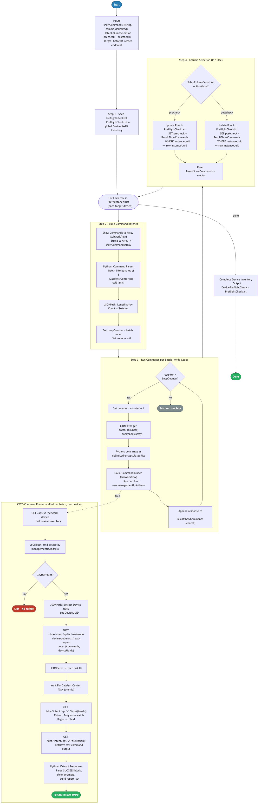

# 12.0 — Cisco Catalyst Center: Bulk Command Runner

> **Workflow:** `CATC-MultipleShowCommands.json` (`CATC-MultipleShowCommands-v3`)
> **Type:** Cisco Catalyst Center Generic Workflow (Intent API)
> **Subworkflows:** `CATC-CommandRunner`, `String to Array`, `Wait For Catalyst Center Task`
> **API Endpoints:**
> &nbsp;&nbsp;`GET  /api/v1/network-device` — full device inventory (used to resolve managementIpAddress → instanceUuid)
> &nbsp;&nbsp;`POST /dna/intent/api/v1/network-device-poller/cli/read-request` — submit a batch of show commands against one device
> &nbsp;&nbsp;`GET  /dna/intent/api/v1/task/{taskId}` — poll task progress and extract the result file ID
> &nbsp;&nbsp;`GET  /dna/intent/api/v1/file/{fileId}` — retrieve the raw command-output file
> **Minimum Catalyst Center version:** 2.3.7.9
> **Authors:** Keith Baldwin — Solutions Engineer - Automation HyperSpecialist (kebaldwi@cisco.com)
> **Copyright © 2024–2026 Cisco Systems, Inc. All rights reserved.**

---

## Table of Contents

1. [Overview](#overview)
   - [What it does](#what-it-does)
   - [What makes this workflow different](#what-makes-this-workflow-different)
   - [Logical Flow](#logical-flow)
2. [Prerequisites](#prerequisites)
3. [Directory Structure](#directory-structure)
4. [Workflow Input Parameters](#workflow-input-parameters)
5. [Internal Working Variables](#internal-working-variables)
6. [How It Works](#how-it-works)
   - [Step 1 — Seed PreflightChecklist](#step-1--seed-preflightchecklist)
   - [Step 2 — Build Command Batches](#step-2--build-command-batches)
   - [Step 3 — Run Commands per Batch (While Loop)](#step-3--run-commands-per-batch-while-loop)
   - [Step 4 — Column Selection (Pre-check / Post-check)](#step-4--column-selection-pre-check--post-check)
   - [Complete Device Inventory](#complete-device-inventory)
7. [Command Runner API Payload Reference](#command-runner-api-payload-reference)
8. [Subworkflows](#subworkflows)
9. [Running the Workflow](#running-the-workflow)
10. [Expected Output](#expected-output)
11. [Workflow Ordering Dependency](#workflow-ordering-dependency)
12. [Troubleshooting](#troubleshooting)
13. [Additional Notes](#additional-notes)

---

## Overview

This Cisco Catalyst Center workflow is a **bulk diagnostic show-command runner** built as a reusable subworkflow. It iterates over the shared global **Device SWIM Inventory** table, breaks the operator-supplied list of show commands into batches of five (the Catalyst Center per-call limit), runs each batch against every targeted device through `CATC-CommandRunner`, and writes the consolidated output back into either the `precheck` or `postcheck` column of the table.

It is the engine behind the pre-check and post-check diagnostics in Workflow 9.0 (Site Based Upgrade), but it can be called from any workflow that populates the global **Device SWIM Inventory** table with target devices. The result is a single, structured table that holds the original device attributes alongside the show-command output captured before and/or after a change — ready for side-by-side comparison.

### What it does

| Action | Mechanism |
|--------|-----------|
| Seed working table | `Set Variables` — `PreflightChecklist = global Device SWIM Inventory` |
| Iterate devices | `For Each` over `PreflightChecklist` rows |
| Normalise commands | `String to Array` (subworkflow) → `showCommandsArray` |
| Batch commands | Python `Command Parser` — chunks of 5 (Catalyst Center limit) |
| Size loop | `JSONPath` `$.length()` → `LoopCounter`; `counter = 0` |
| Iterate batches | `While Loop` (`counter < LoopCounter`) — increments and indexes `batch_{n}` |
| Format commands | Python — join array into `"cmd1","cmd2",…` for the API body |
| Run on device | `CATC-CommandRunner` — `POST /network-device-poller/cli/read-request` → task → file |
| Aggregate output | `Set Variables` — `ResultShowCommands = ResultShowCommands + batch result` |
| Write to column | `Update Row in Table` — `precheck` **or** `postcheck` `WHERE instanceUuid == row.instanceUuid` |
| Reset for next device | `Set Variables` — `ResultShowCommands = ""` |
| Publish output | `Set Variables` — `DevicePreflightCheck = PreflightChecklist` |

### What makes this workflow different

Unlike running show commands manually device-by-device, or wrapping a single `CommandRunner` call, this workflow:

1. **Honors the Catalyst Center 5-command-per-call limit** — the Python `Command Parser` automatically chunks the operator-supplied command list into batches of five, and a `While Loop` walks each batch so the operator can submit a long, freeform list without worrying about API constraints.
2. **Operates on a shared inventory table** — the global **Device SWIM Inventory** table is the single source of truth: input device attributes (`hostname`, `managementIpAddress`, `instanceUuid`, `platformId`, `series`, `softwareVersion`, …) and output (`precheck`, `postcheck`) live in one row, keyed by `instanceUuid`.
3. **Writes results column-selectively** — a single input flag (`TableColumnSelection` = `precheck` or `postcheck`) drives which column is populated, so the same workflow run gives you the pre-change baseline on the first pass and the post-change comparison on the second pass.
4. **Cleans and structures raw CLI output** — `CATC-CommandRunner`'s embedded Python parser strips command echoes and prompt lines, recognises commands with no matching output (`No-Matching-Output`), and emits a uniform `report_str` per device so the table is readable rather than raw.
5. **Accepts loose input formats** — `String to Array` normalises Python/JSON list literals, quoted CSV, and newline-separated values, so the same `showCommands` blob works whether the operator pastes a comma-list, a JSON array, or one command per line.
6. **Pluggable into any upgrade or change workflow** — any parent workflow that populates the global **Device SWIM Inventory** table and supplies `showCommands` + `TableColumnSelection` can call this workflow to capture pre/post diagnostics.

### Logical Flow

The diagram below shows the per-device iteration, the command-batching pipeline, the `While Loop` that drives `CATC-CommandRunner` per batch, the precheck/postcheck column-selection branch, and the embedded `CATC-CommandRunner` subworkflow that resolves the device UUID, submits the batch, waits on the task, and extracts the result file:



> Source: [`DIAGRAMS/logical-flow.mmd`](DIAGRAMS/logical-flow.mmd) — re-render with:
> ```bash
> npx -y @mermaid-js/mermaid-cli -i DIAGRAMS/logical-flow.mmd -o DIAGRAMS/logical-flow.png -w 1100 -b white
> ```

---

## Prerequisites

| Requirement | Notes |
|-------------|-------|
| Cisco Catalyst Center | >= 2.3.7.9 |
| Global `Device SWIM Inventory` table | Must be populated by the parent workflow with `hostname`, `instanceUuid`, `managementIpAddress`, `platformId`, `series`, `softwareType`, `softwareVersion`, `type` |
| `CATC-CommandRunner` subworkflow | Bundled in this workflow's JSON — imported automatically on first import |
| `String to Array` atomic workflow | Bundled — normalises the `showCommands` string into an array |
| `Wait For Catalyst Center Task` atomic workflow | Used by `CATC-CommandRunner` to poll the read-request task |
| Devices discovered, reachable, managed | The Command Runner API requires the device to be present in inventory and reachable |
| Command Runner enabled in Catalyst Center | The `/network-device-poller/cli/read-request` endpoint must be available and the runtime user must have permission to call it |

---

## Directory Structure

```
12.0 Cisco Catalyst Center: Bulk Command Runner/
├── CATC-MultipleShowCommands.json   # Catalyst Center workflow definition (import via CatC UI)
├── DIAGRAMS/
│   ├── logical-flow.mmd             # Mermaid diagram source — re-render with npx mermaid-cli
│   └── logical-flow.png             # Rendered flowchart (referenced by this README)
└── README.md                        # This document
```

---

## Workflow Input Parameters

This workflow is normally invoked **as a subworkflow** (e.g., from Workflow 9.0). When called directly its inputs are:

| Input | Type | Required | Description |
|-------|------|----------|-------------|
| `showCommands` | string | Yes | The diagnostic show commands to run, in any of the supported formats — quoted CSV, JSON/Python list literal, or newline-separated. Example: `"show version | inc INSTALL","show boot system","dir | inc free"`. |
| `TableColumnSelection` | table (single-row dropdown) | No (default behaviour is column-selective) | Single-row table whose `optionValue` is either `precheck` or `postcheck` — drives which column of `PreflightChecklist` is updated. |
| Catalyst Center target | endpoint | Yes | Selected on workflow start; passed through to `CATC-CommandRunner`. |
| Global `Device SWIM Inventory` (table) | global | Yes | Read at Step 1 and used as the iteration source; updated rows are published back at the end. |

> **Note:** When called as a subworkflow, the parent workflow supplies `showCommands` and `TableColumnSelection` and the global **Device SWIM Inventory** table is shared automatically across the chain.

---

## Internal Working Variables

These variables are managed automatically by the workflow.

| Variable | Scope | Purpose |
|----------|-------|---------|
| `showCommands` | input (string) | Operator-supplied command list (loose format) |
| `showCommandsArray` | local (array) | Normalised array of commands from `String to Array` |
| `TableColumnSelection` | input (table) | Single-row selector — `precheck` or `postcheck` |
| `PreflightChecklist` | local (table) | Working copy of the global **Device SWIM Inventory** — iterated and updated per device |
| `DevicePreflightCheck` | output (table) | Final table published as the workflow output |
| `ResultShowCommands` | local (string) | Per-device accumulator — concatenation of every batch's `CATC-CommandRunner` result |
| `LoopCounter` | local (integer) | Number of command batches (from `$.length()` on the batched JSON) |
| `counter` | local (integer) | While-loop index into `batch_1`, `batch_2`, … |
| `Device SWIM Inventory` (global) | global (table) | Shared table — input source and final output target |

---

## How It Works

### Step 1 — Seed PreflightChecklist

The workflow opens a `Discover Details` group whose first step copies the global **Device SWIM Inventory** table into the local `PreflightChecklist` table:

```
PreflightChecklist = $global.Device SWIM Inventory$
```

The parent workflow is expected to have populated **Device SWIM Inventory** with one row per target device, each row carrying the standard inventory attributes (`hostname`, `instanceUuid`, `managementIpAddress`, `platformId`, `series`, `softwareType`, `softwareVersion`, `type`) plus the empty `precheck` and `postcheck` columns.

A `For Each` block then iterates the rows of `PreflightChecklist` — every subsequent step runs **once per device**.

---

### Step 2 — Build Command Batches

Inside the per-device loop, a nested `Group` builds the batched command structure once per device:

1. **`Show Commands to Array`** — calls the `String to Array` atomic workflow to normalise the `showCommands` input into a JSON array. Handles list literals, quoted CSV, and newline-separated values.
2. **`Command Parser Python Script`** — chunks the array into batches of five (the Catalyst Center per-call command limit):

   ```python
   def batch_commands(commands, batch_size=5):
       return {
           f"batch_{i // batch_size + 1}": commands[i:i + batch_size]
           for i in range(0, len(commands), batch_size)
       }
   ```

   The result is a dict `{ "batch_1": [...], "batch_2": [...], ... }`.

3. **`Length Array` JSONPath query** — `$.length()` against the batched dict yields the number of batches.
4. **`Set LoopCounter for Blocks of 5 Commands`** — `LoopCounter = batch count`, `counter = 0`.

---

### Step 3 — Run Commands per Batch (While Loop)

A `While Loop` runs while `counter < LoopCounter`. On each iteration:

1. **`Set LoopCounter`** — `counter = counter + 1`.
2. **`JSONPath Query`** — pulls the next batch via `$.batch_{counter}` into the local `commands` array.
3. **`Join Array as Delimited Encapsulated List`** — Python joins the array into a quoted, comma-separated string suitable for direct interpolation into the API body:

   ```python
   result = ",".join(f'"{c}"' for c in commands)
   ```

4. **`CATC-CommandRunner` (subworkflow)** — invoked with the formatted command string and the current row's `managementIpAddress`. Internally it:
   - `GET /api/v1/network-device` and locates the device by `managementIpAddress` (JSONPath).
   - Extracts `instanceUuid` (`DeviceUUID`).
   - `POST /dna/intent/api/v1/network-device-poller/cli/read-request` with `{ commands, deviceUuids }`.
   - Extracts the `taskId`, waits for completion via `Wait For Catalyst Center Task`, then `GET /dna/intent/api/v1/task/{taskId}` to extract the result file ID with a regex match.
   - `GET /dna/intent/api/v1/file/{fileId}` retrieves the raw command output.
   - A Python parser walks the `SUCCESS` block, strips command echoes and trailing CLI prompts, and emits a structured `report_str` with one section per command.
5. **`Set Show Command Responses Variables`** — appends the batch's `Results` to the per-device `ResultShowCommands` accumulator.

When `counter == LoopCounter` the while loop exits and `ResultShowCommands` holds the concatenated, cleaned output of every batch for that device.

---

### Step 4 — Column Selection (Pre-check / Post-check)

A `Column Selection` `if/else` block routes the accumulated result into the correct column based on `TableColumnSelection`:

| Branch | Condition | Action |
|--------|-----------|--------|
| **Precheck Condition** | `TableColumnSelection[0].optionValue == "precheck"` | `Update Row in Table` on `PreflightChecklist`: set `precheck = ResultShowCommands` where `instanceUuid == row.instanceUuid` |
| **Postcheck Condition** | `TableColumnSelection[0].optionValue == "postcheck"` | `Update Row in Table` on `PreflightChecklist`: set `postcheck = ResultShowCommands` where `instanceUuid == row.instanceUuid` |

After the column write, **`Reset Show Command Responses Variables`** clears `ResultShowCommands` so the next device starts from an empty accumulator.

The `For Each` then advances to the next device and repeats Steps 2–4.

---

### Complete Device Inventory

Once every device has been processed, a final `Set Variables` block (`Complete Device Inventory`) publishes the output table:

```
DevicePreflightCheck = PreflightChecklist
```

`DevicePreflightCheck` is the workflow's `output`-scoped table and is available to the parent workflow, which typically syncs it back into the global **Device SWIM Inventory** table.

---

## Command Runner API Payload Reference

### Submit show commands against a device

`POST /dna/intent/api/v1/network-device-poller/cli/read-request`

```json
{
  "commands": [
    "show version | inc INSTALL",
    "show boot system",
    "show version | inc register",
    "dir | inc free",
    "show cdp nei | sec wap"
  ],
  "deviceUuids": [
    "<device-instance-uuid>"
  ]
}
```

Returns a Catalyst Center task envelope; the `taskId` is polled with `Wait For Catalyst Center Task`.

### Poll the task for the result file

`GET /dna/intent/api/v1/task/{taskId}`

The `progress` field embeds the result file ID, which is extracted with the regex:

```
[0-9a-f]{8}-[0-9a-f]{4}-[0-9a-f]{4}-[0-9a-f]{4}-[0-9a-f]{12}
```

### Retrieve the command-output file

`GET /dna/intent/api/v1/file/{fileId}`

The response body contains a `commandResponses.SUCCESS` block keyed by command. The embedded Python `Extract Responses` script cleans each entry (drops the echoed command and trailing prompt) and emits a uniform `report_str`:

```
======================================================================
EXTRACTED COMMAND OUTPUTS
======================================================================

>>> Command: show version | inc INSTALL
----------------------------------------------------------------------
*    1 65    C9300-48U          17.15.05          CAT9K_IOSXE           INSTALL
     2 41    C9300-24T          17.15.05          CAT9K_IOSXE           INSTALL

>>> Command: show boot system
----------------------------------------------------------------------
…
```

Commands that return nothing are emitted as `No-Matching-Output` so every command in the request appears in the report.

**Key field notes:**

| Field | Notes |
|-------|-------|
| `commands` | Up to **5** strings per call — enforced by the upstream Python `Command Parser` batching. |
| `deviceUuids` | A single-element array; this workflow runs one device per call by design (the parent `For Each` provides the per-row UUID via `managementIpAddress` lookup). |
| `report_str` | Built by `Extract Responses`; this is what gets written into the `precheck`/`postcheck` column. |

---

## Subworkflows

| Subworkflow | Purpose |
|-------------|---------|
| `CATC-CommandRunner` | Runs a single batch of up to 5 show commands against one device — resolves the device UUID, submits the read-request, waits on the task, extracts the result file, and returns a cleaned `report_str`. |
| `String to Array` | Atomic helper — normalises a string into a JSON array (handles list literals, CSV, newline-separated values). |
| `Wait For Catalyst Center Task` | Atomic helper — polls Catalyst Center task status until completion or failure (configurable interval and retries). Used inside `CATC-CommandRunner`. |

---

## Running the Workflow

### Import the Workflow

1. In Catalyst Center, navigate to **Platform → Workflow Manager**.
2. Click **Import** and upload `CATC-MultipleShowCommands.json`.
3. The import bundles `CATC-CommandRunner`, `String to Array`, and `Wait For Catalyst Center Task` — confirm they appear in the workflow list.
4. The workflow appears as **CATC-MultipleShowCommands-v3** in the workflow list.

### Execute the Workflow

The typical execution path is **as a subworkflow** from a parent workflow (such as Workflow 9.0 — Site Based Upgrade), which:

1. Populates the global **Device SWIM Inventory** table with target device rows.
2. Calls `CATC-MultipleShowCommands-v3` with `showCommands` and `TableColumnSelection = precheck` to capture the baseline.
3. Performs its change (e.g., a software upgrade).
4. Calls `CATC-MultipleShowCommands-v3` again with `TableColumnSelection = postcheck` to capture the post-change state.
5. Renders the final **Device SWIM Inventory** table for side-by-side comparison.

To run **standalone** for testing:

1. Click **Run** on the imported workflow.
2. Select the **Catalyst Center target** when prompted (mandatory).
3. Provide `showCommands` (the default sample list is pre-populated).
4. Provide `TableColumnSelection` (single-row table — `precheck` or `postcheck`).
5. Ensure the global **Device SWIM Inventory** table has been seeded by a previous run; otherwise the `For Each` exits immediately with no rows.
6. Monitor progress in **Workflow Executions** → **Execution Details**.

---

## Expected Output

A successful per-device pass produces the following sequence in the workflow execution log:

```
Step 1       PreflightChecklist seeded from global Device SWIM Inventory (12 rows)
For Each     row 1 of 12 — hostname: ASW-C9300-48-DEMO.base2hq.com
Step 2       String to Array → showCommandsArray (29 commands)
             Command Parser → 6 batches (5,5,5,5,5,4)
             LoopCounter = 6, counter = 0
Step 3       While iteration 1/6 → batch_1 → CATC-CommandRunner → +cleaned output
             While iteration 2/6 → batch_2 → CATC-CommandRunner → +cleaned output
             … 6/6 → ResultShowCommands fully populated
Step 4       Column Selection → precheck → Update Row WHERE instanceUuid=ff5570fe-…
             ResultShowCommands reset
For Each     row 2 of 12 …
…
Completed    Complete Device Inventory → DevicePreflightCheck published (12 rows updated)
```

A second invocation with `TableColumnSelection = postcheck` populates the `postcheck` column of the same rows, leaving `precheck` untouched — giving the operator a before/after view in one table.

---

## Workflow Ordering Dependency

This workflow is a **diagnostic engine** — it depends on a parent workflow having populated the global **Device SWIM Inventory** table.

| Workflow | Purpose | Depends on | Required before |
|----------|---------|------------|-----------------|
| 1.0 — Site Hierarchy | Creates Area / Building / Floor hierarchy | — | Indirectly — devices must be assigned to sites |
| 3.0 — Device Discovery | Discovers devices and assigns them to sites | 1.0 | Indirectly — devices must exist in inventory |
| 9.0 — Site Based Upgrade | Populates **Device SWIM Inventory** and calls this workflow for pre/post checks | 1.0, 3.0, 10.0, **12.0** | Calls this workflow |
| **12.0 — This workflow** | Bulk show-command runner / diagnostic engine | A parent workflow that seeds **Device SWIM Inventory** | — |

---

## Troubleshooting

| Symptom | Likely Cause | Resolution |
|---------|-------------|------------|
| `For Each` exits immediately, no rows iterated | Global **Device SWIM Inventory** table is empty | Confirm the parent workflow populated the table before calling this workflow. |
| `Skip - no output` for a device | `CATC-CommandRunner` couldn't find the device by `managementIpAddress` | Verify the device exists in inventory and the `managementIpAddress` in the table matches the inventory IP exactly. |
| `precheck` / `postcheck` column empty after run | `TableColumnSelection` not set or mis-typed | Ensure `TableColumnSelection[0].optionValue` is exactly `precheck` or `postcheck` (case-sensitive). |
| Some commands missing from the report | More than 5 commands per batch reached Catalyst Center | Should not happen — the `Command Parser` enforces batches of 5. If it does, re-import the workflow and verify the Python script is intact. |
| `No-Matching-Output` for every command | Device returned the prompt only / Command Runner permissions | Confirm the runtime user has Command Runner privileges and the device CLI is reachable from Catalyst Center. |
| Task wait times out | Slow device or congested Catalyst Center | `Wait For Catalyst Center Task` defaults to 5 s × 5 retries inside `CATC-CommandRunner`; increase the retry count in the subworkflow if your devices need longer. |
| Result file extraction fails | Regex didn't match a fileId in `progress` | Inspect the raw `task` response — confirm the task succeeded and the `progress` field contains the file UUID. |
| Embedded JSON parse error in `Extract Responses` | Device output contained unescaped control characters | The primary parser escapes raw `\n`/`\r` before `json.loads`; if it still fails, check the device's CLI output for malformed multi-line responses. |

---

## Additional Notes

- **Designed as a subworkflow:** the primary call site is from a parent workflow (e.g., 9.0) that seeds the global **Device SWIM Inventory** table and invokes this workflow twice — once for pre-check, once for post-check.
- **5-command-per-call ceiling:** this is a Catalyst Center API constraint, not a workflow limitation. The `Command Parser` Python step makes it invisible to the operator — paste as many commands as you need.
- **Loose input formats accepted:** `showCommands` can be quoted CSV (`"a","b","c"`), a JSON/Python list literal (`["a","b","c"]`), or newline-separated. `String to Array` normalises all three.
- **Column-selective writes:** only the column named by `TableColumnSelection` is touched on each run, so pre- and post-check data coexist on the same row.
- **Per-device accumulator is reset:** `ResultShowCommands` is cleared after the column write so the next device starts clean — concatenation is intra-device only.
- **Output parsing is defensive:** `Extract Responses` always emits one section per command — commands with no output appear as `No-Matching-Output` rather than being silently dropped.
- **Idempotent on re-run:** running the workflow again with the same `TableColumnSelection` overwrites that column with fresh output; the other column is left untouched.
- **Output table schema is fixed:** the `UpdateTable` table type defines `hostname`, `instanceUuid`, `managementIpAddress`, `platformId`, `series`, `softwareType`, `softwareVersion`, `type`, `precheck`, `postcheck`. Parent workflows must populate the inventory columns; this workflow writes only `precheck`/`postcheck`.
