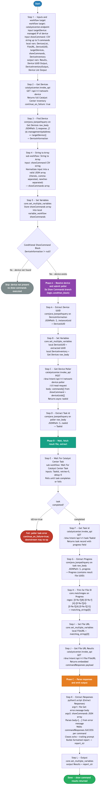

# 8.0 — Cisco Catalyst Center: Command Runner

> **Workflow:** `CATC-CommandRunner.json`
> **Type:** Cisco Catalyst Center Generic Workflow (Intent API)
> **Subworkflows:** `String to Array`, `Wait For Catalyst Center Task`
> **API Endpoints:**
> &nbsp;&nbsp;`GET  /api/v1/network-device` — retrieve full Catalyst Center device inventory
> &nbsp;&nbsp;`POST /dna/intent/api/v1/network-device-poller/cli/read-request` — submit show commands to a device
> &nbsp;&nbsp;`GET  /dna/intent/api/v1/task/{taskId}` — retrieve poller task record (contains result file UUID in `progress`)
> &nbsp;&nbsp;`GET  /dna/intent/api/v1/file/{fileId}` — retrieve the raw CLI command output payload
> &nbsp;&nbsp;`Wait For Catalyst Center Task` (atomic workflow) — poll the read-request task to completion
> **Minimum Catalyst Center version:** 2.3.7.9
> **Authors:** Keith Baldwin — Solutions Engineer - Automation HyperSpecialist (kebaldwi@cisco.com)
> **Copyright © 2024–2026 Cisco Systems, Inc. All rights reserved.**

---

## Table of Contents

1. [Overview](#overview)
   - [What it does](#what-it-does)
   - [What makes this workflow different](#what-makes-this-workflow-different)
   - [Logical Flow](#logical-flow)
2. [Prerequisites](#prerequisites)
3. [Directory Structure](#directory-structure)
4. [Workflow Input Parameters](#workflow-input-parameters)
5. [Workflow Variables](#workflow-variables)
6. [How It Works](#how-it-works)
   - [Step 1 — Get Devices](#step-1--get-devices)
   - [Step 2 — Find Device by Management IP](#step-2--find-device-by-management-ip)
   - [Step 3 — Normalize `showCommand` into a JSON Array](#step-3--normalize-showcommand-into-a-json-array)
   - [Step 4 — Conditional ShowCommand Block](#step-4--conditional-showcommand-block)
   - [Step 5 — Extract Device UUID and Submit Poller Request](#step-5--extract-device-uuid-and-submit-poller-request)
   - [Step 6 — Wait for Task, Resolve Result File, and Parse](#step-6--wait-for-task-resolve-result-file-and-parse)
   - [Step 7 — Set Output](#step-7--set-output)
7. [Command Runner Payload Reference](#command-runner-payload-reference)
8. [Running the Workflow](#running-the-workflow)
9. [Expected Output](#expected-output)
10. [Workflow Ordering Dependency](#workflow-ordering-dependency)
11. [Troubleshooting](#troubleshooting)
12. [Additional Notes](#additional-notes)

---

## Overview

This Cisco Catalyst Center workflow runs **read-only show commands on a single managed device** by way of the Catalyst Center CLI Poller API. It resolves a device by its management IP, submits up to five show commands in a single batch, waits for the asynchronous poller task to complete, retrieves the result file, and returns a cleaned, human-readable report as the workflow output.

The workflow uses the native `/network-device-poller/cli/read-request` endpoint, which executes commands on the device through Catalyst Center's existing managed device connection — no per-device credentials are required at workflow run time, and no SSH session is opened by the workflow itself.

### What it does

| Action | Mechanism |
|--------|-----------|
| Retrieve full device inventory | `Generic Catalyst Center API Request` — `GET /api/v1/network-device` |
| Find device by management IP | `JSONPath Query` — `$.response..[?(@.managementIpAddress == targetDevice)]` |
| Normalize `showCommand` input into a JSON array | `String to Array` subworkflow (supports list literals, comma-separated, newline-separated, mixed) |
| Guard against missing device | `Condition Block` — `DeviceInformation != null` |
| Extract device UUID | `JSONPath Query` — `$..instanceUuid` |
| Submit show commands to device | `POST /dna/intent/api/v1/network-device-poller/cli/read-request` (body: `commands[]` + `deviceUuids[]`) |
| Extract async `taskId` | `JSONPath Query` — `$..taskId` |
| Wait for task completion | `Wait For Catalyst Center Task` subworkflow (retries=5, delay=5) |
| Retrieve task record | `GET /dna/intent/api/v1/task/{taskId}` |
| Extract result `progress` field | `JSONPath Query` — `$..progress` |
| Isolate result file UUID | `Match Regex` — `[0-9a-f]{8}-[0-9a-f]{4}-[0-9a-f]{4}-[0-9a-f]{4}-[0-9a-f]{12}` |
| Retrieve raw command output payload | `GET /dna/intent/api/v1/file/{fileId}` |
| Parse, clean, and format per-command output | `Execute Python Script` — walks `commandResponses.SUCCESS`, strips echoed command + trailing prompt, builds `report_str` |
| Emit workflow output | `Set Variables` — `Results = report_str` |

### What makes this workflow different

Unlike opening an SSH session manually or running `show` commands one at a time in the device CLI, this workflow:

1. **Uses the managed CatC channel** — no separate device credentials, no SSH session, no jump host. Commands flow through Catalyst Center's existing device connection.
2. **Batches up to five show commands** per device in a single async task, reducing API churn and providing one unified result file.
3. **Idempotent and side-effect-free** — only read-only show commands are accepted by the poller endpoint; the workflow cannot modify device configuration.
4. **Auto-extracts the result file** — handles the indirection through `task.progress` → file UUID → `/file/{id}` automatically, including the regex extraction.
5. **Returns a cleaned, per-command report** — a Python post-processor strips the echoed command and trailing CLI prompt from each `commandResponses.SUCCESS` entry, producing output that is ready to display, log, or feed into a downstream workflow.
6. **Safe device lookup** — if the management IP is not present in the inventory, the workflow short-circuits via the `Conditional ShowCommand Block` and skips poller submission entirely.

### Logical Flow

The diagram below shows every decision point and loop from startup to completion, including the conditional skip path when the target device is not present in the inventory, and the three execution phases (resolve → poll → parse):



> Source: [`DIAGRAMS/logical-flow.mmd`](DIAGRAMS/logical-flow.mmd) — re-render with:
> ```bash
> npx -y @mermaid-js/mermaid-cli -i DIAGRAMS/logical-flow.mmd -o DIAGRAMS/logical-flow.png -w 1600 -b white
> ```

---

## Prerequisites

| Requirement | Notes |
|-------------|-------|
| Cisco Catalyst Center | >= 2.3.7.9 |
| Catalyst Center API access | CatC Intent API v1 (`network-device-poller`, `task`, `file`) must be accessible and authenticated |
| Target device discovered and managed | The device whose management IP is supplied as `targetDevice` must already exist in Catalyst Center inventory and be in a managed state |
| Catalyst Center CLI Poller enabled | The CLI read-request endpoint must be permitted for the target device platform |
| Sufficient privileges in CatC | User/service account running the workflow must have permission to issue CLI read commands |
| Sub-workflows imported | `String to Array` and `Wait For Catalyst Center Task` must be present in the CatC workflow catalog (listed as dependencies in the workflow JSON) |

---

## Directory Structure

```
8.0-Cisco-Catalyst-Center-Command-Runner/
├── CATC-CommandRunner.json         # Catalyst Center workflow definition (import via CatC UI)
├── DIAGRAMS/
│   ├── logical-flow.mmd            # Mermaid diagram source — re-render with npx mermaid-cli
│   └── logical-flow.png            # Rendered flowchart (referenced by this README)
└── README.md                       # This document
```

---

## Workflow Input Parameters

These parameters are entered when the workflow is launched from the Catalyst Center UI or triggered via the Workflow API.

| Parameter | Type | Required | Description |
|-----------|------|----------|-------------|
| `targetDevice` | string | Yes | Managed IP address of the device to target (e.g., `10.1.1.10`). Must match the `managementIpAddress` field in CatC inventory. |
| `showCommand` | string | Yes | Show commands to be executed on the device, in comma-delimited form. **Limit: 5 commands per run.** Examples: `"show version | inc INSTALL", "show boot system"` |

In addition, the workflow target itself is supplied at launch time:

| Target | Type | Description |
|--------|------|-------------|
| Catalyst Center endpoint | `catalystcenter.endpoint` | Specified on workflow start. All Generic Catalyst Center API Request activities use this target. |

---

## Workflow Variables

The workflow defines the following internal and output variables (all declared in `CATC-CommandRunner.json`):

| Name | Scope | Type | Purpose |
|------|-------|------|---------|
| `targetDevice` | input | string | Managed IP supplied at runtime |
| `showCommand` | input | string | Raw CSV of show commands supplied at runtime |
| `DevicesList` | local | string (json) | Reserved local — holds device list snapshot |
| `DeviceInventory` | local | string (json) | Full Catalyst Center inventory snapshot from `Get Devices` |
| `DeviceUUID` | local | string | Resolved `instanceUuid` of the target device |
| `targetDevices` | local | array | Reserved local — populated by `String to Array` patterns when extended |
| `showCommands` | local | array | Normalized command array returned by `String to Array` |
| `FileURL` | local | string | Result file UUID extracted from task `progress` |
| `Results` | output | string (json) | Final formatted command output report (`report_str`) |
| `Device UUID Output` | output | string | Optional output mirror of `DeviceUUID` |
| `DeviceInventoryOutput` | output | string (json) | Optional output mirror of `DeviceInventory` |
| `Device List Output` | output | string (json) | Optional output mirror of `DevicesList` |

---

## How It Works

### Step 1 — Get Devices

The `Get Devices` activity (`catalystcenter.invoke_api`) retrieves the entire Catalyst Center device inventory:

```
GET /api/v1/network-device
Accept: application/json
Content-Type: application/json
```

The full response is held in `output.raw_body` for downstream JSONPath filtering. `continue_on_failure` is set to `true` so a transient inventory failure does not abort the workflow before the conditional block is reached.

---

### Step 2 — Find Device by Management IP

A `JSONPath Query` activity filters the inventory for the row whose `managementIpAddress` matches the `targetDevice` input:

```
JSONPath: $.response..[?(@.managementIpAddress == "{targetDevice}")]
Stored as: DeviceInformation
```

If the device is not found, `DeviceInformation` is `null` and the `Conditional ShowCommand Block` in Step 4 short-circuits the rest of the workflow.

---

### Step 3 — Normalize `showCommand` into a JSON Array

The `String to Array` subworkflow normalizes the raw `showCommand` string into a valid JSON array.

Supported input formats:
- Python / JSON list literals: `["A","B"]` or `['A','B']`
- Comma-separated values: `A,B,C` or `"A,B",C`
- Newline-separated values: one item per line
- Mixed: newline-separated lines where each line may contain comma-separated values

Processing rules:
- Literal lists are returned unchanged.
- Non-literal input is split by newline, then each line is parsed with Python's `csv` module.
- Whitespace and surrounding quotes are stripped from each value.
- Empty values are discarded.
- Empty or whitespace-only input returns `[]`.

The resulting array is stored in the local variable `showCommands`. (Limitation: CSV fields that span multiple lines inside quotes are not supported.)

---

### Step 4 — Conditional ShowCommand Block

A `logic.if_else` block branches on the JSONPath result from Step 2:

**Condition:** `DeviceInformation != null`

- **False** — device not in inventory: the workflow exits the block immediately and proceeds to workflow completion with no poller submission and no `Results` output.
- **True** — device exists: proceeds to Step 5.

The block has `continue_on_failure: true` so that a single device lookup miss does not propagate an error to the workflow caller.

---

### Step 5 — Extract Device UUID and Submit Poller Request

Inside the **Do Show Commands** branch:

#### 5a — Extract Device UUID

```
JSONPath: $..instanceUuid   (on DeviceInformation)
Stored as: DeviceUUID
```

#### 5b — Set Variables

`Set Variables` (`core.set_multiple_variables`) stores:

- local `DeviceUUID` = extracted UUID from 5a
- local `DeviceInventory` = `Get Devices` raw_body

These locals are also surfaced as workflow outputs (`Device UUID Output`, `DeviceInventoryOutput`) for downstream consumers.

#### 5c — Get Device Poller (submit show commands)

```
POST /dna/intent/api/v1/network-device-poller/cli/read-request
Content-Type: application/json
Accept: application/json

{
    "commands": [ {showCommand items} ],
    "deviceUuids": [ "{DeviceUUID}" ]
}
```

CatC returns an async `taskId` immediately; the actual CLI execution happens in the background on the device through the managed connection.

#### 5d — Extract Task Id

```
JSONPath: $..taskId   (on poller raw_body)
Stored as: TaskId
```

---

### Step 6 — Wait for Task, Resolve Result File, and Parse

#### 6a — Wait For Catalyst Center Task

The `Wait For Catalyst Center Task` subworkflow polls task status until the task completes or fails. Configured inputs:

| Parameter | Value |
|-----------|-------|
| Task ID | `{TaskId}` from Step 5d |
| Retries | `5` |
| Delay between polls (seconds) | `5` |

`continue_on_failure: true` on this activity means a polling failure (timeout, transient error) propagates as an empty result rather than aborting the workflow.

#### 6b — Get Task Id

After the wait subworkflow returns, the task record is fetched explicitly:

```
GET /dna/intent/api/v1/task/{TaskId}
```

This response contains a `progress` field that includes the UUID of the result file produced by the poller.

#### 6c — Extract Progress

```
JSONPath: $..progress
Stored as: Progress
```

#### 6d — Trim for File ID

A `core.matchregex` activity extracts the file UUID from the `progress` string:

```
Regex: [0-9a-f]{8}-[0-9a-f]{4}-[0-9a-f]{4}-[0-9a-f]{4}-[0-9a-f]{12}
Stored as: matching_strings[0]
```

#### 6e — Set File URL

`Set Variables` stores the extracted UUID in the local variable `FileURL`.

#### 6f — Get File URL Results

```
GET /dna/intent/api/v1/file/{FileURL}
Accept: application/json
```

This call returns the raw payload that contains the per-command CLI output. In the current Catalyst Center contract, the payload is embedded in the response error envelope as `output.error.message` containing a `body=[...]` JSON segment — this is exactly what the parsing step in 6g expects.

#### 6g — Extract Responses (Python)

`Execute Python Script` activity (`python3.script`) parses, cleans, and formats the per-command output:

- **argv[1]** — `output.error.message` from `Get File URL Results`
- **argv[2]** — `showCommands` JSON array

Logic:
1. Attempt to JSON-parse `argv[1]`. If it parses to a dict, use directly; otherwise wrap as `{"output": {"error": {"message": <raw>}}}`.
2. Locate `body=[...]` inside the error message, escape raw control characters, and `json.loads` it into a structured list.
3. For each entry, walk `commandResponses.SUCCESS[<command>]`:
   - Strip the leading echoed command if present.
   - Strip the trailing CLI prompt (lines matching `^\S+[#>]\s*$`).
   - Discard blank lines around the result.
4. Mark any command with no matching output as `No-Matching-Output`.
5. Build a single formatted `report_str` containing one section per command.

The output query `report_str` is exposed for the final Set Variables step.

---

### Step 7 — Set Output

`Set Variables` (`Output`) writes the final report to the workflow output:

```
Results (output, json) = report_str
```

The workflow then completes.

---

## Command Runner Payload Reference

### Request — Submit Show Commands

`POST /dna/intent/api/v1/network-device-poller/cli/read-request`

```json
{
  "commands": [
    "show version | inc INSTALL",
    "show boot system"
  ],
  "deviceUuids": [
    "11111111-2222-3333-4444-555555555555"
  ]
}
```

**Key field notes:**

| Field | Notes |
|-------|-------|
| `commands` | Array of up to 5 show commands. Read-only commands only; configuration commands are rejected by the endpoint. |
| `deviceUuids` | Array of one or more device `instanceUuid` values. This workflow submits exactly one UUID per run. |

### Response on Success (Submission)

```json
{
  "response": {
    "taskId": "<task uuid>",
    "url": "/api/v1/task/<task uuid>"
  },
  "version": "1.0"
}
```

### Task Record (after poll completes)

`GET /dna/intent/api/v1/task/{taskId}`

The `progress` field contains a sentence-form status string that includes the file UUID of the result payload, e.g.:

```text
{"fileId":"aabbccdd-eeff-1122-3344-556677889900"}
```

The workflow's `Trim for File ID` regex isolates the UUID directly from this string.

### Final Result Payload

`GET /dna/intent/api/v1/file/{fileId}` returns a JSON envelope; the parser walks into `commandResponses.SUCCESS`:

```json
[
  {
    "commandResponses": {
      "SUCCESS": {
        "show version | inc INSTALL": "<raw CLI text>",
        "show boot system": "<raw CLI text>"
      },
      "FAILED": {},
      "BLACKLISTED": {}
    },
    "deviceUuid": "11111111-2222-3333-4444-555555555555"
  }
]
```

---

## Running the Workflow

### Import the Workflow

1. In Catalyst Center, navigate to **Platform → Workflow Manager**.
2. Click **Import** and upload `CATC-CommandRunner.json`.
3. Ensure the dependent atomic workflows **String to Array** and **Wait For Catalyst Center Task** are already present in the workflow catalog (they are listed under `atomic_workflows` and `dependent_workflows` in the JSON).
4. The workflow appears as **CATC-CommandRunner** in the workflow list.

### Execute the Workflow

1. Click **Run** on the imported workflow.
2. Select the target **Catalyst Center endpoint** when prompted.
3. Fill in the input parameters:
   - **targetDevice:** managed IP of the target device (e.g., `10.1.1.10`)
   - **showCommand:** comma-delimited list of up to 5 show commands, e.g. `"show version | inc INSTALL", "show boot system"`
4. Click **Execute**.
5. Monitor progress in **Workflow Executions → Execution Details**.

### Trigger via API

```bash
POST /dna/intent/api/v1/workflow-manager/workflows/{workflowId}/run
{
  "inputParameters": {
    "targetDevice": "10.1.1.10",
    "showCommand": "\"show version | inc INSTALL\", \"show boot system\""
  },
  "target": {
    "type": "catalystcenter.endpoint",
    "id": "<catc endpoint id>"
  }
}
```

---

## Expected Output

A successful run against an in-inventory device produces the following sequence in the workflow execution log:

```
Step 1   Get Devices            → GET /api/v1/network-device → inventory snapshot retrieved
Step 2   Find Device            → JSONPath match on managementIpAddress=10.1.1.10
                                  DeviceInformation: { instanceUuid: <uuid>, hostname: edge-01, ... }
Step 3   String to Array        → showCommands = ["show version | inc INSTALL", "show boot system"]
Step 4   Conditional Block      → DeviceInformation != null → branch: Do Show Commands
Step 5a  Extract Device UUID    → DeviceUUID = <uuid>
Step 5b  Set Variables          → local DeviceUUID + DeviceInventory stored
Step 5c  Get Device Poller      → POST /network-device-poller/cli/read-request → TaskId = <task>
Step 5d  Extract Task Id        → TaskId stored
Step 6a  Wait For CatC Task     → poll until endTime defined (max 5 retries × 5s)  ✓ completed
Step 6b  Get Task Id            → GET /task/<task> → progress contains fileId
Step 6c  Extract Progress       → Progress = "...fileId aabbccdd-..."
Step 6d  Trim for File ID       → FileURL = aabbccdd-eeff-1122-3344-556677889900
Step 6e  Set File URL           → local FileURL stored
Step 6f  Get File URL Results   → GET /file/<fileId> → raw command payload
Step 6g  Extract Responses (py) → cleaned per-command report_str built
Step 7   Output                 → Results = report_str   ✓ SUCCESS
Completed
```

If `targetDevice` is **not** present in the inventory:

```
Step 1   Get Devices            → inventory snapshot retrieved
Step 2   Find Device            → DeviceInformation = null
Step 4   Conditional Block      → branch skipped; no poller submission
Completed (Results unset)
```

---

## Workflow Ordering Dependency

This workflow is an **operational / diagnostic** workflow, not a provisioning workflow. It does not modify Catalyst Center state and can be run at any time once the target device is discovered and managed.

| Workflow | Purpose | Depends on | Required before |
|----------|---------|------------|-----------------|
| 1.0 — Site Hierarchy Build | Creates Area / Building / Floor hierarchy | — | — |
| 2.0 — Settings and Credentials | Applies DNS, DHCP, NTP, AAA, SNMP, and device credentials | 1.0 | — |
| 3.0 — Device Discovery | Discovers devices and adds to inventory | 1.0, 2.0 | **Yes — must run before this workflow** |
| 4.0 — Templates GitHub integration | Syncs templates from GitHub to CatC | 1.0 | — |
| 5.0 — Templates Composite | Provisions templates onto devices | 1.0, 3.0 | — |
| 6.0 — Network Profile | Creates profiles and assigns to site | 1.0, 2.0 | — |
| 7.0 — Provision Composite | Provisions devices + deploys templates | 1.0–6.0 | — |
| **8.0 — This workflow** | Runs show commands on a single managed device | 3.0 (device must be in inventory) | — |

---

## Troubleshooting

| Symptom | Likely Cause | Resolution |
|---------|-------------|------------|
| Workflow completes with no `Results` output | `targetDevice` IP not found in CatC inventory | Verify the device is discovered and managed (`GET /api/v1/network-device?managementIpAddress=<ip>`). Re-run after the device appears in inventory. |
| `Get Device Poller` returns HTTP 400 | More than 5 commands submitted, or a non-read command included | Reduce to ≤ 5 show commands. Remove any `config`, `clear`, `reload`, or other state-changing commands. |
| `Wait For Catalyst Center Task` times out | Device unreachable or task taking longer than 25 seconds (5 retries × 5 s) | Verify device reachability from CatC. Re-import the workflow and edit the wait subworkflow input to increase `retries` and/or `delay`. |
| `Extract Progress` returns empty | Task completed with `isError=true` and no `fileId` was written | Inspect the task record manually (`GET /task/{taskId}`); check `failureReason`. Common causes: device unreachable, CLI auth failure, command unsupported on platform. |
| `Trim for File ID` produces no match | `progress` string does not contain a UUID (task failed before file generation) | Same as above — inspect the task `progress` and `failureReason` fields. |
| `Get File URL Results` returns an error envelope | Expected behavior — the result payload is delivered inside `output.error.message` for this endpoint contract | No action required; the Python parser is designed to read this envelope. |
| `Results` contains `No-Matching-Output` for every command | Commands echoed differently than expected, or `body=[...]` not found in the file payload | Confirm the device platform is supported by the CLI poller. Re-run with a single simple command (e.g. `show version`) to verify the result envelope shape. |
| `Results` contains `[!] Failed to parse embedded JSON body` | Result payload contains unescaped control characters not handled by the parser | Re-run the workflow; the parser auto-escapes common control characters, but very large outputs from `show running-config` can occasionally trip it. Split into smaller commands. |
| Workflow fails immediately on launch | Sub-workflows `String to Array` or `Wait For Catalyst Center Task` not present in catalog | Import both atomic workflows listed under `atomic_workflows` in `CATC-CommandRunner.json` before importing this workflow. |

---

## Additional Notes

- **Read-only by design:** The `/network-device-poller/cli/read-request` endpoint accepts only show / read commands. Any attempt to submit configuration or operational commands (e.g. `configure terminal`, `reload`, `clear counters`) will be rejected by Catalyst Center before reaching the device.
- **Five-command batch limit:** Catalyst Center enforces an upper bound of five commands per read-request. The workflow does not pre-validate this — exceeding the limit is reported by the poller endpoint as an HTTP 400.
- **Single-device scope:** This workflow targets exactly one device per run. To target multiple devices, invoke the workflow once per device or build a wrapper workflow that loops over a device list and calls this one as a sub-workflow.
- **Output is a single string:** The `Results` output variable is a formatted multi-section string (`report_str`), not a structured JSON object. Consumers that need structured data should adapt the Python `Extract Responses` step to emit JSON instead.
- **Inventory snapshot is also exposed:** `DeviceInventoryOutput` and `Device UUID Output` mirror internal locals — these are convenient for downstream workflows that want to reuse the inventory call rather than re-fetching it.
- **No device credentials required at runtime:** Authentication to the device is handled by Catalyst Center's existing managed device connection. The workflow's only authentication target is Catalyst Center itself.
