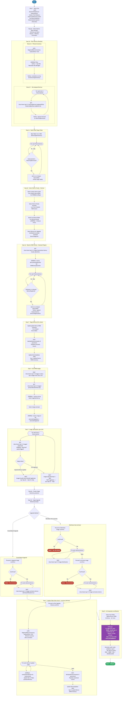

# 9.1 — Cisco Catalyst Center: Site Based Upgrade with AI

> **Workflow:** `Catalyst Center Site Based Upgrade with AI.json`
> **Type:** Cisco Catalyst Center Generic Workflow (Intent API) + GenAI validation
> **Subworkflows:** `CATC-DynamicSiteSelector`, `CATC-PaginatedDeviceInventory`, `CATC-MultipleShowCommands-v3`, `Get Task ID`, `Wait For Catalyst Center Task`, `String to Array`, `Create Image Uuid Array`
> **API Endpoints:**
> &nbsp;&nbsp;`GET  /dna/intent/api/v1/networkDevices/assignedToSite` — devices assigned to a site (paginated)
> &nbsp;&nbsp;`GET  /dna/intent/api/v1/image/importation/device-family-identifiers` — resolve device family identifier
> &nbsp;&nbsp;`POST /dna/intent/api/v1/images/ccoSync` — sync software images from Cisco.com
> &nbsp;&nbsp;`GET  /dna/intent/api/v1/images?productNameOrdinal={id}` — list images for a device family
> &nbsp;&nbsp;`GET  /dna/intent/api/v1/images?siteId={id}` — list images available for a site
> &nbsp;&nbsp;`POST /dna/intent/api/v1/images/{id}/download` — download an image from Cisco.com
> &nbsp;&nbsp;`POST /dna/intent/api/v1/images/{uuid}/sites/{siteId}/tagGolden` — tag an image as golden for a site/family
> &nbsp;&nbsp;`POST /dna/intent/api/v1/image/distribution` — distribute an image to a device
> &nbsp;&nbsp;`POST /dna/intent/api/v1/image/activation/device` — activate (boot) an image on a device
> **AI Endpoint:** Anthropic Messages API (`https://api.anthropic.com`) — model `claude-opus-4-7` via the `Anthropic-AI` GenAI target and `ANTHROPIC-KEY` runtime credential
> **Minimum Catalyst Center version:** 2.3.7.9 (with the GenAI / LLM connector enabled)
> **Authors:** Keith Baldwin — Solutions Engineer - Automation HyperSpecialist (kebaldwi@cisco.com)
> **Copyright © 2024–2026 Cisco Systems, Inc. All rights reserved.**

---

## Table of Contents

1. [Overview](#overview)
   - [What it does](#what-it-does)
   - [What makes this workflow different](#what-makes-this-workflow-different)
   - [Logical Flow](#logical-flow)
2. [Prerequisites](#prerequisites)
3. [Directory Structure](#directory-structure)
4. [Workflow Input Parameters](#workflow-input-parameters)
5. [Internal Working Variables](#internal-working-variables)
6. [How It Works](#how-it-works)
   - [Step 1 — Select Site](#step-1--select-site)
   - [Step 2 — Device Selection](#step-2--device-selection)
   - [Step 3 — Target Devices (Pre-check)](#step-3--target-devices-pre-check)
   - [Step 4 — Get SWIM Images](#step-4--get-swim-images)
   - [Step 5 — Image Sanitization (per site)](#step-5--image-sanitization-per-site)
   - [Step 6 — Image Deployment](#step-6--image-deployment)
   - [Step 7 — Update Table (Post-check + Inventory Refresh)](#step-7--update-table-post-check--inventory-refresh)
   - [Step 8 — AI Comparison and Results](#step-8--ai-comparison-and-results)
7. [SWIM API Payload Reference](#swim-api-payload-reference)
8. [AI Validation Report](#ai-validation-report)
9. [Subworkflows](#subworkflows)
10. [Running the Workflow](#running-the-workflow)
11. [Expected Output](#expected-output)
12. [Workflow Ordering Dependency](#workflow-ordering-dependency)
13. [Troubleshooting](#troubleshooting)
14. [Additional Notes](#additional-notes)

---

## Overview

This Cisco Catalyst Center workflow performs a **site-based software image upgrade (SWIM)** across the devices within a selected site hierarchy and then adds an **AI-powered, audit-ready validation report** that compares the pre-check and post-check diagnostics for every upgraded device. It guides an operator through site selection, device-type filtering, device family and target device selection, golden image preparation, and a choice of upgrade methodology — with diagnostic show-command capture before and after the upgrade, followed by an automated analysis that produces per-device verdicts.

The workflow scopes the upgrade to a parent site and all of its child sites, intersects the site-assigned devices with a filtered, reachable, managed inventory of the selected device type, and lets the operator pick a specific device family (e.g., `Cisco Catalyst 9300 Switch`) and the final list of devices to upgrade. It then runs pre-check show commands against the cleansed target list, resolves the SWIM device family identifier, syncs and selects a golden image, ensures the image is downloaded and golden-tagged at each site, and distributes and/or activates the image on the selected devices. A confirmation prompt gates the post-check, after which the workflow refreshes device inventory to record the new software version, captures the post-check show commands, and finally submits the combined pre/post table to a GenAI model that returns a structured change-validation report.

### What it does

| Action | Mechanism |
|--------|-----------|
| Select parent + child sites | `CATC-DynamicSiteSelector` + Python "Find Children" → `HierarchyNames`, `HierarchyUuid` |
| Choose device type | `task.prompt_request` — Switches and Hubs / Routers / Wireless Controllers |
| Collect site-assigned devices | `For Each` site → `GET /dna/intent/api/v1/networkDevices/assignedToSite` → `HierarchyDeviceList` |
| Retrieve filtered inventory | `CATC-PaginatedDeviceInventory` (Workflow 10.0) + JSONPath filter (`family` + Reachable + Managed) |
| Build initial target table | Intersect inventory with site-assigned UUIDs → `Output-DeviceTable` |
| Choose device family | `task.prompt_request` — unique types from `Output-DeviceTable` (e.g., `Cisco Catalyst 9300 Switch`) |
| Select devices for upgrade | `task.prompt_request` (multiselect) → cleansed `DeviceTargetList` |
| Resolve SWIM family id | `GET /dna/intent/api/v1/image/importation/device-family-identifiers` → `SWIMFamilyIdentifier` |
| Build cleansed target table | Second `For Each` over filtered devices → `Output-DeviceTable` + `DeviceTargetUuidList` |
| Capture pre-check | `CATC-MultipleShowCommands-v3` → `precheck` column |
| Sync + select image | `POST /dna/intent/api/v1/images/ccoSync` + `GET /dna/intent/api/v1/images?productNameOrdinal=…` + prompt |
| Golden-tag per site | `GET images?siteId=…` → conditional `download` + `tagGolden` with task waits |
| Image upgrade method | `task.prompt_request` — Consolidated Upgrade / Distribute then Activate |
| Distribute / Activate | `POST image/distribution` and/or `POST image/activation/device` per device, with confirmations |
| Refresh software version | `CATC-PaginatedDeviceInventory` → JSONPath `softwareVersion` → `Update Row in Table` |
| Capture post-check | Confirmation prompt → `CATC-MultipleShowCommands-v3` → `postcheck` column |
| AI validation report | `lc_agent.llm_step` (`claude-opus-4-7`) reads the pre/post table + `AI-Tone` persona → audit-ready report |

### What makes this workflow different

Unlike a manual, device-by-device upgrade through the Catalyst Center UI — and unlike the base [9.0 Site Based Upgrade](../9.0-Cisco-Catalyst-Center-Site-Based-Upgrade/) workflow — this workflow:

1. **Scopes upgrades by site hierarchy** — selecting a parent site automatically includes all child sites (matched by `siteHierarchy` prefix), so an entire campus or building can be upgraded in one run.
2. **Intersects two device views** — it cross-references the site-assigned device list with a filtered, reachable, managed inventory, ensuring only devices that are both in the selected hierarchy **and** the chosen device type **and** online/managed are targeted.
3. **Pre-check runs against the cleansed list** — device family selection and the multi-select "Select Devices for Upgrade" prompt happen **before** the pre-check, so `CATC-MultipleShowCommands-v3` only runs against the devices the operator actually intends to upgrade.
4. **Automates golden image preparation per site** — for each site it checks whether the selected image is imported and golden-tagged, and conditionally downloads from Cisco.com and tags as golden, waiting on each Catalyst Center task to complete.
5. **Offers two upgrade methodologies** — operators choose **Consolidated Upgrade** (distribute-if-needed + activate in one call) or **Distribute then Activate** (separate, individually confirmed distribution and activation phases).
6. **Built-in safety gates** — every destructive phase and the post-check require explicit confirmation prompts (`Proceed to Upgrade Image`, `Proceed to Distribute Image`, `Proceed to Activate Image`, `Proceed to Post Upgrade Checks`); declining halts the workflow cleanly with a descriptive status.
7. **Refreshes the software version after activation** — the post-check phase re-reads the device inventory and updates each row's `softwareVersion` so the report reflects the booted image, not the pre-upgrade value.
8. **Adds AI-driven change validation** — the combined pre/post inventory table is sent to a GenAI model (`claude-opus-4-7`) primed with a Senior Network Engineer persona (`AI-Tone`), which returns an evidence-based report with per-device verdicts (✅ PASS / ⚠️ PASS WITH WARNINGS / ❌ FAIL / INCONCLUSIVE) suitable for attaching to a change ticket.
9. **Reuses pagination utilities** — device inventory is gathered through Workflow 10.0 (`CATC-PaginatedDeviceInventory`), keeping inventory retrieval scalable and consistent.

### Logical Flow

The diagram below shows the full orchestration from site selection through parallel device collection, device family and target selection, pre-check against the cleansed list, image sync and per-site sanitization, the upgrade-method branch (with confirmation gates and halt paths), the gated post-check with inventory refresh, and the final AI validation stage:



> Source: [`DIAGRAMS/logical-flow.mmd`](DIAGRAMS/logical-flow.mmd) — re-render with:
> ```bash
> npx -y @mermaid-js/mermaid-cli -i DIAGRAMS/logical-flow.mmd -o DIAGRAMS/logical-flow.png -w 1100 -b white
> ```

---

## Prerequisites

| Requirement | Notes |
|-------------|-------|
| Cisco Catalyst Center | >= 2.3.7.9 with the GenAI / LLM connector enabled |
| Workflow 1.0 — Site Hierarchy | Site hierarchy must exist in Catalyst Center |
| Workflow 10.0 — Paginated Device Inventory | `CATC-PaginatedDeviceInventory` and `CATC-DeviceInventory-v2` must be imported (called as a subworkflow) |
| `CATC-DynamicSiteSelector` subworkflow | Must be imported (provides the site selection UI and hierarchy JSON) |
| `CATC-MultipleShowCommands-v3` subworkflow | Must be imported (pre/post-check diagnostics via Command Runner) |
| `Get Task ID` / `Wait For Catalyst Center Task` | Atomic workflows used to poll SWIM tasks (download/tag golden) |
| `Create Image Uuid Array` / `String to Array` | Atomic helpers used by image deployment and array normalization |
| Anthropic GenAI target + credential | The `Anthropic-AI` LLM endpoint target and the `ANTHROPIC-KEY` runtime user (Anthropic API key) must be configured; Catalyst Center must reach `https://api.anthropic.com` |
| Devices assigned to sites | Target devices must be discovered, reachable, managed, and assigned to sites in the selected hierarchy |
| Cisco.com connectivity (for image sync/download) | Catalyst Center must be able to reach Cisco.com to sync and download images |
| Sufficient privileges in CatC | User/service account must have permission to download images, tag golden, distribute, and activate |

---

## Directory Structure

```
9.1 Cisco Catalyst Center: Site Based Upgrade with AI/
├── Catalyst Center Site Based Upgrade with AI.json  # Catalyst Center workflow definition (import via CatC UI)
├── DIAGRAMS/
│   ├── logical-flow.mmd                              # Mermaid diagram source — re-render with npx mermaid-cli
│   └── logical-flow.png                              # Rendered flowchart (referenced by this README)
└── README.md                                         # This document
```

---

## Workflow Input Parameters

This workflow is **interactive** — most inputs are collected through prompts during execution rather than as launch-time parameters. The key operator decision points are:

| Prompt | Type | Options / Source | Description |
|--------|------|------------------|-------------|
| Select Site | site selector | Catalyst Center hierarchy (via `CATC-DynamicSiteSelector`) | Parent site to upgrade; all child sites are included automatically |
| Select Device Type | single select | Switches and Hubs / Routers / Wireless Controllers | Device family to target |
| Select Device Family | single select | Unique device types from initial target table (e.g., `Cisco Catalyst 9300 Switch`) | SWIM device family for image selection |
| Select Devices for Upgrade | multiselect | Filtered `Local-DeviceTable` | Final set of devices to upgrade — drives both the pre-check and the upgrade |
| Select Image | single select | Images returned for the family | Golden image to deploy |
| Image Upgrade Method | single select | Consolidated Upgrade Method / Distribute then Activate | Upgrade methodology |
| Proceed to Upgrade / Distribute / Activate Image | checkbox | — | Per-phase confirmation gates for the destructive image operations |
| Proceed to Post Upgrade Checks | checkbox | — | Confirmation gate before the post-check show commands are captured |

> **Note:** All prompts expire after 72 hours if unanswered.

---

## Internal Working Variables

These variables are managed automatically by the workflow.

| Variable | Type | Purpose |
|----------|------|---------|
| `HierarchyNames` | array | Parent and child site name hierarchies |
| `HierarchyUuid` | array | Parent and child site UUIDs (iterated for device collection and image tagging) |
| `HierarchyDeviceList` | array | Device IDs assigned to the selected sites |
| `DeviceTypeInventory` | string (JSON) | Filtered, reachable, managed inventory of the selected device type |
| `Output-DeviceTable` | table (output) | Target device table with `precheck`/`postcheck` columns |
| `Local-DeviceTable` | table | Per-family device table used to drive the multi-select prompt |
| `DeviceTargetUuidList` | array | UUIDs of devices selected for upgrade |
| `DeviceTargetList` | array | Hostnames of devices selected for upgrade |
| `DeviceType` | array | Selected device type tokens used by the inventory filter |
| `SWIMDeviceTypes` | array | Unique device types extracted from the initial target table |
| `SWIMFamilyIdentifier` | string | Device family identifier used for image queries |
| `SWIMFamilyIdentifier-v2` | integer | Numeric device family identifier variant used during image resolution |
| `selectedImageName` | string | Name of the chosen golden image (also passed to the AI prompt) |
| `selectedImageUuid` | string | UUID of the chosen golden image |
| `imageNameArray` | array | Image names presented in the Select Image prompt |
| `UpgradeMethod` | array | Upgrade methodology options |
| `showCommands` / `showCommandsArray` | string / array | Diagnostic show commands for pre/post-check |
| `DeviceUpdates` | table (output) | Working table written by `CATC-MultipleShowCommands-v3` |
| `AI-Tone` | string | System-instructions persona for the GenAI validation step (see [AI Validation Report](#ai-validation-report)) |
| `TEST` | table | Sample device rows (pre/post columns) used for testing the AI analysis |
| `counter` | integer | Loop/iteration counter |
| `Inventory Page Size` | integer | Pagination size passed to `CATC-PaginatedDeviceInventory` |
| `Device SWIM Inventory` (global) | table | Shared pre/post-check results table across subworkflows and the AI step |

---

## How It Works

### Step 1 — Select Site

The `CATC-DynamicSiteSelector` subworkflow presents the Catalyst Center site hierarchy and returns the selected site and the full hierarchy JSON. A Python "Find Children" script then:

1. Locates the selected site by `siteNameHierarchy`.
2. Reads its `siteHierarchy` prefix.
3. Collects every site whose `siteHierarchy` starts with that prefix (the parent and all descendants).

The resulting site names and IDs are stored in `HierarchyNames` and `HierarchyUuid`.

---

### Step 2 — Device Selection

Step 2 is a single grouped phase that gathers, filters, and cleanses the device list, and resolves the SWIM family identifier — all **before** the pre-check runs. It is composed of five sub-stages.

**2a — Select Device Type**

A prompt asks the operator to select a single device type: **Switches and Hubs**, **Routers**, or **Wireless Controllers**. The selection is stored in `DeviceType` and drives the inventory filter.

**2b — Filter Devices (Parallel)**

A `logic.parallel` block runs two branches concurrently.

Branch 1 — Site-assigned devices: a `For Each` loop over `HierarchyUuid` calls

```
GET /dna/intent/api/v1/networkDevices/assignedToSite?siteId={siteId}&offset={offset}&limit={limit}
```

and a Python script appends each returned `deviceId` to `HierarchyDeviceList`.

Branch 2 — Filtered inventory: `CATC-PaginatedDeviceInventory` (Workflow 10.0) retrieves the full inventory, which is then filtered with JSONPath:

```
$.response[?(@.family == '<selected_type>'
            && @.reachabilityStatus == 'Reachable'
            && @.managementState == 'Managed')]
```

A Python script normalizes the result to an array and stores it in `DeviceTypeInventory`.

**2c — Build Initial Target Table**

The filtered inventory is converted to a table (`Read Table from JSON`). A `For Each` loop over the filtered devices checks whether each device's `instanceUuid` is present in `HierarchyDeviceList`:

| Branch | Condition | Action |
|--------|-----------|--------|
| Match | `instanceUuid ∈ HierarchyDeviceList` | Add row to `Output-DeviceTable` (initial target table) |
| No match | otherwise | Skip the device |

**2d — Select Device Family and Devices**

Unique device types are extracted from `Output-DeviceTable` into `SWIMDeviceTypes`, and the operator picks a specific **Device Family** (e.g., `Cisco Catalyst 9300 Switch`). A `Local-DeviceTable` is built for that family (JSONPath + `String to Array`), and a multiselect **Select Devices for Upgrade** prompt lets the operator choose the final target devices. The selection cleanses `DeviceTargetList`.

> **Why this order matters:** by collecting both the device family and the upgrade target list here, the pre-check in Step 3 runs **only** against the devices the operator intends to upgrade.

**2e — Resolve SWIM Family and Cleansed Targets**

The workflow resolves the SWIM device family identifier:

```
GET /dna/intent/api/v1/image/importation/device-family-identifiers
JSONPath: $..[?(@.deviceFamily == '<selected_family>')].deviceFamilyIdentifier
```

and stores it in `SWIMFamilyIdentifier`. A second `For Each` loop then rebuilds `Output-DeviceTable` containing only the operator-selected devices and populates `DeviceTargetUuidList` (instance UUIDs of the cleansed targets).

---

### Step 3 — Target Devices (Pre-check)

With the cleansed `Output-DeviceTable` in hand, the workflow:

1. Copies `Output-DeviceTable` into the global **Device SWIM Inventory** table.
2. Calls `CATC-MultipleShowCommands-v3` to run the diagnostic show commands against the target devices, writing the results into the `precheck` column.
3. Updates the working `DeviceUpdates` table and syncs the result back to the global **Device SWIM Inventory** table.

The diagnostic commands captured for pre/post comparison are:

```
show version | inc INSTALL
show boot system
show version | inc register
dir | inc free
show cdp nei | sec wap
```

---

### Step 4 — Get SWIM Images

```
POST /dna/intent/api/v1/images/ccoSync                                  # sync from Cisco.com (continue on failure)
GET  /dna/intent/api/v1/images?productNameOrdinal={SWIMFamilyIdentifier}  # list candidate images
```

Image names are extracted (JSONPath + `String to Array`) into `imageNameArray` and presented in a **Select Image** prompt. The selected image's `id` is resolved via JSONPath and stored as `selectedImageName` and `selectedImageUuid`.

---

### Step 5 — Image Sanitization (per site)

A `For Each` loop over `HierarchyUuid` ensures the image is ready at each site:

```
GET /dna/intent/api/v1/images?siteId={siteId}
JSONPath: imported?  isGoldenTagged?
```

| Branch | Condition | Action |
|--------|-----------|--------|
| Imported, not golden | `imported == true && goldenTagged == false` | `POST images/{uuid}/sites/{siteId}/tagGolden` → `Get Task ID` → `Wait For Catalyst Center Task` |
| Not imported | `imported == false` | `POST images/{id}/download` → `Wait For Catalyst Center Task` → `tagGolden` → `Get Task ID` → `Wait For Catalyst Center Task` |

The `Get Task ID` and `Wait For Catalyst Center Task` atomic workflows handle task polling.

---

### Step 6 — Image Deployment

The `Create Image Uuid Array` atomic workflow builds the `imageUuidList` payload from `selectedImageUuid`. An **Image Upgrade Method** prompt then offers two paths:

**Consolidated Upgrade**

1. **Proceed to Upgrade Image** confirmation prompt.
2. If confirmed — `For Each` selected device:
   ```
   POST /dna/intent/api/v1/image/activation/device
   { deviceUpgradeMode: "currentlyExists", deviceUuid, distributeIfNeeded: "true", imageUuidList }
   ```
3. If declined — workflow halts: **"Image Not Activated - Process Halted"**.

**Distribute then Activate**

1. **Proceed to Distribute Image** confirmation prompt.
   - If confirmed — `For Each` selected device: `POST /dna/intent/api/v1/image/distribution` `{ deviceUuid, imageUuid }`.
   - If declined — halt: **"Image Not Distributed - Process Halted"**.
2. **Proceed to Activate Image** confirmation prompt.
   - If confirmed — `For Each` selected device: `POST /dna/intent/api/v1/image/activation/device`.
   - If declined — halt: **"Image Not Activated - Process Halted"**.

---

### Step 7 — Update Table (Post-check + Inventory Refresh)

A **Proceed to Post Upgrade Checks** confirmation prompt gates the post-check phase. When confirmed, the workflow:

1. Calls `CATC-PaginatedDeviceInventory` to re-read the device inventory after activation.
2. For each device in the global table, resolves the current `softwareVersion` via JSONPath (`newSoftwareVersion` matched by `instanceUuid`) and writes it back with `Update Row in Table`, so the table reflects the booted image.
3. Runs `CATC-MultipleShowCommands-v3` again to capture the same diagnostic commands into the `postcheck` column.
4. Updates the `DeviceUpdates` table and the global **Device SWIM Inventory**, providing a before/after view of device state.

---

### Step 8 — AI Comparison and Results

The final group submits the completed pre/post inventory to a GenAI model for validation:

1. **Select from Table** reads all rows of the global **Device SWIM Inventory** (hostname, management IP, instance UUID, platform, series, software type/version, and the `precheck` / `postcheck` outputs).
2. **AI Prompt** (`lc_agent.llm_step`) sends that table to the `claude-opus-4-7` model on the `Anthropic-AI` target, using `AI-Tone` as the system instructions and a user prompt requesting an executive summary and per-device validation. The `selectedImageName` is included so the model knows the target image.
3. **Completed** returns the model's report as the workflow `result_message`.

The activity properties are:

| Property | Value |
|----------|-------|
| Activity type | `lc_agent.llm_step` |
| Model | `claude-opus-4-7` |
| Target | `Anthropic-AI` (`target.lc_agent_endpoint`, provider `anthropic`, `https://api.anthropic.com`) |
| Credential | `ANTHROPIC-KEY` (`runtime_user.anthropic_credentials`) |
| System instructions | `AI-Tone` variable |
| Temperature | 1 |
| Action timeout | 180 s |

---

## SWIM API Payload Reference

### Tag Image as Golden

`POST /dna/intent/api/v1/images/{imageUuid}/sites/{siteId}/tagGolden`

```json
{
  "productNameOrdinal": "<SWIMFamilyIdentifier>",
  "deviceRoles": ["UNKNOWN", "BORDER_ROUTER", "CORE", "DISTRIBUTION", "ACCESS"]
}
```

### Distribute Image

`POST /dna/intent/api/v1/image/distribution`

```json
[
  { "deviceUuid": "<device-uuid>", "imageUuid": "<image-uuid>" }
]
```

### Activate Image

`POST /dna/intent/api/v1/image/activation/device`

```json
[
  {
    "deviceUpgradeMode": "currentlyExists",
    "deviceUuid": "<device-uuid>",
    "distributeIfNeeded": "true",
    "imageUuidList": ["<image-uuid>"]
  }
]
```

**Key field notes:**

| Field | Notes |
|-------|-------|
| `distributeIfNeeded` | `"true"` allows the consolidated method to distribute the image if it is not already present before activating. |
| `deviceUpgradeMode` | `"currentlyExists"` activates the image already staged on the device. |
| `productNameOrdinal` | The SWIM device family identifier resolved in Step 2e. |
| `deviceRoles` | Roles for which the image is tagged golden at the site. |

---

## AI Validation Report

Step 8 replaces manual review of raw CLI output with an automated, evidence-based analysis. The `AI-Tone` variable primes the model as a **Senior Network Engineer and Change Validation Specialist** with expertise in Cisco IOS-XE (Catalyst 9000 series) INSTALL-mode upgrades, and instructs it to be factual, never invent values, and flag missing or ambiguous data as **INCONCLUSIVE**.

### Analysis criteria (applied per device, pre vs post)

| Check | Pass criteria |
|-------|---------------|
| Version | All stack members run the target version in the post-check |
| Install Mode | Mode remains `INSTALL` (flagged if `BUNDLE`) |
| Boot Variable | Post-check current `BOOT = flash:packages.conf` on all members |
| Stack Integrity | Same number of members and same models, pre vs post |
| Flash Space | Report delta in GB; **WARN** if post free space < 1 GB |
| Config Register | Unchanged (`No-Matching-Output` on both = OK) |
| WAP Neighbors | Post-check neighbors match pre-check (flag any missing WAPs) |

### Verdicts

| Verdict | Meaning |
|---------|---------|
| ✅ PASS | All criteria met |
| ⚠️ PASS WITH WARNINGS | Upgraded successfully but with minor issues (low flash, missing WAP, etc.) |
| ❌ FAIL | Version mismatch, missing stack member, or wrong boot variable |
| INCONCLUSIVE | Data missing, malformed, or ambiguous — not guessed |

### Report structure

The user prompt asks the model to return the report in three sections:

1. **Executive Summary** — total devices and counts of PASS / WARN / FAIL / INCONCLUSIVE, plus a one-line table: `Hostname | Pre Ver | Post Ver | Verdict`.
2. **Per-Device Detail** — version, boot-variable, and flash tables per device, WAP-neighbor comparison, and any warnings/failures with the exact evidence line quoted from the output.
3. **Follow-Up Actions** — devices needing remediation and the recommended commands (e.g., `install remove inactive` for low flash, re-run upgrade for FAIL).

The report is written to be concise and audit-ready so it can be attached to a change ticket (CRQ/CHG).

---

## Subworkflows

| Subworkflow | Purpose |
|-------------|---------|
| `CATC-DynamicSiteSelector` | Presents the site hierarchy and returns the selected site plus the full hierarchy JSON. |
| `CATC-PaginatedDeviceInventory` | Workflow 10.0 — retrieves the full device inventory via pagination, with an optional device-type filter. |
| `CATC-MultipleShowCommands-v3` | Runs multiple show commands via Command Runner for pre-check and post-check diagnostics. |
| `Get Task ID` | Atomic workflow — extracts the Catalyst Center service task ID from an Intent API response. |
| `Wait For Catalyst Center Task` | Atomic workflow — polls task status until completion or failure (configurable interval and retries). |
| `String to Array` | Atomic workflow — normalizes a string into a JSON array (handles list literals, CSV, newline-separated values). |
| `Create Image Uuid Array` | Atomic workflow — builds the `imageUuidList` payload from `selectedImageUuid` for the activation call. |

---

## Running the Workflow

### Import the Workflow

1. In Catalyst Center, navigate to **Platform → Workflow Manager**.
2. Click **Import** and upload `Catalyst Center Site Based Upgrade with AI.json`.
3. Ensure all required subworkflows are imported (see [Prerequisites](#prerequisites)), including Workflow 10.0's `CATC-PaginatedDeviceInventory`.
4. Configure the `Anthropic-AI` GenAI endpoint target and the `ANTHROPIC-KEY` runtime credential with a valid Anthropic API key.
5. The workflow appears as **Catalyst Center Site Based Upgrade with AI** in the workflow list.

### Execute the Workflow

1. Click **Run** on the imported workflow.
2. Select the **Catalyst Center target** when prompted (mandatory).
3. Answer the interactive prompts in sequence:
   - **Select Site** → parent site (child sites included automatically)
   - **Select Device Type** → Switches and Hubs / Routers / Wireless Controllers
   - **Select Device Family** → e.g., `Cisco Catalyst 9300 Switch`
   - **Select Devices for Upgrade** → multiselect from the cleansed target list
   - **Select Image** → golden image to deploy
   - **Image Upgrade Method** → Consolidated or Distribute then Activate
   - **Confirmation prompts** → confirm each destructive phase and the post-check
4. Monitor progress in **Workflow Executions** → **Execution Details**, and read the AI validation report in the completion message.

---

## Expected Output

A successful run produces the following sequence in the workflow execution log:

```
Step 1       Site selected: Global/Campus/Building-1
             Hierarchy resolved: 1 parent + 3 child sites
Step 2a      Device Type selected: Switches and Hubs
Step 2b      (parallel)
             Branch 1: site-assigned devices collected → HierarchyDeviceList (24 devices)
             Branch 2: CATC-PaginatedDeviceInventory → filtered (Reachable+Managed) → 31 devices
Step 2c      Initial Output-DeviceTable built: 18 devices (in hierarchy + type + online)
Step 2d      Device Family selected: Cisco Catalyst 9300 Switch
             Devices selected for upgrade: 12 (cleansed DeviceTargetList)
Step 2e      SWIMFamilyIdentifier resolved
             Cleansed Output-DeviceTable rebuilt → DeviceTargetUuidList (12 entries)
Step 3       Global Device SWIM Inventory updated
             Pre-check show commands captured → precheck column populated
Step 4       images/ccoSync triggered
             Candidate images listed → Select Image: cat9k_iosxe.17.15.05.SPA.bin
             selectedImageUuid resolved
Step 5       Per-site image sanitization:
               Site Building-1/Floor-1: image imported, tagging golden → task complete
               Site Building-1/Floor-2: image not imported → download → golden → task complete
Step 6       Create Image Uuid Array → imageUuidList built
             Upgrade Method: Distribute then Activate
             Distribution confirmed → 12 devices distributed ✓
             Activation confirmed → 12 devices activated ✓
Step 7       Proceed to Post Upgrade Checks confirmed
             CATC-PaginatedDeviceInventory refresh → softwareVersion updated per device
             Post-check show commands captured → postcheck column populated
             DeviceUpdates + global Device SWIM Inventory updated
Step 8       Select from Table → global Device SWIM Inventory (12 rows)
             AI Prompt (claude-opus-4-7) analyzing pre vs post …
             Validation report generated: 10 PASS / 2 PASS WITH WARNINGS / 0 FAIL
Completed    Site based upgrade with AI validation completed successfully
             (AI report returned as the workflow result message)
```

Example AI report (abridged):

```
1. Executive Summary
   Total devices: 12  —  ✅ 10 PASS  |  ⚠️ 2 PASS WITH WARNINGS  |  ❌ 0 FAIL  |  0 INCONCLUSIVE
   Hostname        | Pre Ver     | Post Ver    | Verdict
   9300-Floor1-01  | 17.12.04    | 17.15.05    | ✅ PASS
   9300-Floor2-03  | 17.12.04    | 17.15.05    | ⚠️ PASS WITH WARNINGS (post free flash 0.8 GB)

2. Per-Device Detail
   9300-Floor2-03 (10.1.2.13) — ⚠️ PASS WITH WARNINGS
     Version : member 1/2 17.12.04 → 17.15.05 (target met)
     Boot    : flash:packages.conf (both members) ✓
     Flash   : pre 2.4 GB free / post 0.8 GB free / delta 1.6 GB consumed  ⚠️ < 1 GB free

3. Follow-Up Actions
   9300-Floor2-03: run `install remove inactive` to reclaim flash space.
```

---

## Workflow Ordering Dependency

This workflow orchestrates a complete site-based upgrade and depends on several supporting workflows.

| Workflow | Purpose | Depends on | Required before |
|----------|---------|------------|-----------------|
| 1.0 — Site Hierarchy | Creates Area / Building / Floor hierarchy | — | Yes — provides sites and device assignments |
| 3.0 — Device Discovery | Discovers devices and assigns them to sites | 1.0 | Yes — devices must exist and be assigned |
| 10.0 — Paginated Device Inventory | Full paginated device inventory utility | `CATC-DeviceInventory-v2` | **Yes — called as a subworkflow** |
| **9.1 — This workflow** | Site-based software image upgrade with AI validation | 1.0, 3.0, 10.0, supporting subworkflows, Anthropic GenAI endpoint | — |

---

## Troubleshooting

| Symptom | Likely Cause | Resolution |
|---------|-------------|------------|
| `No target devices found` | Selected hierarchy has no devices of the chosen type that are reachable and managed | Verify devices are discovered, reachable, managed, and assigned to the selected sites; confirm the device type matches. |
| `Site has no child sites` | Selected site is a leaf or the hierarchy prefix match returned only the parent | This is expected for leaf sites; the upgrade scopes to the selected site only. |
| `Image not listed for family` | `images/ccoSync` failed or the family identifier is wrong | Verify Cisco.com connectivity; confirm the selected Device Family resolves a valid `SWIMFamilyIdentifier`. |
| `Image download times out` | Slow Cisco.com download or insufficient wait retries | The download wait allows ~10 minutes (5 s × 120). Re-run; verify Cisco.com bandwidth and Catalyst Center disk space. |
| `Tag golden task fails` | Image not fully imported, or insufficient privileges | Ensure the image import completed before tagging; verify the account can tag golden images. |
| `Distribution or activation fails for a device` | Device unreachable, low storage, or unsupported image | Check device reachability and flash space; confirm the image is compatible with the device platform. |
| `Workflow halts after a confirmation prompt` | Operator declined a confirm gate | This is expected (safety gate). Re-run and confirm the phase to proceed. |
| `Pre/post-check columns empty` | `CATC-MultipleShowCommands-v3` failed or Command Runner unavailable | Verify the subworkflow is imported and Command Runner is functional; check device reachability. |
| `softwareVersion not updated after upgrade` | Post-check inventory refresh returned no match for a device | Confirm the device re-registered after reload and that `CATC-PaginatedDeviceInventory` returns it; re-run the post-check. |
| `AI step fails / empty report` | `ANTHROPIC-KEY` invalid, `Anthropic-AI` endpoint unreachable, or GenAI connector disabled | Verify the API key and target configuration; confirm outbound access to `https://api.anthropic.com` and that the LLM connector is enabled. |
| `AI report shows INCONCLUSIVE for a device` | Pre/post output missing or malformed for that device | Re-capture the show commands for the device; ensure both `precheck` and `postcheck` columns are populated before Step 8. |

---

## Additional Notes

- **Hierarchy scoping:** Selecting a parent site includes all descendant sites (matched by `siteHierarchy` prefix). To upgrade a single floor only, select that floor directly.
- **Intersection logic:** A device is targeted only if it is simultaneously (1) assigned to a site in the hierarchy, (2) of the selected device type, (3) `Reachable`, and (4) `Managed`.
- **Selection drives the pre-check:** Device family and the multi-select upgrade list are collected in Step 2 **before** the pre-check, so `CATC-MultipleShowCommands-v3` runs only against the cleansed `DeviceTargetUuidList`.
- **Two upgrade methods:** Use **Consolidated** for a single distribute-if-needed + activate operation; use **Distribute then Activate** to stage images first and activate during a later maintenance window, with independent confirmation gates.
- **Safety gates:** Every destructive phase — plus the post-check (`Proceed to Post Upgrade Checks`) — requires explicit confirmation; declining halts the workflow with a clear status rather than proceeding.
- **Before/after verification:** Pre-check and post-check show commands are stored in the shared global **Device SWIM Inventory** table for state comparison, and the post-check refresh updates each device's `softwareVersion` to the booted image.
- **AI validation:** The GenAI step is analytical only — it reads the pre/post table and produces a report; it does not change device state. Deterministic upgrade actions remain fully under the operator's confirmation gates.
- **Data privacy:** The pre/post table (device hostnames, IPs, and CLI output) is sent to the configured Anthropic endpoint. Review your organization's data-handling policy before enabling the AI step against production data.
- **Image preparation is idempotent:** Already-imported and already-golden images are left as-is; only missing images are downloaded and tagged.
- **Reuses Workflow 10.0:** Device inventory retrieval is delegated to `CATC-PaginatedDeviceInventory`, so keep Workflow 10.0 imported for this workflow to function.
