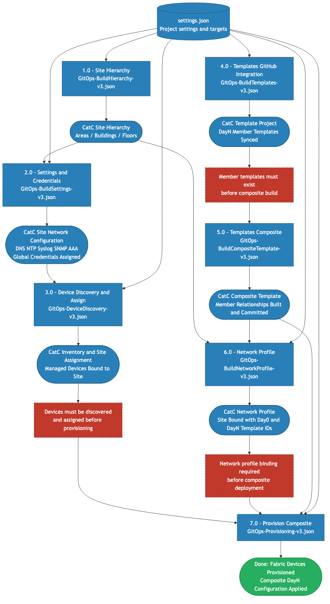

# Cisco Catalyst Center - GitOps Workflow Suite

> As-Built Documentation
> Authors: Keith Baldwin - Solutions Engineer - Automation HyperSpecialist (kebaldwi@cisco.com)
> Copyright (c) 2024-2026 Cisco Systems, Inc. All rights reserved.

This document describes the complete Cisco Catalyst Center GitOps workflow suite under this folder. The suite consists of eleven ordered workflows that automate site foundation, settings and credentials, discovery and assignment, template synchronization, composite template construction, profile binding, composite deployment, ad-hoc device CLI diagnostics, site-scoped software upgrades, and the paginated inventory/hierarchy utilities that the upgrade pipeline depends on.

Workflows 1.0 through 7.0 form the core GitOps build-and-deploy chain. Workflow 8.0 provides ad-hoc CLI read access for verification. Workflow 9.0 orchestrates site-scoped SWIM upgrades, and it consumes the reusable pagination utilities in Workflows 10.0 and 11.0.

---

## Table of Contents

1. [Suite Overview](#suite-overview)
2. [Business Drivers](#business-drivers)
3. [Provisioning Workflow](#provisioning-workflow)
4. [Workflow Reference](#workflow-reference)
   - [1.0 - Site Hierarchy](#10---site-hierarchy)
   - [2.0 - Settings and Credentials](#20---settings-and-credentials)
   - [3.0 - Device Discovery and Assign](#30---device-discovery-and-assign)
   - [4.0 - Templates GitHub Integration](#40---templates-github-integration)
   - [5.0 - Templates Composite](#50---templates-composite)
   - [6.0 - Network Profile](#60---network-profile)
   - [7.0 - Provision Composite](#70---provision-composite)
   - [8.0 - Command Runner](#80---command-runner)
   - [9.0 - Site Based Upgrade](#90---site-based-upgrade)
   - [10.0 - Paginated Device Inventory](#100---paginated-device-inventory)
   - [11.0 - Paginated Site Hierarchy](#110---paginated-site-hierarchy)
5. [Input Data Sources](#input-data-sources)
6. [Installation Options](#installation-options)
7. [Meraki Free Account Setup (Optional Lab On-Ramp)](#meraki-free-account-setup-optional-lab-on-ramp)
8. [Ordering and Dependencies](#ordering-and-dependencies)
9. [Appendix — Workflow and API Reference](#appendix--workflow-and-api-reference)

---

## Suite Overview

| # | Workflow | File | Outcome in Catalyst Center |
|---|----------|------|----------------------------|
| 1.0 | [Site Hierarchy](1.0-Cisco-Catalyst-Center-Site-Hierarchy/) | `GitOps-BuildHierarchy-v3.json` | Areas, buildings, and floors created in deterministic order |
| 2.0 | [Settings and Credentials](2.0-Cisco-Catalyst-Center-Settings-and-Credentials/) | `GitOps-BuildSettings-v3.json` | Site network settings and credential objects applied and assigned |
| 3.0 | [Device Discovery and Assign](3.0-Cisco-Catalyst-Center-Device-Discovery-and-Assign/) | `GitOps-DeviceDiscovery-v3.json` | Discovery jobs execute and discovered devices are assigned to target sites |
| 4.0 | [Templates GitHub Integration](4.0-Cisco-Catalyst-Center-Templates-Github-integration/) | `GitOps-BuildTemplates-v3.json` | DayN member templates synchronized from GitHub into CatC project |
| 5.0 | [Templates Composite](5.0-Cisco-Catalyst-Center-Templates-Composite/) | `GitOps-BuildCompositeTemplate-v3.json` | Composite template graph created/updated and committed |
| 6.0 | [Network Profile](6.0-Cisco-Catalyst-Center-Network-Profile/) | `GitOps-BuildNetworkProfile-v3.json` | Switching network profile bound to site with Day0 and DayN template IDs |
| 7.0 | [Provision Composite](7.0-Cisco-Catalyst-Center-Provision-Composite/) | `GitOps-Provisioning-v3.json` | Devices provisioned (or re-provisioned) and composite template deployed |
| 8.0 | [Command Runner](8.0-Cisco-Catalyst-Center-Command-Runner/) | `CATC-CommandRunner.json` | Runs up to five read-only show commands on a managed device via the CLI Poller API and returns a cleaned per-command report |
| 9.0 | [Site Based Upgrade](9.0-Cisco-Catalyst-Center-Site-Based-Upgrade/) | `Catalyst Center Site Based Upgrade.json` | Site-scoped SWIM upgrade: golden image preparation, distribution and/or activation across selected devices with pre/post-check diagnostics |
| 10.0 | [Paginated Device Inventory](10.0-Cisco-Catayst-Center-Paginated-Device-Inventory/) | `CATC-PaginatedDeviceInventory.json` | Reusable utility — paginates the full device inventory and returns a merged, optionally filtered device list |
| 11.0 | [Paginated Site Hierarchy](11.0-Cisco-Catalyst-Center-Paginated-Site-Hierarchy/) | `CATC-PaginatedSiteHierarchy.json` | Reusable utility — paginates the complete site hierarchy and returns merged JSON plus name and UUID lists |

---

## Business Drivers

This workflow suite is designed to support enterprise and public-sector operational goals:

1. Speed to service
- Compresses multi-team manual provisioning steps into an ordered, repeatable workflow chain.
- Reduces deployment lead time for new sites and pods.

2. Operational consistency
- Enforces a single source of truth from version-controlled project settings and template artifacts.
- Reduces configuration drift across locations by reusing deterministic automation paths.

3. Risk reduction
- Uses idempotent, API-driven operations with explicit dependency ordering and task polling.
- Lowers change-failure rates caused by skipped prerequisites or inconsistent execution order.

4. Governance and auditability
- Every change to topology intent and template content can be traced to Git history and workflow execution logs.
- Supports CAB and compliance reporting with reproducible run outcomes.

5. Scale enablement
- Supports multi-device and multi-site growth without proportional growth in manual effort.
- Standardizes onboarding and DayN rollout patterns across pods and regions.

---

## Provisioning Workflow

The diagram below shows the complete end-to-end build-and-deploy flow across workflows 1.0 through 7.0, the resources each stage produces, and the hard dependencies that gate the final deployment stage. Workflows 8.0 through 11.0 are utility and operations workflows that consume the same Catalyst Center state once it has been built.



Source: [DIAGRAMS/provisioning-workflow.mmd](DIAGRAMS/provisioning-workflow.mmd)

Color coding:

| Color | Meaning |
|-------|---------|
| Blue | Workflow stages, input source, and intermediate Catalyst Center resources |
| Green | Final deployed state |
| Red dashed | Dependency and ordering constraints |

---

## Workflow Reference

### 1.0 - Site Hierarchy

Workflow folder: [1.0-Cisco-Catalyst-Center-Site-Hierarchy](1.0-Cisco-Catalyst-Center-Site-Hierarchy/)

Function:
- Creates and updates site hierarchy entities from project settings.
- Produces the structural dependency required by all downstream workflows.

Primary outcome:
- Valid site path objects exist and can be resolved to site IDs by later workflows.

Utilization statement:
- Use this workflow when onboarding a new region, pod, or building structure, or whenever hierarchy drift must be corrected before any site-scoped operation.

### 2.0 - Settings and Credentials

Workflow folder: [2.0-Cisco-Catalyst-Center-Settings-and-Credentials](2.0-Cisco-Catalyst-Center-Settings-and-Credentials/)

Function:
- Applies DNS, DHCP, NTP, SNMP, syslog, banner, AAA, and credential definitions per site entry.

Primary outcome:
- Site-level settings baseline and credential assignment are in place for discovery and operations.

Utilization statement:
- Use this workflow to enforce day-0 operational standards (management services and access credentials) before discovery and provisioning at scale.

### 3.0 - Device Discovery and Assign

Workflow folder: [3.0-Cisco-Catalyst-Center-Device-Discovery-and-Assign](3.0-Cisco-Catalyst-Center-Device-Discovery-and-Assign/)

Function:
- Resolves credential UUIDs, executes discovery jobs, polls task status, and assigns discovered devices to the site hierarchy.

Primary outcome:
- Devices are managed and site-assigned, enabling profile and deployment stages.

Utilization statement:
- Use this workflow when adding new switches or refreshing inventory to ensure all targets are discoverable, trusted, and mapped to the correct site scope.

### 4.0 - Templates GitHub Integration

Workflow folder: [4.0-Cisco-Catalyst-Center-Templates-Github-integration](4.0-Cisco-Catalyst-Center-Templates-Github-integration/)

Function:
- Pulls DayN template artifacts from GitHub, dependency-sorts them, and creates or updates templates in CatC.

Primary outcome:
- Member templates exist in the CatC project and are commit-ready for composite assembly.

Utilization statement:
- Use this workflow after any GitHub template change to keep Catalyst Center template content synchronized with source control.

### 5.0 - Templates Composite

Workflow folder: [5.0-Cisco-Catalyst-Center-Templates-Composite](5.0-Cisco-Catalyst-Center-Templates-Composite/)

Function:
- Builds or updates composite templates from YAML definitions and commits resulting template versions.

Primary outcome:
- Composite template and member relationships are available for profile and deployment workflows.

Utilization statement:
- Use this workflow whenever composite definitions or member bindings change so deployment payloads reference current committed template graphs.

### 6.0 - Network Profile

Workflow folder: [6.0-Cisco-Catalyst-Center-Network-Profile](6.0-Cisco-Catalyst-Center-Network-Profile/)

Function:
- Resolves Day0/DayN template IDs and binds them to site-level switching network profiles.

Primary outcome:
- Site profile exists with correct template associations for deployment context.

Utilization statement:
- Use this workflow to bind template intent to operational site context, enabling deterministic template deployment behavior per site.

### 7.0 - Provision Composite

Workflow folder: [7.0-Cisco-Catalyst-Center-Provision-Composite](7.0-Cisco-Catalyst-Center-Provision-Composite/)

Function:
- Resolves site and template version IDs, checks SDA provisioning state, provisions/re-provisions devices, and deploys the composite template per device.

Primary outcome:
- DayN configuration is rendered and applied to managed target devices.

Utilization statement:
- Use this workflow for controlled production rollout, post-change re-provisioning, and repeatable remediation of target devices in a site.

### 8.0 - Command Runner

Workflow folder: [8.0-Cisco-Catalyst-Center-Command-Runner](8.0-Cisco-Catalyst-Center-Command-Runner/)

Function:
- Resolves a managed device by its management IP, submits up to five read-only show commands through the Catalyst Center CLI Poller API, polls the resulting task, retrieves the result file, and returns a cleaned, per-command report.
- Uses Catalyst Center's existing managed device channel; no per-device credentials and no SSH session are required at run time.

Primary outcome:
- Operator receives a sanitized, ready-to-display report of show command output for the target device.

Utilization statement:
- Use this workflow for ad-hoc diagnostics, change verification, and as a building block for higher-level workflows (for example, pre/post-check capture in 9.0).

### 9.0 - Site Based Upgrade

Workflow folder: [9.0-Cisco-Catalyst-Center-Site-Based-Upgrade](9.0-Cisco-Catalyst-Center-Site-Based-Upgrade/)

Function:
- Scopes a SWIM upgrade to a parent site and all of its child sites, intersects site-assigned devices with a filtered, reachable, managed inventory (via Workflow 10.0), and builds a target device table with pre-check diagnostics.
- Resolves the SWIM device family identifier, syncs and selects a golden image, and per site ensures the image is downloaded and golden-tagged.
- Executes operator-confirmed distribution and/or activation against selected devices, then captures post-check diagnostics into a shared SWIM inventory table.

Primary outcome:
- Selected devices in the chosen site hierarchy run the operator-selected golden image, with before/after CLI evidence captured.

Utilization statement:
- Use this workflow to perform controlled, site-scoped software upgrades with deterministic device targeting, explicit confirmation gates, and built-in pre/post-check verification.

### 10.0 - Paginated Device Inventory

Workflow folder: [10.0-Cisco-Catayst-Center-Paginated-Device-Inventory](10.0-Cisco-Catayst-Center-Paginated-Device-Inventory/)

Function:
- Counts the total managed device population, computes the required page count, then paginates the Network Device API and merges every page into one consolidated response.
- Applies an optional device-type filter (Switches and Hubs, Routers, Wireless Controllers, or ALL) intersected with reachable and managed state.

Primary outcome:
- Caller receives a complete (optionally filtered) device inventory as JSON, regardless of total device count.

Utilization statement:
- Use this workflow as a reusable building block whenever a workflow needs the full inventory without page-size truncation. It is consumed by Workflow 9.0.

### 11.0 - Paginated Site Hierarchy

Workflow folder: [11.0-Cisco-Catalyst-Center-Paginated-Site-Hierarchy](11.0-Cisco-Catalyst-Center-Paginated-Site-Hierarchy/)

Function:
- Counts the total site population, computes the required page count, then paginates the Site API and merges every page into one consolidated response.
- In the same pagination cadence, retrieves a corresponding page of device inventory so site and device data stay aligned.
- Extracts ready-to-consume `siteHierarchyNameList` and `siteHierarchyUuidList` outputs from the merged hierarchy.

Primary outcome:
- Caller receives the complete merged site hierarchy plus index-aligned name and UUID arrays for direct consumption.

Utilization statement:
- Use this workflow as a reusable building block whenever a workflow needs the full site hierarchy by name or UUID without page-size truncation.

---

## Input Data Sources

The workflow suite uses shared GitOps input artifacts:

1. Project settings JSON
- `Projects/<project>/Settings/settings.json`
- Consumed across hierarchy, settings, discovery, profile, and provisioning logic.

2. GitHub template source
- Referenced by workflows 4.0 and 5.0 for member and composite template synchronization.

3. Catalyst Center runtime state
- Workflows 8.0, 9.0, 10.0, and 11.0 read live Catalyst Center inventory, hierarchy, and SWIM state directly through the Intent API rather than from Git artifacts.

---

## Installation Options

This workflow suite supports two installation paths in Catalyst Center Workflow Manager.

### Option A - Install from included JSON files (local import)

Use this path when you want explicit version control of the exact workflow artifacts in this repository.

1. Open Catalyst Center and go to Platform, then Workflow Manager.
2. Select Import.
3. Import each workflow JSON from the matching folder in this repository:
- [1.0-Cisco-Catalyst-Center-Site-Hierarchy/](1.0-Cisco-Catalyst-Center-Site-Hierarchy/) — `GitOps-BuildHierarchy-v3.json`
- [2.0-Cisco-Catalyst-Center-Settings-and-Credentials/](2.0-Cisco-Catalyst-Center-Settings-and-Credentials/) — `GitOps-BuildSettings-v3.json`
- [3.0-Cisco-Catalyst-Center-Device-Discovery-and-Assign/](3.0-Cisco-Catalyst-Center-Device-Discovery-and-Assign/) — `GitOps-DeviceDiscovery-v3.json`
- [4.0-Cisco-Catalyst-Center-Templates-Github-integration/](4.0-Cisco-Catalyst-Center-Templates-Github-integration/) — `GitOps-BuildTemplates-v3.json`
- [5.0-Cisco-Catalyst-Center-Templates-Composite/](5.0-Cisco-Catalyst-Center-Templates-Composite/) — `GitOps-BuildCompositeTemplate-v3.json`
- [6.0-Cisco-Catalyst-Center-Network-Profile/](6.0-Cisco-Catalyst-Center-Network-Profile/) — `GitOps-BuildNetworkProfile-v3.json`
- [7.0-Cisco-Catalyst-Center-Provision-Composite/](7.0-Cisco-Catalyst-Center-Provision-Composite/) — `GitOps-Provisioning-v3.json`
- [8.0-Cisco-Catalyst-Center-Command-Runner/](8.0-Cisco-Catalyst-Center-Command-Runner/) — `CATC-CommandRunner.json`
- [9.0-Cisco-Catalyst-Center-Site-Based-Upgrade/](9.0-Cisco-Catalyst-Center-Site-Based-Upgrade/) — `Catalyst Center Site Based Upgrade.json` (requires 10.0 imported)
- [10.0-Cisco-Catayst-Center-Paginated-Device-Inventory/](10.0-Cisco-Catayst-Center-Paginated-Device-Inventory/) — `CATC-PaginatedDeviceInventory.json`
- [11.0-Cisco-Catalyst-Center-Paginated-Site-Hierarchy/](11.0-Cisco-Catalyst-Center-Paginated-Site-Hierarchy/) — `CATC-PaginatedSiteHierarchy.json`
4. Verify each workflow appears with expected name and version.
5. Run in the documented order in this README.

Recommended when:
- You need deterministic promotion across dev, test, and production.
- You maintain workflow changes in Git and want exact parity with repository content.

### Option B - Install from Workflow Exchange (in-product)

Use this path when you want rapid onboarding from published workflow content directly inside Catalyst Center.

1. Open Catalyst Center and go to Platform, then Select Automation.
2. Select Exchange and browse the Catalog.
3. Search for the matching GitOps workflow titles.
4. Install each required workflow package and follow any installation instructions provided.
5. Validate input variables and API permissions before first run.
6. Execute in the same dependency order defined in this README.

Recommended when:
- You want faster first-time setup without manual file import.
- Your team prefers catalog-driven lifecycle operations.

Post-install validation for either option:

1. Confirm all eleven workflows are visible and enabled.
2. Confirm runtime target, credentials, and required permissions are set.
3. Execute a non-production test run using a limited target scope.
4. Confirm task polling and terminal status behavior before production rollout.

---

## Meraki Free Account Setup (Optional Lab On-Ramp)

If you are new to Cisco workflow automation, a free Meraki Dashboard environment can be useful to practice API auth, inventory modeling, and network object workflows before production Catalyst Center changes.

Important:
- Meraki Dashboard workflows are not to be confused with Catalyst Center workflows. They are not the same and do not interact.
- This step is optional in the event you already have a Meraki account and is required to run workflows 1.0 through 11.0 in this folder.

### Create a free Meraki Dashboard account

1. Go to the Meraki Dashboard signup page and create an account.
2. Verify email and complete organization setup.
3. Start a trial organization if prompted.

### Create a test network

1. In Dashboard, create a new network (for example: combined network).
2. Add at least one product type in the network profile.
3. If hardware is not available, keep the network as a logical lab network for API experimentation.

### Enable API access

1. Go to Organization settings and enable Dashboard API access.
2. Generate an API key from your user profile.
3. Store the key securely (password manager or secrets vault).

### Suggested lab exercises before CatC production use

1. Perform authenticated GET requests for organizations, networks, and devices.
2. Build a small script that reads network metadata and validates expected fields.
3. Practice idempotent update logic and rollback behavior on non-production objects.

This optional prep helps teams build API discipline and change-control habits that transfer directly to Catalyst Center workflow operations.

---

## Ordering and Dependencies

Workflows 1.0 through 7.0 are designed to run in strict order to build and deploy site state. Workflows 8.0 through 11.0 are utility and operations workflows that run on demand once that state exists.

```text
1.0 Site Hierarchy
  -> foundation for all site-scoped operations

2.0 Settings and Credentials
  -> requires hierarchy from 1.0

3.0 Device Discovery and Assign
  -> requires settings/credentials and valid hierarchy

4.0 Templates GitHub Integration
  -> can run once GitHub content is available

5.0 Templates Composite
  -> requires member templates from 4.0

6.0 Network Profile
  -> requires hierarchy (1.0) and template artifacts (4.0/5.0)

7.0 Provision Composite
  -> requires managed site-assigned devices (3.0), composite templates (5.0), and profile binding (6.0)

8.0 Command Runner (on-demand)
  -> requires a discovered, managed target device (3.0)

10.0 Paginated Device Inventory (utility / subworkflow)
  -> requires Catalyst Center API access; consumed by 9.0

11.0 Paginated Site Hierarchy (utility / subworkflow)
  -> requires a populated site hierarchy (1.0) for meaningful output

9.0 Site Based Upgrade (on-demand)
  -> requires site hierarchy (1.0), discovered managed devices (3.0), and Workflow 10.0 imported as a subworkflow dependency
```

Recommended rollback/deletion order for workflows 1.0 through 7.0 is reverse execution order to preserve dependency integrity. Workflows 8.0 through 11.0 are read/operations workflows and do not require rollback.

---

## Appendix — Workflow and API Reference

This appendix provides a complete technical reference for all workflows, embedded subworkflows, and Catalyst Center and GitHub API endpoints used across the eleven workflow definition files in this suite (the seven `-v3.json` GitOps workflows in folders 1.0–7.0 plus the four operational and utility workflows in folders 8.0–11.0).

---

### A.1 Main Workflows

| # | Workflow Name | JSON File | Description |
|---|---|---|---|
| 1 | `GitOps-BuildHierarchy-v3` | `GitOps-BuildHierarchy-v3.json` | Reads site hierarchy JSON from GitHub and creates Areas, Buildings, and Floors in Catalyst Center |
| 2 | `GitOps-BuildSettings-v3` | `GitOps-BuildSettings-v3.json` | Reads `settings.json` from GitHub and applies network settings and credentials per site |
| 3 | `GitOps-DeviceDiscovery-v3` | `GitOps-DeviceDiscovery-v3.json` | Reads settings from GitHub, runs device discovery jobs, and assigns discovered devices to sites |
| 4 | `GitOps-BuildTemplates-v3` | `GitOps-BuildTemplates-v3.json` | Reads Jinja2 templates from GitHub and creates or updates them in the Catalyst Center Template Hub |
| 5 | `GitOps-BuildCompositeTemplate-v3` | `GitOps-BuildCompositeTemplate-v3.json` | Reads YAML composite definitions from GitHub and builds composite templates in Catalyst Center |
| 6 | `GitOps-BuildNetworkProfile-v3` | `GitOps-BuildNetworkProfile-v3.json` | Reads template lists from GitHub and assigns them to a site switching network profile |
| 7 | `GitOps-Provisioning-v3` | `GitOps-Provisioning-v3.json` | Provisions devices using the SDA fabric workflow and deploys the composite template |
| 8 | `CATC-CommandRunner` | `CATC-CommandRunner.json` | Submits up to five read-only show commands to a managed device via the CLI Poller API and returns a cleaned per-command report |
| 9 | `Catalyst Center Site Based Upgrade` | `Catalyst Center Site Based Upgrade.json` | Orchestrates a site-scoped SWIM upgrade: target device construction, golden image preparation, distribution/activation, and pre/post-check capture |
| 10 | `CATC-PaginatedDeviceInventory` | `CATC-PaginatedDeviceInventory.json` | Counts devices, paginates the Network Device API, and returns the full (optionally filtered) inventory |
| 11 | `CATC-PaginatedSiteHierarchy` | `CATC-PaginatedSiteHierarchy.json` | Counts sites, paginates the Site API alongside the Network Device API, and returns the full hierarchy plus name and UUID lists |

---

### A.2 Subworkflows

Each main workflow bundles its subworkflow definitions inline within the JSON. The distinct named subworkflows are listed below.

#### GitHub Utility Subworkflows

Shared across all seven workflows.

| Subworkflow | Purpose |
|---|---|
| `Get-GitHub-Directory-v2` | URL-encodes the repository path and calls the GitHub Contents API to list a directory |
| `Get-GitHub-File-v2` | URL-encodes path and filename and calls the GitHub Contents API to retrieve and decode file content |

#### Catalyst Center (CATC) Subworkflows

| Subworkflow | Purpose | Used By |
|---|---|---|
| `CATC-BuildHierarchy-v3` | Creates Area, Building, and Floor site objects and polls execution status | 1.0 BuildHierarchy |
| `CATC-AssignSettings-v2` | Assigns DNS, DHCP, NTP, SNMP, syslog, banner, and AAA network settings to a site | 2.0 BuildSettings |
| `CATC-DeviceDiscovery-v3` | Resolves credential UUIDs, runs a discovery job, polls task status, and assigns devices to a site | 3.0 DeviceDiscovery |
| `CATC-DependencyMapping-v1` | Resolves template include dependencies before creation to ensure correct ordering | 4.0 BuildTemplates |
| `CATC-CreateTemplate-v3` | Creates or updates a Day-N Jinja2 member template in a Catalyst Center project | 4.0 BuildTemplates |
| `CATC-GetProjectTemplateIDs-v2` | Retrieves all template IDs within a named project | 4.0 BuildTemplates |
| `CATC-CommitTemplate-v2` | Commits and versions a template in the Template Hub | 4.0 BuildTemplates, 5.0 BuildCompositeTemplate |
| `CATC-GetTemplates-v2` | Queries the Template Hub for existing template IDs by project name | 4.0 BuildTemplates, 5.0 BuildCompositeTemplate, 6.0 BuildNetworkProfile |
| `CATC-ProductFamily-v1` | Resolves device product family and series metadata for template targeting | 4.0 BuildTemplates, 5.0 BuildCompositeTemplate |
| `CATC-CreateCompositeTemplate-v3` | Creates or updates a composite template from a YAML-defined member list | 5.0 BuildCompositeTemplate |
| `CATC-CreateSiteProfile-v3` | Creates or updates a switching network profile and binds template IDs | 6.0 BuildNetworkProfile |
| `CATC-DeviceInventory-v2` | Retrieves a single page of the device inventory using `offset`/`limit` (continues on failure) | 10.0 PaginatedDeviceInventory, 11.0 PaginatedSiteHierarchy |
| `CATC-PaginatedDeviceInventory` | Counts devices and paginates the Network Device API to return the full, optionally filtered inventory | 9.0 Site Based Upgrade (subworkflow call) |
| `CATC-GetHierarchy-v2` | Retrieves a single page of the site hierarchy using `offset`/`limit` | 11.0 PaginatedSiteHierarchy |
| `CATC-DynamicSiteSelector` | Presents the Catalyst Center site hierarchy and returns the selected site plus the full hierarchy JSON | 9.0 Site Based Upgrade |
| `CATC-MultipleShowCommands` | Captures diagnostic show command output for each target device into a shared SWIM inventory table | 9.0 Site Based Upgrade |

#### Utility Subworkflows (SecureX/XDR Catalog)

Referenced by name from the Cisco workflow platform catalog.

| Subworkflow | Purpose |
|---|---|
| `Wait For Catalyst Center Task` | Polls `/dna/intent/api/v1/task/{taskId}` until the task reaches a terminal state |
| `Catalyst Center - Poll Execution Status by ID` | Polls bulk execution status for site-creation operations |
| `Get Task ID` | Extracts the asynchronous `taskId` from a Catalyst Center API response for downstream polling |
| `String to Array` | Normalizes a free-form string (comma-, newline-, or list-literal-delimited) into a JSON array of values |

---

### A.3 API Endpoint Reference

#### GitHub API (`api.github.com`)

| Method | Endpoint | Purpose |
|---|---|---|
| `GET` | `/repos/{owner}/{repo}/contents/{path}` | List files in a GitHub directory |
| `GET` | `/repos/{owner}/{repo}/contents/{path}/{file}` | Retrieve and Base64-decode a specific file |

#### Catalyst Center — Site and Hierarchy

| Method | Endpoint | Purpose |
|---|---|---|
| `GET` / `POST` | `/dna/intent/api/v1/site` | Get existing sites or create Area, Building, Floor |
| `GET` | `/dna/intent/api/v2/site?groupNameHierarchy=...&id=...&type=...` | Query site by hierarchy name or UUID |
| `GET` | `/dna/intent/api/v1/sites?name=...&nameHierarchy=...&type=...` | Query sites by name or type filter |

#### Catalyst Center — Template Hub

| Method | Endpoint | Purpose |
|---|---|---|
| `GET` / `POST` | `/dna/intent/api/v1/template-programmer/project` | List all projects or create a new project |
| `GET` | `/dna/intent/api/v2/template-programmer/project?name=...` | Get project by name (URL-encoded) |
| `POST` | `/dna/intent/api/v1/template-programmer/project/{projectId}/template` | Create a new member template in a project |
| `PUT` | `/dna/intent/api/v1/template-programmer/template/` | Update an existing template |
| `GET` | `/dna/intent/api/v2/template-programmer/template?projectId=...&name=...` | List templates with filters |
| `POST` | `/dna/intent/api/v1/templates/{templateId}/versions/commit` | Commit and version a template |
| `POST` | `/api/v1/template-programmer/template/version` | Commit a template (legacy endpoint) |
| `GET` | `/api/v1/template-programmer/template` | List templates (legacy endpoint) |
| `POST` | `/dna/intent/api/v2/template-programmer/template/deploy` | Deploy a template to target devices |

#### Catalyst Center — Network Profiles

| Method | Endpoint | Purpose |
|---|---|---|
| `GET` / `POST` | `api/v1/siteprofile` | Get or create a switching site profile |
| `PUT` | `api/v1/siteprofile/{siteProfileUuid}` | Update an existing site profile |
| `POST` | `/dna/intent/api/v1/networkProfilesForSites/{profileId}/siteAssignments` | Assign a network profile to a site |

#### Catalyst Center — Network Settings

| Method | Endpoint | Purpose |
|---|---|---|
| `GET` / `POST` | `/dna/intent/api/v2/network/{siteId}` | Get or update site-level network settings |
| `GET` | `/dna/intent/api/v2/network?siteId=...` | Get network settings filtered by site ID |
| `POST` | `/dna/intent/api/v1/sites/{siteId}/aaaSettings` | Assign AAA settings to a site |
| `GET` / `POST` | `/dna/intent/api/v1/device-credential` | Manage device credential objects |
| `GET` | `/dna/intent/api/v1/device-credential?siteId=...` | Get credentials assigned to a specific site |
| `POST` | `/dna/intent/api/v1/credential-to-site/{siteId}` | Assign a credential profile to a site |
| `GET` | `/dna/intent/api/v2/global-credential` | List all global credential objects |
| `POST` | `/dna/intent/api/v2/global-credential` | Create a new global credential object |

#### Catalyst Center — Device Discovery

| Method | Endpoint | Purpose |
|---|---|---|
| `GET` | `/dna/intent/api/v1/dnac-release` | Determine the installed Catalyst Center version |
| `GET` | `/api/v1/discovery/1/100` | List existing discovery jobs (paginated) |
| `POST` | `/dna/intent/api/v1/discovery` | Start a new discovery job |
| `DELETE` | `/dna/intent/api/v1/discovery/{id}` | Delete an existing discovery by ID |
| `GET` | `/dna/intent/api/v1/discovery/{id}/network-device` | Get devices found by a specific discovery |
| `GET` | `/dna/intent/api/v1/network-device?...` | Get managed network devices with filter parameters |
| `POST` | `/dna/intent/api/v1/networkDevices/assignToSite/apply` | Assign discovered devices to a site |

#### Catalyst Center — SDA Provisioning

| Method | Endpoint | Purpose |
|---|---|---|
| `GET` | `/dna/intent/api/v1/sda/provisionDevices?networkDeviceId=...&siteId=...` | Check current SDA provisioning state for a device |
| `POST` | `/dna/intent/api/v1/sda/provisionDevices` | Provision or re-provision devices in the SDA fabric |

#### Catalyst Center — Task Polling

| Method | Endpoint | Purpose |
|---|---|---|
| `GET` | `/dna/intent/api/v1/task/{taskId}` | Poll an asynchronous task until it reaches a terminal state |

#### Catalyst Center — Inventory and Site Pagination

| Method | Endpoint | Purpose |
|---|---|---|
| `GET` | `/dna/intent/api/v1/networkDevices/count` | Count total devices to size pagination (10.0) |
| `GET` | `/dna/intent/api/v1/network-device?offset={offset}&limit={limit}` | Retrieve one page of the device inventory (10.0, 11.0) |
| `GET` | `/dna/intent/api/v2/site/count` | Count total sites to size pagination (11.0) |
| `GET` | `/dna/intent/api/v1/site?offset={offset}&limit={limit}` | Retrieve one page of the site hierarchy (11.0) |
| `GET` | `/dna/intent/api/v1/networkDevices/assignedToSite` | List devices assigned to a site, paginated (9.0) |

#### Catalyst Center — CLI Command Runner (8.0)

| Method | Endpoint | Purpose |
|---|---|---|
| `GET` | `/api/v1/network-device` | Retrieve the full Catalyst Center device inventory for management-IP lookup |
| `POST` | `/dna/intent/api/v1/network-device-poller/cli/read-request` | Submit up to five read-only show commands against a target device UUID |
| `GET` | `/dna/intent/api/v1/task/{taskId}` | Retrieve the poller task record (contains the result file UUID in `progress`) |
| `GET` | `/dna/intent/api/v1/file/{fileId}` | Retrieve the raw CLI command output payload |

#### Catalyst Center — SWIM (Software Image Management, 9.0)

| Method | Endpoint | Purpose |
|---|---|---|
| `GET` | `/dna/intent/api/v1/image/importation/device-family-identifiers` | Resolve the SWIM device family identifier |
| `POST` | `/dna/intent/api/v1/images/ccoSync` | Sync software images from Cisco.com |
| `GET` | `/dna/intent/api/v1/images?productNameOrdinal={id}` | List images available for a device family |
| `GET` | `/dna/intent/api/v1/images?siteId={id}` | List images available for a site |
| `POST` | `/dna/intent/api/v1/images/{id}/download` | Download an image from Cisco.com to Catalyst Center |
| `POST` | `/dna/intent/api/v1/images/{uuid}/sites/{siteId}/tagGolden` | Tag an image as golden for a site and device family |
| `POST` | `/dna/intent/api/v1/image/distribution` | Distribute an image to a target device |
| `POST` | `/dna/intent/api/v1/image/activation/device` | Activate (boot) an image on a target device |
