# Exercise 3 - Advanced Use Cases

## Overview

Welcome to the ‘Simple Network Automation – The Added Value of Cisco Workflows’ session.

Don’t panic. This lab is not going to be nearly as long as the other two. This lab is more of a live tour of some really important features of Cisco Workflows.

## General Information

* **[Overview](#overview)**
* **[Lab Exercise 3A](#lab-exercise-3a-integration-with-github)** - Integration with GitHub
* **[Lab Exercise 3B](#lab-exercise-3b-calendars-and-other-goodies)** - Calendars and Other Goodies
* **[Lab Exercise 3C](#lab-exercise-3c-remotes)** - Remotes
* **[Lab Exercise 3D](#lab-exercise-3d-api-documentation)** - API Documentation
* **[Lab Exercise 3E](#lab-exercise-3e-approvals)** - Approvals
* **[Lab Exercise 3F](#lab-exercise-3f-a-note-about-the-execute-python-script-activity)** - A Note About the Execute Python Script Activity
* **[Lab Exercise 3G](#lab-exercise-3g-loops)** - Loops
* **[Lab Exercise 3H](#lab-exercise-3h-user-prompts)** - User Prompts
* **[Appendix](./module6-advanced.md#advanced-information-and-resources)** - Useful Workflows Resources

## Lab Exercise 3A: Integration with GitHub

1. Navigate to **Automation &rarr; Workflows** and under **Actions** select the **Manage Git Repositories**.

2. Click **New git repository** and complete the form with the following details:

<table>
<tr><td valign="top" align="left" width="50%" style="font-size:12px;">

* **Display Name:** workflows2025
* **No Account Keys:** True	workflows2025
* **Protocol:** HTTPS

</td><td valign="top" align="left" width="50%" style="font-size:12px;">

* **REST API Repository Type:** GitHub
* **REST API Repository:** api.github.com/repos/brynpounds/
* **Branch:** main

</td></tr>
</table>

<div style="padding-left:40px;">
<table>
<tr><td valign="top" align="center" width="50%">

   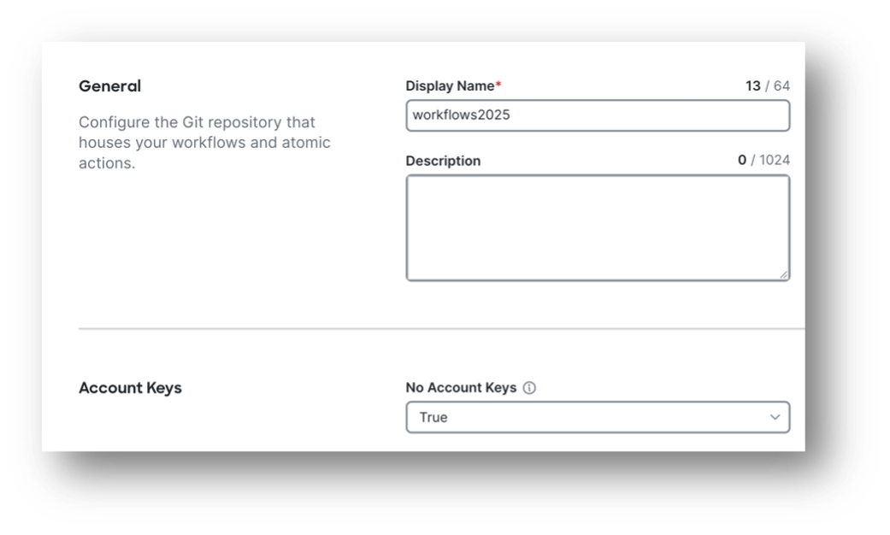

</td><td valign="top" align="center" width="50%">

   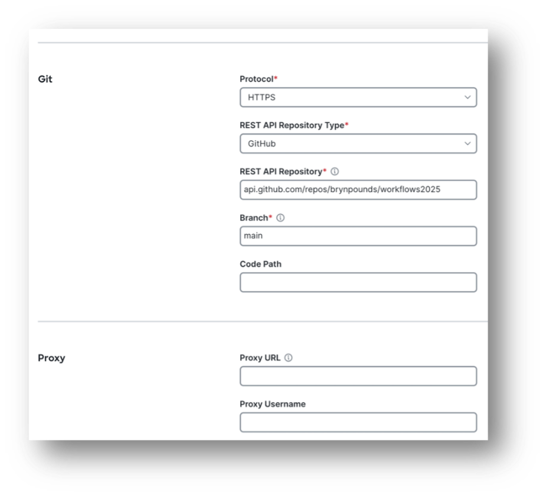

</td></tr>
</table>
</div>

3. Click **Save**.

   Now you can import any of the workflows I’ve added to my GitHub repo.

4. Navigate to your workspace and click **Import Workflow**.

   Try importing any of the workflows you might be interested in.

   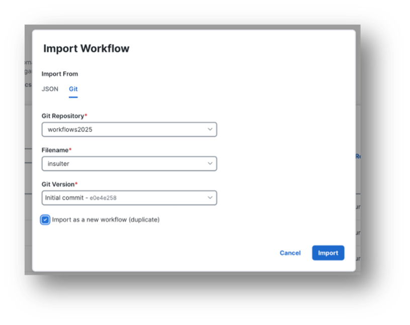

> [!NOTE]
> These workflows are NOT meant for production environments.
>
> **Keith Baldwin** has some excellent workflows for **Catalyst Center:**
**`api.github.com/repos/kebaldwi/WORKFLOWS(main)`**.
>
> At the time of this writing the Business Entity is setting up a **GitHub** for **workflows:** **`api.github.com/repos/CiscoDevNet/CiscoWorkflowsAutomation(main)`**

## Lab Exercise 3B: Calendars and Other Goodies

Another cool feature is the ability to schedule workflows whenever you want. Maybe you want to check common settings or error logs every morning at 2:00 am Cisco Workflows makes this super easy.

1. Navigate to **Automation &rarr; Rules** and click **+ Add automation rule**.

   First, take note of all the options for creating rules. You can run a workflow based on receiving a webhook or an approval.

2. Select Schedule Rule.

   If you want to click **Save**, feel free. But keep in mind you will lose access to the Self-Serve Meraki devices after this lab. Feel free to explore the other tabs.

   * History shows you what was run based on what.
   * Calendars allow you to explore or create new calendars for your workflows.
   * Webhooks are self-explanatory.

<table>
<tr><td valign="top" align="center" width="50%">

   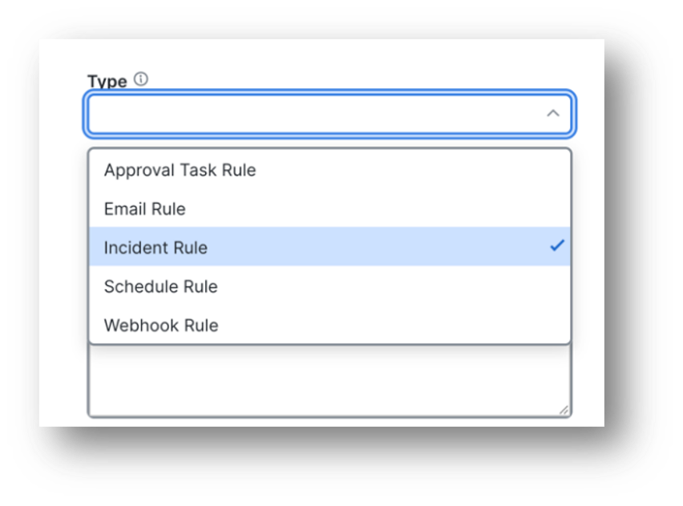

</td><td valign="top" align="center" width="50%">

   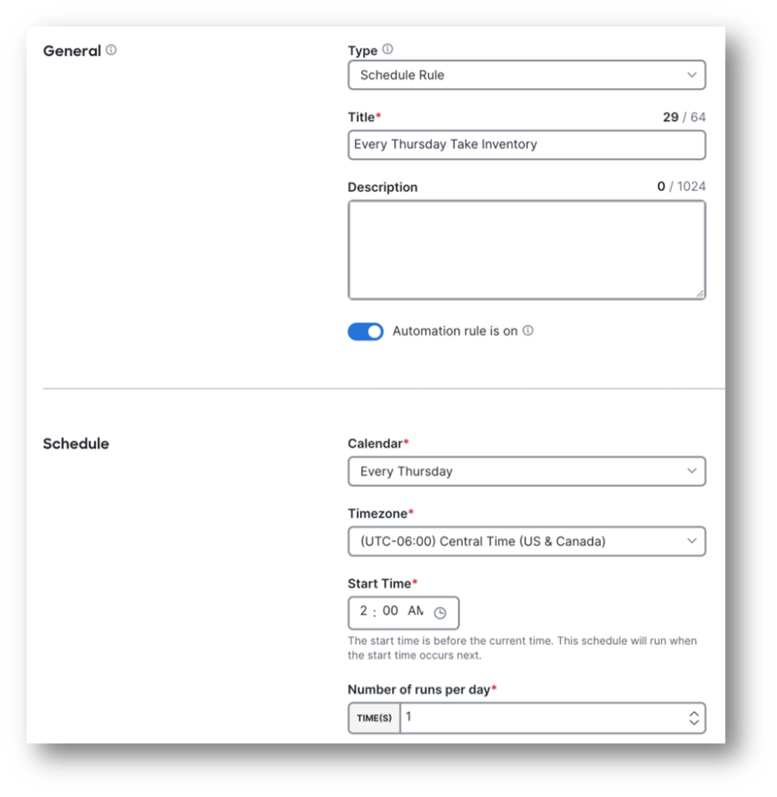

</td></tr>
</table>

## Lab Exercise 3C: Remotes

Let’s say you want to automate something, but it’s behind a firewall. The first thought might be to start poking holes in the firewall—but wait. There is a better way: TLS Gateway.

1. Navigate to **Automation &rarr; Advanced &rarr; Remotes**.

2. Click **+ New Remote**.

   Most of the options are self-explanatory.

3. Select Show advanced options.

   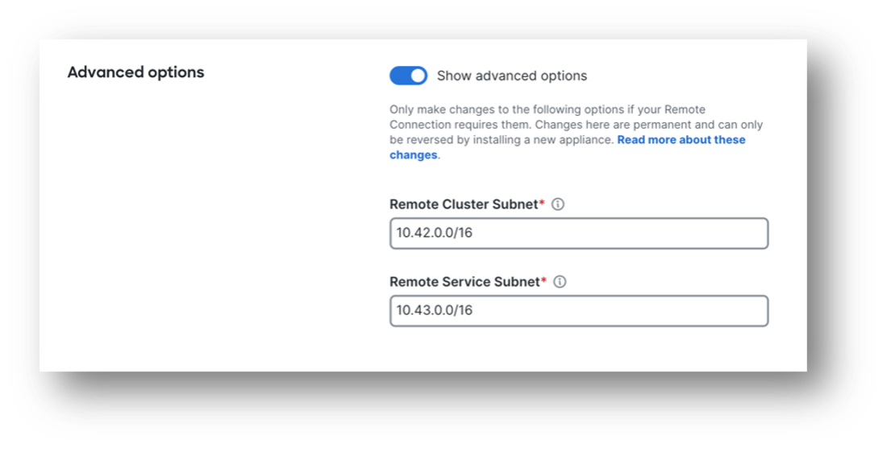

The only thing you’d need to worry about with customers is whether they use IP addresses in the 10.42.0.0/16 range.

The **Workflows Automation Engine** is the same as **XDR Automate**. At the time of this writing, the Workflows Remote VM is pending Export Compliance review, so there’s no direct link to download the OVA for the “Remote” (TLS gateway) inside of Workflows. 

When the Export Compliance review is completed, this functionality will be enabled. Until then, you can download the OVA from XDR or reach out to the Workflows team using the **[Ask Workflows Team](https://eurl.io/#ch_sJHXdb)** Webex Space and use the **[Workflows Remote Setup and Deployment documentation](https://documentation.meraki.com/Workflows/Advanced/Remote_Setup_and_Deployment)**.

> [!TIP]
> There is an **“XDR workflows”** demo in DCLOUD. You can easily download the **OVA** from there. You **need** **ESXi** and **vCenter** to install it. It’s very straightforward. When you add a new remote here, it generates a file the OVA needs and everything just connects.

## Lab Exercise 3D: API Documentation

1. Navigate to **Automation &rarr; API Documentation**.

   This will take you to the Workflows “Swagger” interface. This is a very handy tool developers use all the time to document (and explore others’ documentation) of APIs.

   Your customer might want to call workflows from other systems, and this is 100% allowed.

2. For example, find **Handler to get all workflows** under the category **Workflows**.

   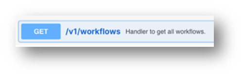

3. Expand it, click **try it out**, and click **Execute**.

   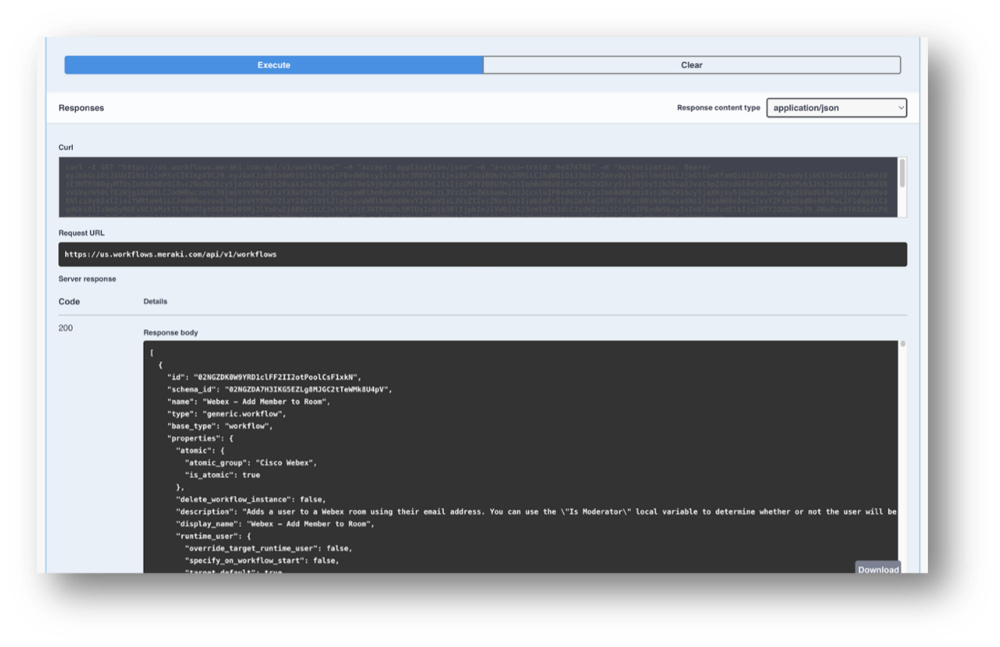

   There are no inputs for this API, so it’s a good one to try. The result is every workflow on your platform. If you do a search of this page (after clicking **Execute**) you will find any workflow you’ve built.

   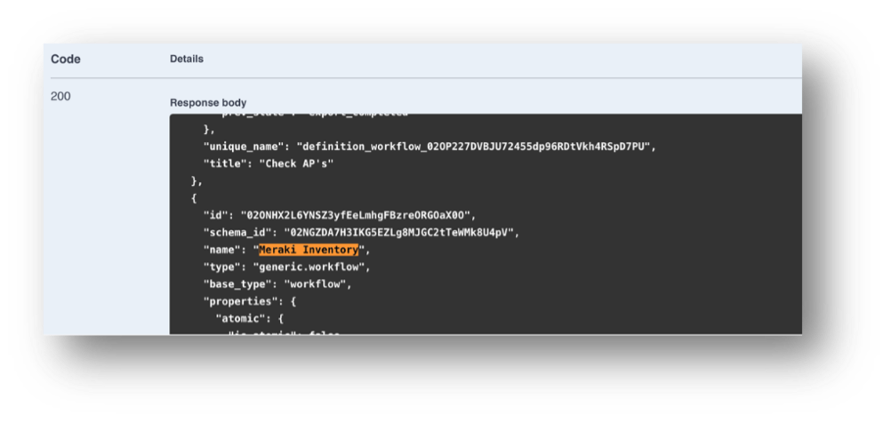

## Lab Exercise 3E: Approvals

We’re going to cover this feature lightly as there are enhancements in progress. Still, at the time of this writing, it is very possible to allow for approvals and human interaction in the middle of a workflow.

Let’s insert an approval into our Meraki Inventory workflow. For example, you require an approval before it sends the inventory to your Webex BOT.

1. Search for the **Approval** activity

   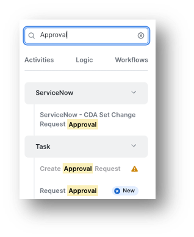

2. Click and drag the **Request Approval** activity from the Task section onto the Canvas. Drop it right after the **Replace String** activity. 

   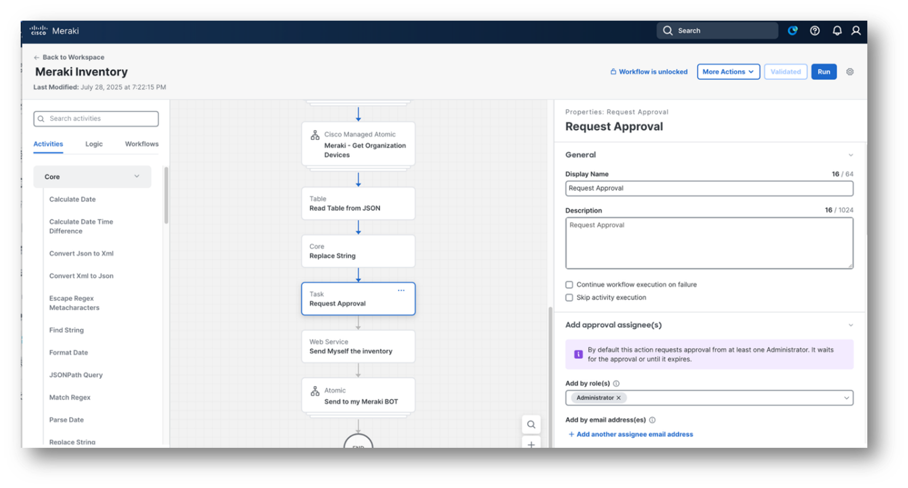

3. Fill out the required details for the **Approval Title** and **Body Text**.  

   The remaining sections can be left as the default settings.

<table>
<tr><td valign="top" align="center" width="33%">

   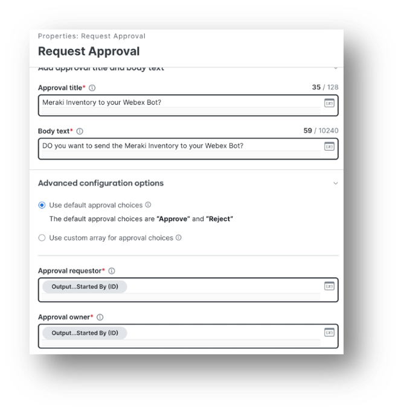

</td><td valign="top" align="center" width="33%">

   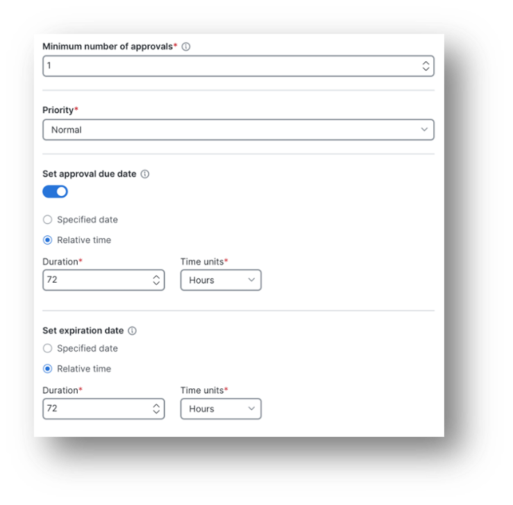

</td><td valign="top" align="center" width="33%">

   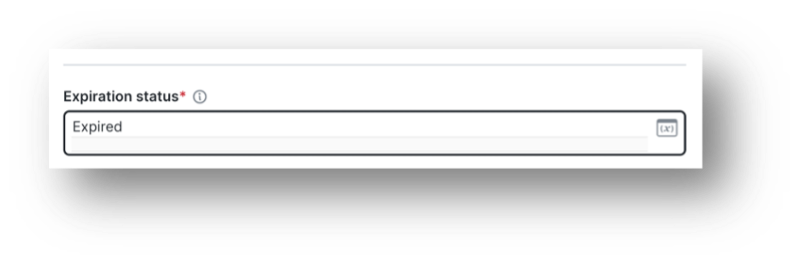

</td></tr>
</table>

4. Click **Run**.

   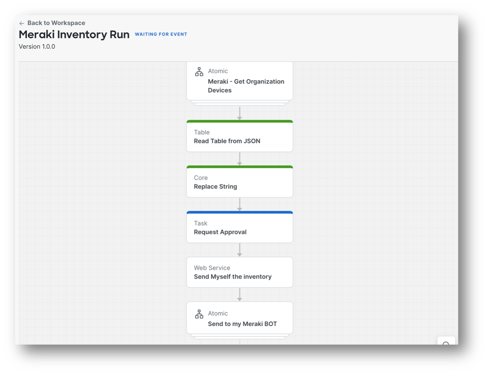

> [!NOTE]
> The workflow has paused. It’s not going to proceed until someone approves it. Keep in mind that, as of this writing, we do not yet have the upcoming RBAC features. There will eventually be many more options like sending and receiving email approvals and advanced form options. For now (as of this writing), the approval process is self-contained in this environment. Still, we can demonstrate the concept.

5. Navigate to **Automation &rarr; User Tasks**.

6. Click the **Display Name** that you assigned to your Approval task and has a status of **Due soon** or select **the Approve** action from the Actions menu on the right.

   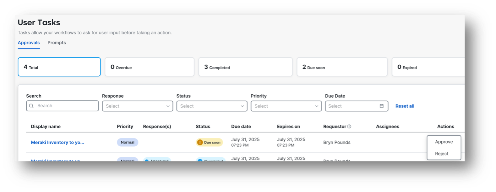

7. Click **Approve** and navigate to your workflow run (or simply go to your Meraki BOT).

   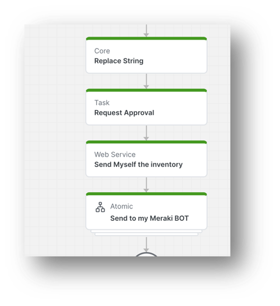

> [!NOTE]
> The Approve activity just paused the workflow and waited for the approval response. Even if you selected Reject, your workflow would continue to run. You will need to add a Conditional activity after the Approval task in your workflow to check what selection was made by the approver(s) and then design your workflow to take the appropriate actions.

<table>
<tr valign="top" align="center" width="100%">

   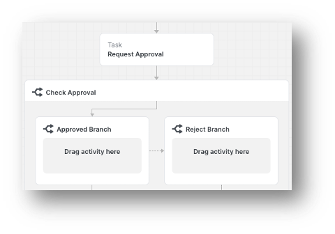

</td></tr><tr><td valign="top" align="left" width="50%">

   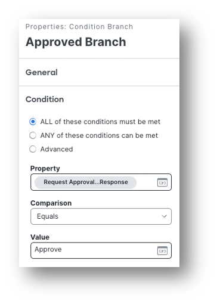

</td><td valign="top" align="left" width="50%">

   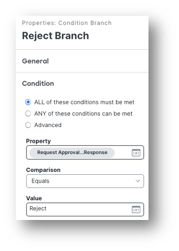

</td></tr>
</table>

## Lab Exercise 3F: A Note About the Execute Python Script Activity
 
The Python activity in workflows is your ‘get out of jail free’ card and can be used to do custom data transformations when Workflows doesn’t have the required activity. As of this writing, it is **version: `3.12.3`**. It **includes** libraries like requests, **but not** libraries like paramiko.

   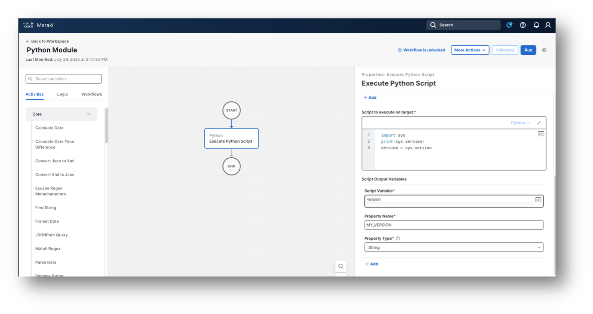

> [!NOTE]
> It may be helpful to also review the Workflows documentation for Execute Python Script as well as the list of supported Python modules.

The Python task does not support `__main__` level of code, but it does support `def` functions that you can call. But let’s be realistic here, you don’t have much screen real estate available to write code, so you won’t be writing classes or 1000s of lines of complex code.

You can also map workflow variables into your Python scripts in two different ways. The first is to simply place your cursor in your code and then click the map variables (x) icon. The second is to add the variables as Script arguments just above the Script block.  This screen capture shows both ways.

   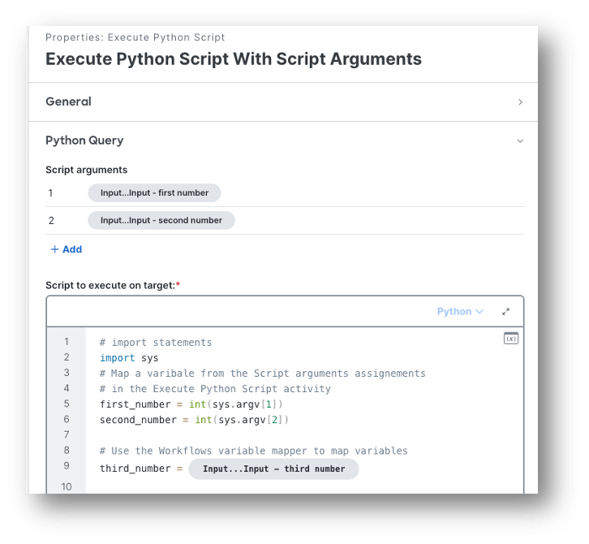

> [!NOTE]
> In my screenshot below, I can pull out Python variables and use them in future workflow steps, which is extremely handy. The Property Name assigned becomes the name of that variable in the Browse Variable window for the Output of the Python activity.

<table>
<tr><td valign="top" align="center" width="50%">

   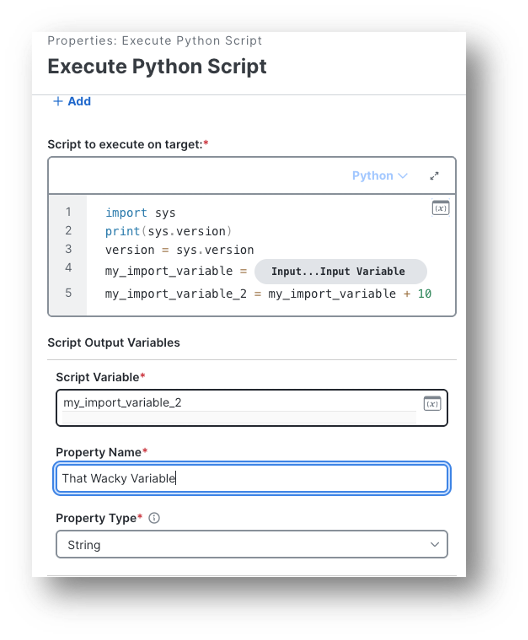

</td><td valign="top" align="center" width="50%">

   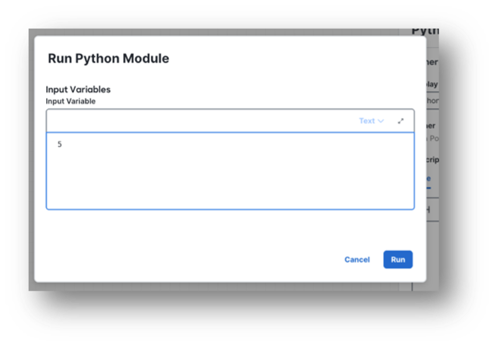

   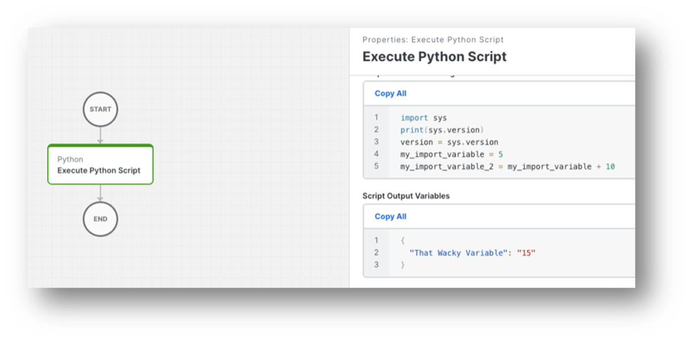

</td></tr>
</table>

> [!NOTE]
> #### Best Practice: 
> For activity output variables, like Python activity or JSON Path, the names of the variables should be written in camelCase, as they're considered code-related. And that helps distinguish them from the workflow names. For example, deviceID vs. Device ID, and sortByDate vs. sort_by_date.

The python module is especially helpful when you need to have multiple levels of nested loops.

> [!NOTE]
> #### Best Practice: 
> Because of the relatively small real estate on the screen – get your code running in your favorite IDE – then copy it in and replace variables with our friend *(x)*. There is also a training video on using Python in Workflows.

**CONGRATULATIONS!** You’re now an expert on building automation and orchestration.

## Lab Exercise 3G: Loops

Loops are a great logic item that allow you to iterate over an array and perform repetitive operations. Do you need to loop through the networks in an organization, the interfaces on a switch, or the SSIDs on an AP, and perform a common activity? Cisco Workflows makes this easy.

Let’s return to the Meraki Inventory workflow and duplicate it for this section. Then rename the Copy(1)-Meraki Inventory to Meraki Inventory Advanced. The first thing we need is an array to iterate over. Let’s choose to iterate over all the devices from the output of the Meraki – Get Organization Devices.  

1. Drag-and-drop a **JSONPath Query** activity from the Core section of the Activities menu onto the Canvas and place it after the Read Table from JSON that follows the Meraki – Get Organization Devices.

   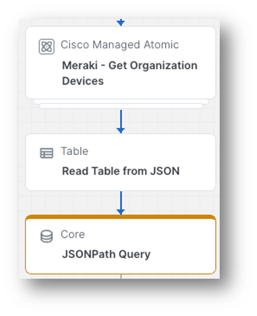

2. Open the properties for this JSONPath Query and then use the Browse Variables window to map in the output result of the Meraki – Get Organization Devices activity.

   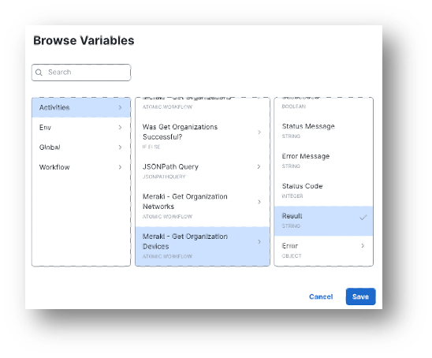

3. Enter **`$[*].serial`** into the JSONPath Query field. This will give us all the device serial numbers.

4. Enter a descriptive name into the Property Name field so that when we map this value later, we can easily identify the content of the variable.

   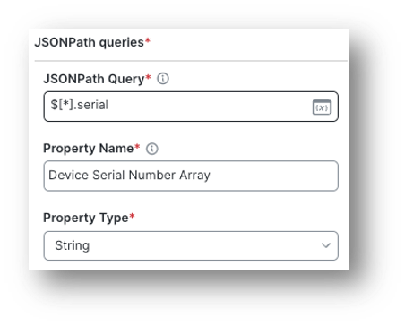

   Unfortunately, this output is of Type String, and we need an Array. At the time of this writing, the JSONPath Query activity does not have an option to select Type String Array, so we need to convert this string into an array. The easy way to do this is to first create a local variable of String Array Type.  

5. Access the workflows Properties window and click **Add variable** under the Variables section.

6. Select **Local** for the Scope, **String Array Type** for the Data Type, and a nice Display Name such as Device Serial Number Array.

   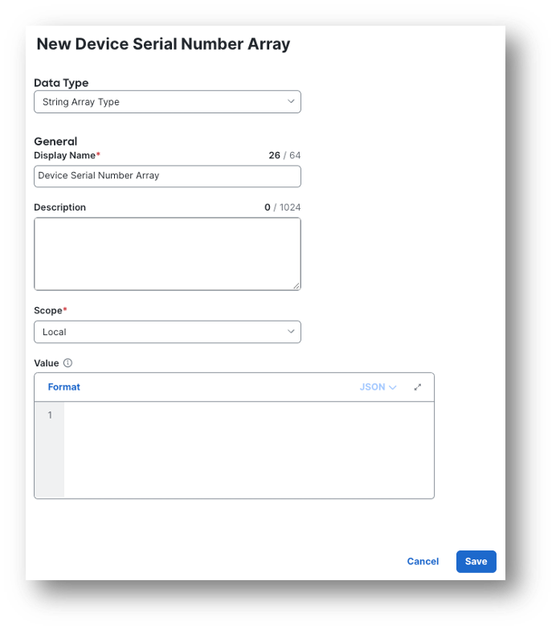

7. Drag a **Set Variables** activity from the Core section of the Activities menu onto the Canvas and place it immediately after the JSONPath Query.

   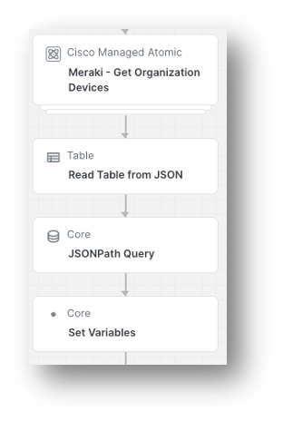

8. Click on the Set Variables activity to open up the Properties and in the Variables section, click on Add then in the Variable to update click on the (x) icon to bring up the Browse Variable window. Select the Local variable Device Serial Number Array.

   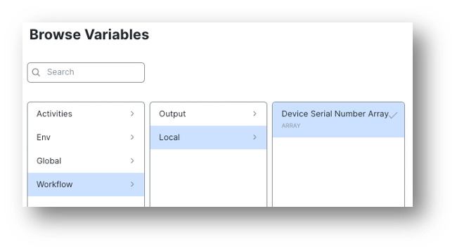

9. To set the New Value, use the (x) icon to launch the Browse Variables window and select **Activities &rarr; JSONPath Query &rarr; Jsonpath Queries &rarr; Device Serial Number Array**.

<table>
<tr><td valign="center" align="center" width="50%">

   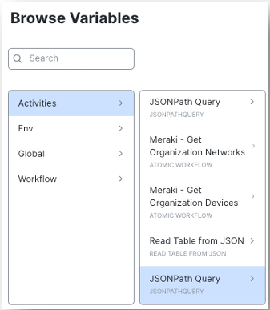

</td><td valign="center" align="center" width="50%">

   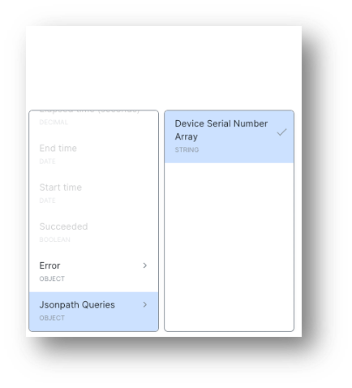

</td></tr>
</table>

10. Select the **Logic** tab in the left menu and drag a **For Each Loop** onto the Canvas and place it after the **Set Variables** that was just configured.

<table>
<tr><td valign="bottom" align="center" width="50%">

   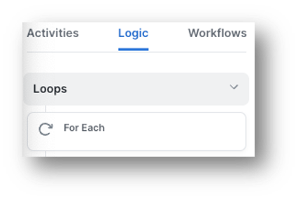

</td><td valign="bottom" align="center" width="50%">

   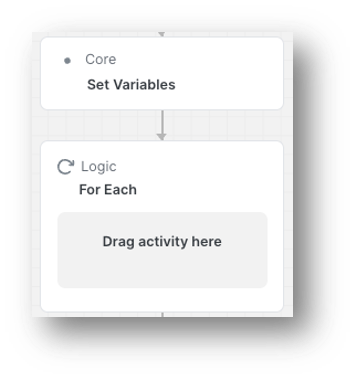

</td></tr>
</table>

<div style="padding-left:40px">
When you click on the For Each Loop activity, the properties field shows that only one item is required, the Source Array
</div></br>

11. Click the **(x) icon** to access the Browse Variables window and select the **Local Variable Device Serial Number Array**.

    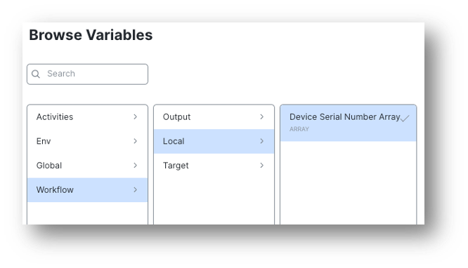

12. In the activities search box, enter **Meraki – Get Device**, drag that into the **For Each Loop**, and drop it where you see “Drag activity here.”

<table>
<tr><td valign="top" align="center" width="33%">

   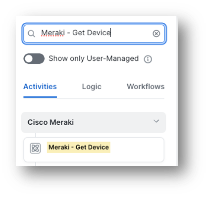

</td><td valign="top" align="center" width="33%">

   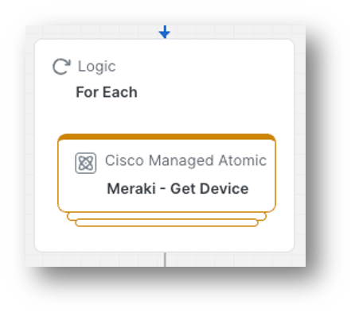

</td></tr>
</table>

13. Click the **Meraki – Get Device** activity to access the Properties panel. Here we see the only item required is the Input: Device Serial to Get.  

14. Click the **(x) icon** and bring up the Browse Variables window.
Now, how do we get a different serial number for each iteration of the loop? From **Activities &rarr; For Each &rarr; Source Array – Items**. 

<table>
<tr><td valign="top" align="left" width="60%">

   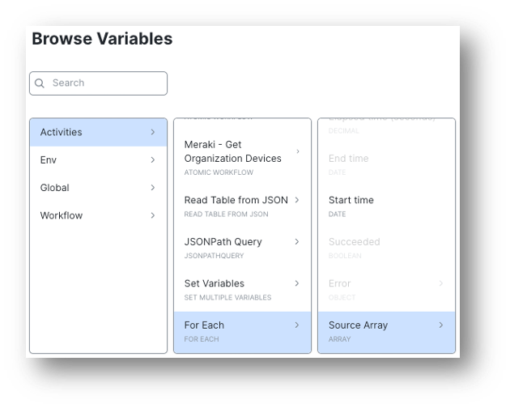

</td><td valign="top" align="center" width="40%">

   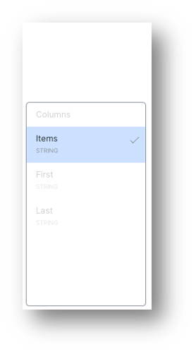

</td></tr><tr><td valign="top" align="left" width="50%">

   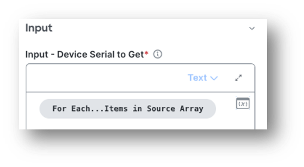

</td></tr>
</table>

15. To speed up this lab, delete the activities after the **For Each Loop** and then click **Run**.  

    While the workflow is running, you’ll notice the counter in the upper right corner of the **For Each** increasing with each iteration. While the workflow is running, or even after it completes, you can use this to drill into any iteration of your loop.

<table>
<tr><td valign="top" align="center" width="50%">

   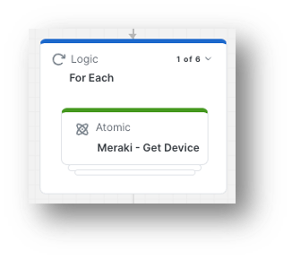

</td><td valign="top" align="center" width="50%">

   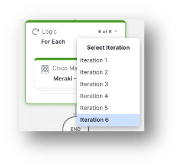

</td></tr>
</table>

16. Select **Iteration 6** and then click the **Meraki – Get Device**.  

    Here in the Atomic Properties window, you can see all the details for this activity. If you expand the General area, and scroll down below the Atomic Description, you will see the output variables from this atomic.

<table>
<tr><td valign="top" align="center" width="33%">

   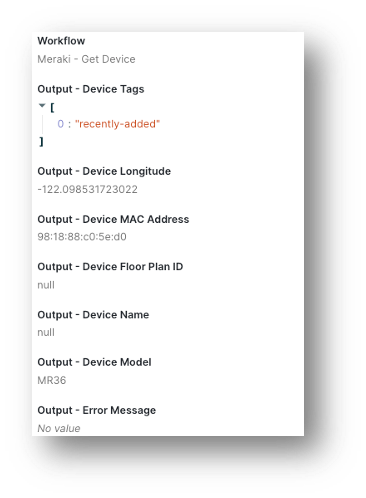

</td><td valign="top" align="center" width="33%">

   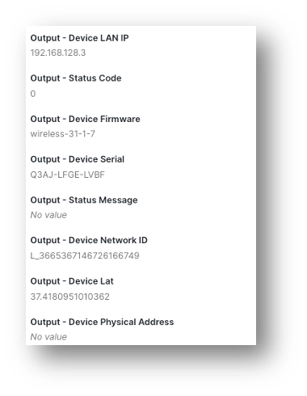

</td><td valign="top" align="center" width="33%">

   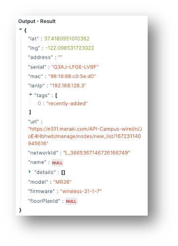

</td></tr>
</table>

<div style="padding-left:40px">
Just below the General area you can see the Input that was used.

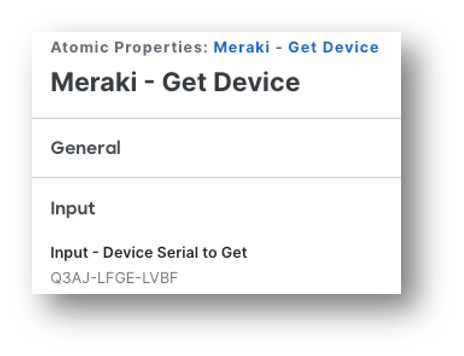

Notice that when you click the For Each Loop activity, the properties show the Source Array that was used as input for the loop.

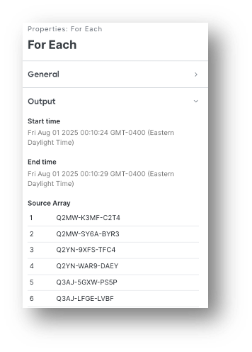
</div></br>

> [!IMPORTANT]
> #### Loop Limits
> There are some important limits to keep in mind when using loops in workflows. The first is that a single looping operation is limited to **500 iterations**. The workaround for this is to use nested loops. There is a **[Nested Loop Example on the Workflows Community](https://community.cisco.com/t5/cisco-workflows/example-workflows/m-p/5303172/highlight/true#M57)** site that shows how to do this:
>
>   * Maximum total loop runs per workflow: 50,000 iterations (includes loop counts from all    logic actions in a workflow)
>   * Maximum number of iterations a For Each or While Loop can run: 500
>   * Maximum workflow run time: 30 minutes
>   * If a limit is reached, the workflow fails with the run status of workflow_timeout
>
> These limits are all documented in the **[Workflows Important Notes and Limits](https://documentation.meraki.com/Workflows/Workflows#Important_Notes_and_Limits)**

## Lab Exercise 3H: User Prompts

What if your workflow needs to collect information about a network or setting and then present that to the user for a selection or decision? For example, if the workflow is to schedule firmware upgrades, one would need to know what firmware versions are available. There is no way for the workflow to know this before it starts running, so this information won’t be available for the user to select when they click Run and are prompted for input variables. This is where the Create Prompt activity comes in.

Let’s take another look at the Meraki Inventory workflow we created previously. This workflow gives the inventory of the entire organization.  What if we only wanted the inventory of a single network? We could have the user enter the name of the network at workflow start, but if you have hundreds of networks, would you remember the names of them all? How about if the workflow gathered the list of network names and then asked the user to select the network by name?

Let’s return to the Meraki Inventory workflow, duplicate it for this section of the lab, and rename the copy “Meraki Inventory of User Selected Network.”

The information we need is the Network Name and Network ID. That information is available in the output of the Meraki – Get Organization Networks but we need a simple and easy way to access that data.  

1. Create two new Local variables, one for Network Names and one for Network IDs. Since these are both going to contain multiple entries, they should be of **String Array** Type and Scope **Local**.

<table>
<tr><td valign="top" align="center" width="50%">

   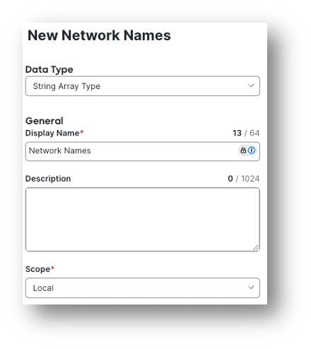

</td><td valign="top" align="center" width="50%">

   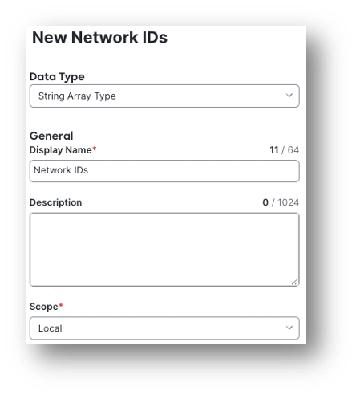

</td></tr>
</table>

   The next step is to set these with the values, but first we will need to use a JSON Path Query to get the values from the output of the Meraki – Get Organization Networks activity.

2. In the Core section of the Activity menu, click the **JSONPath Query** activity and drag it onto the canvas after the Meraki – Get Organization Networks activity.

   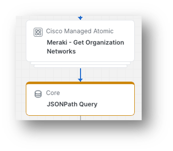

3. Click the **JSONPath Query** activity to open it’s properties and change the name of the activity to something descriptive, like Network Name and ID JSONPath Query.

   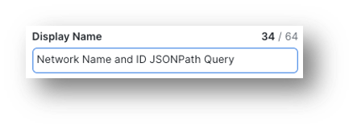

4. Map the value of the Output – Result from the Meraki – Get Organization Networks into the source JSON to Query field by using the Browse Variables window.

   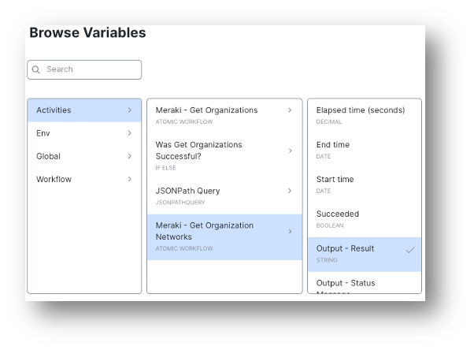

5. Next we need to add two JSONPath Queries, so click **Add** twice, enter the following for the JSONPath Query and Property Name, and leave the Property Type as **String**.

   ```
   $[*].name
   Network Names
   $[*].id
   Network IDs
   ```

> [!NOTE]
> As of this writing, the JSONPath Query activity did not support the Array Data Type. That enhancement may now be present. If it is, you could map the value directly from the JSONPath Query and skip the Local variable.

Next, we need to assign these values to our Local variables.

6. Click the **Set Variables** activity from the Core section of the Activities menu and drag it onto the canvas placing it directly after the Network Name and ID JSONPath Query.

   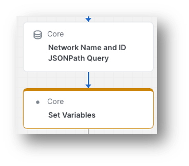

7. Click the **Set Variables** activity to access its properties and enter a descriptive name, like Set Network Name and ID arrays.

8. Add two variables in the Variables section and map the two local variables into the Variable to Update fields.

<table>
<tr><td valign="top" align="center" width="50%">

   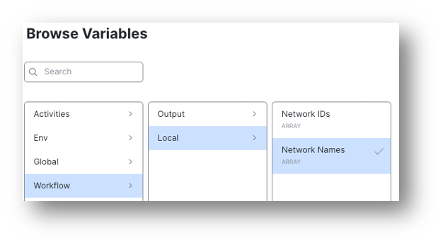

</td><td valign="top" align="center" width="50%">

   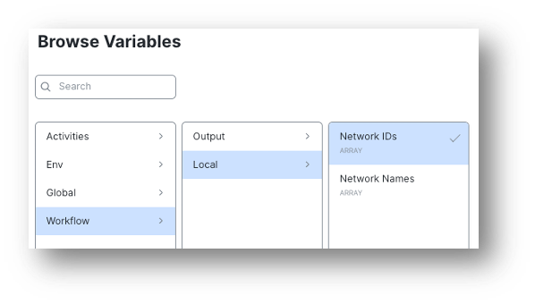

</td></tr>
</table>

9. Map the corresponding variables from the output of the Network Name and ID JSONPath Query activity.

<table>
<tr><td valign="top" align="center" width="50%">

   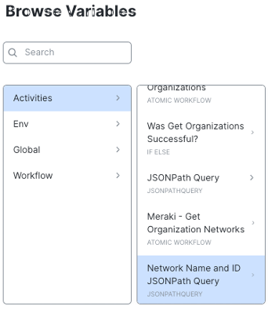

</td><td valign="top" align="center" width="50%">

   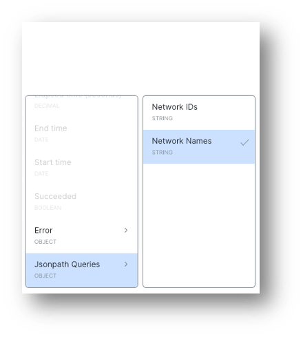

</td></tr><tr><td valign="top" align="center" width="50%">

   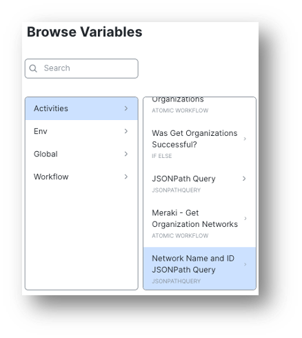

</td><td valign="top" align="center" width="50%">

   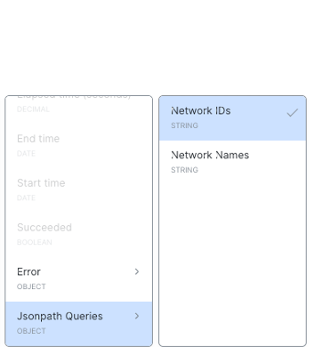

</td></tr>
</table>

   Now that we have our data, we can create the User Prompt that will allow the workflow user to select the name of the network.

10. In the Task section of the Activities menu click and drag the **Create Prompt** activity onto the canvas and place it directly after the Set Network Name and ID arrays activity.

    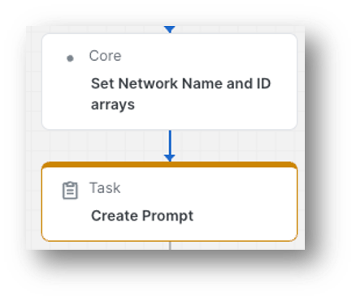

11. Click the **Create Prompt** activity to access its properties window and set a descriptive name like Select Network Name.

    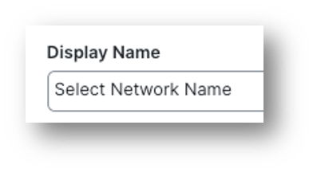


    Next, we need to assign this activity to someone to complete. In the Properties panel, in the Add assignees section. Currently, the only option is Administrator, as that is the only role with access to Workflows. Additional roles will be added before Cisco Workflows is generally available. Note that you do have the option to add assignees by email address, but selecting Administrator is sufficient for this lab.

12. Select **Administrator**.

    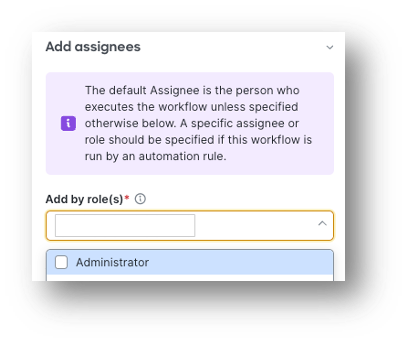

13. Create the Prompt Title and provide body text with additional information for the user making the selection. This title will be shown in the list on the Prompts page (accessed via **Automation &rarr; Tasks &rarr; Prompts**).

    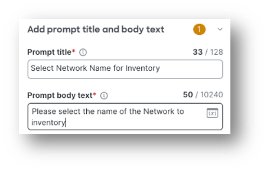

    And finally, we’re ready to create what we started this lesson to do, and that is provide the user with a selection of Network Names.

14. Click the **+Add another form element** in the Add form elements section of the Properties panel.

    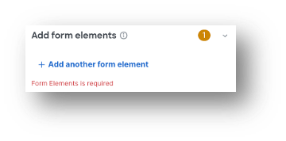

15. Select the **Dropdown select** option.

    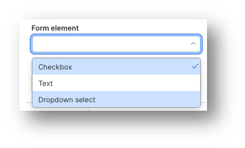

16. Enter **Network Name** in the **Dropdown select label** field and then map the Local variable called Network Names into the **Dropdown select options array**.

<table>
<tr><td valign="top" align="center" width="40%">

   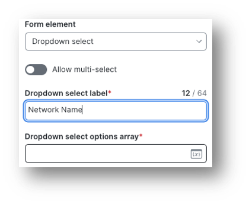

</td><td valign="top" align="center" width="60%">

   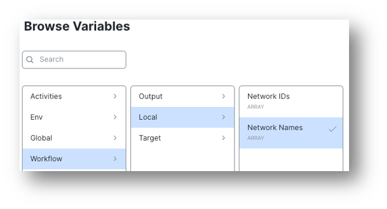

</td></tr>
</table>

17. Click **Run** to test our progress. You’ll now notice that the **Select Network Name** task is blue and remains blue. The workflow has now paused for the User Prompt activity to be completed.

    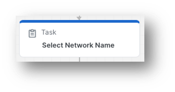

    For the workflow to continue the User Prompt action must be completed.

18. Navigate to **Automation &rarr; User Tasks**.

    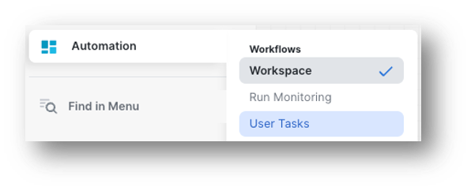

19. Select the **Prompts** tab.

    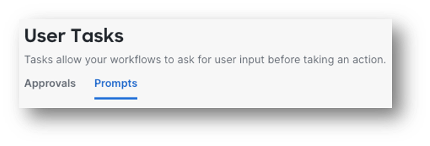

    You will see the Prompt name previously configured.

    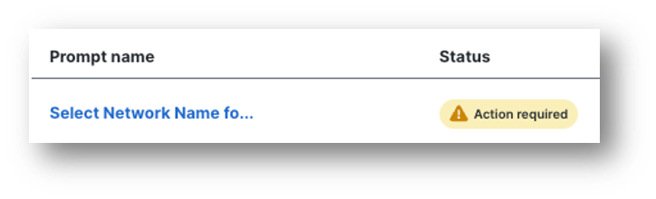

20. Click the **Prompt name** to access the Prompt form where the user can select the Network Name and click **Save**. The workflow can now resume running.  

    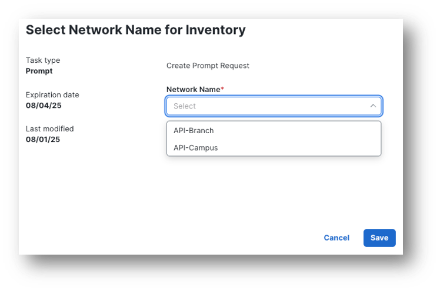

21. You can return to the View Run for the workflow by clicking the three dots and selecting **View Run**.

    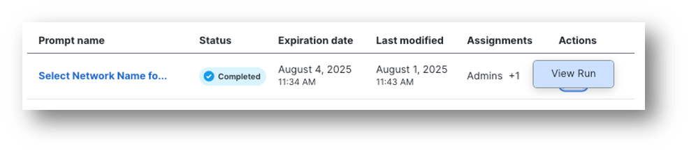

22. Back in the Run Monitoring view of the workflow, click the **Select Network Name** activity and the Properties panel will show the values that were presented in the **Dropdown select** as well as the Prompt Response that shows the Network Name selected by the user.

<table>
<tr><td valign="top" align="center" width="50%">

   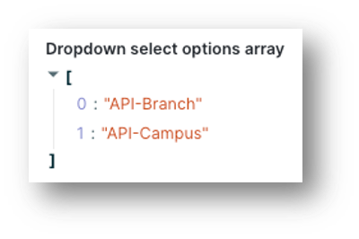

</td><td valign="top" align="left" width="50%">

   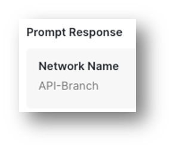

</td></tr>
</table>

    If the value you need to use is what is displayed in the Prompt Response, then you can just map that value using the Browse Variable window.

<table>
<tr><td valign="top" align="center" width="50%">

   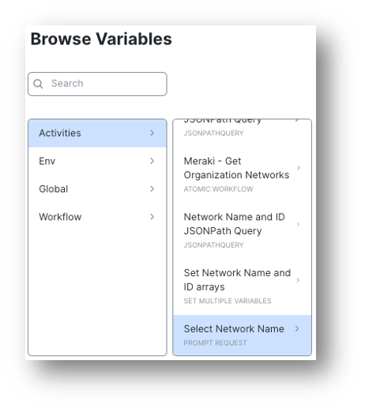

</td><td valign="top" align="center" width="50%">

   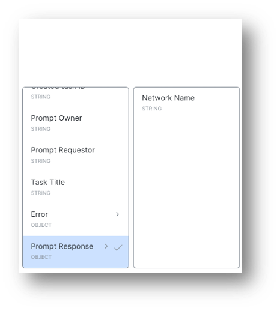

</td></tr>
</table>

    However, we need to use the Network ID associated with the Network Name that is returned in the Prompt Response. There are multiple ways to do this programmatically, but for training purposes, let’s use the Execute Python Script activity.

23. From the left-hand Activities menu, in the Python section, click and drag the **Execute Python Script** activity onto the canvas and drop it just below the **Select Network Name** activity.

<table>
<tr><td valign="bottom" align="center" width="50%">

   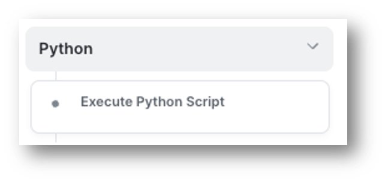

</td><td valign="bottom" align="left" width="50%">

   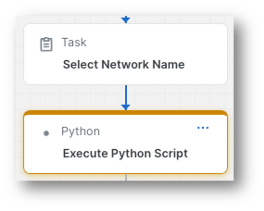

</td></tr>
</table>

24. Click the **Execute Python Script** activity to open the Properties panel and give it a descriptive name like Get Network ID from Network Name.

    There are two different ways to map variables as input to a Python Script in Cisco Workflows.

<table>
<tr><td valign="top" align="left" width="55%">

1. Define them in the Script arguments section by clicking Add and then using the Browse variables window to select the variable you want to pass to the Python Script as a command line argument.  Then, enter the code shown here into the Script to execute on the target field.

</td><td valign="top" align="center" width="45%">

   

   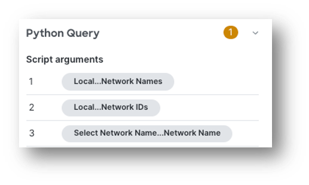

</td></tr>
<tr><td valign="top" align="left" width="50%">
<div style="padding-left:40px;">

[//]: # ()
```py
import json
import sys
def find_matching_value(key_array, value_array, target):
    if target in key_array:
        index = key_array.index(target)
        return [value_array[index]]  # wrap result in a list
    else:
        return []
# Run the function and print the result
key_array = json.loads(sys.argv[1])
value_array = json.loads(sys.argv[2])
target = sys.argv[3]
# Format as a JSON array
result = find_matching_value(key_array, value_array, target)
networkId = json.dumps(result, indent=4)
# Print to Response Body
print(networkId)	  
```
[//]: # ()

</div>
</td><td valign="top" align="center" width="50%">

   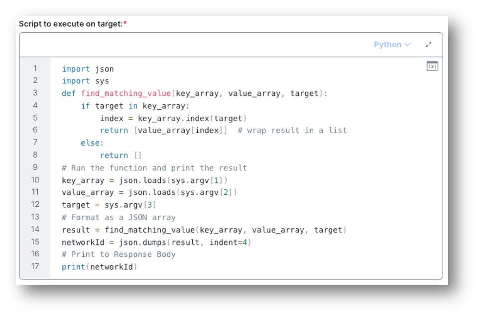

</td></tr>
</table>
<table>
<tr><td valign="top" align="left" width="100%">

2. The other method is to place your cursor in your Python code, click the (x) icon to launch the Browse Variable window, and then select the variable to map in.

</td></tr>
</table>

> [!WARNING]
> When mapping strings directly into Python code, Cisco Workflows will pass in the values un-quoted.

> [!NOTE]
> The print function is not required, but when used, the output of that will be displayed in the Response Body of the activity.

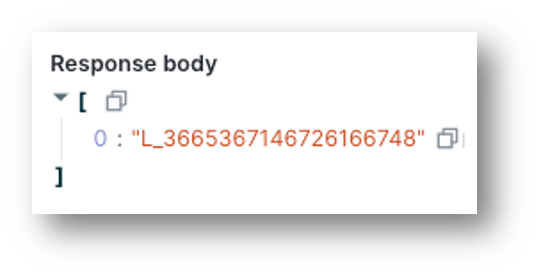

25. The final step is to set the Script Output Variables.  
    
    * Enter **networkID** for the Script Variable, as this is the name used in the Python script.  
    * Enter **networkID** as the Property Name. This is the name that will appear in the Browse Variables window. We will use it for mapping later.

      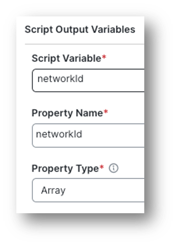

26. Click **Meraki – Get Organization Devices Atomic** to open the Properties panel and scroll down to you see the Query – Network IDs field. Delete the square brackets **`[ ]`** that are present in the field.

27. Click the **`(x)`** icon to access the Browse Variables window and map in the value of the Local Variable Network IDs.

<table>
<tr><td valign="bottom" align="center" width="50%">

   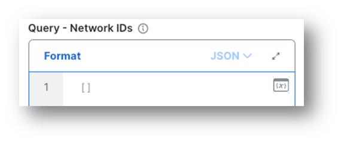

</td><td valign="bottom" align="center" width="50%">

   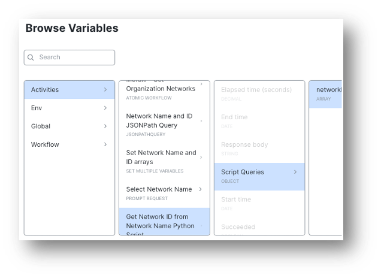

</td></tr><tr><td valign="top" align="center" width="50%">

   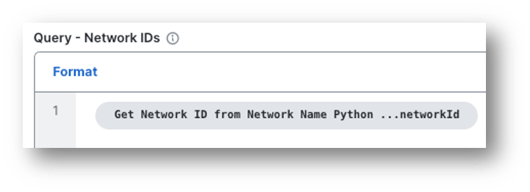

</td></tr>
</table>

30. Click **Run**, choose your network name, and receive the inventory for that network.
 
## Summary

The next step would be to look at the Additional Resources, and identify some of the key use cases for your network. Remember the paradigms of programmability:

1. **D**on't **R**epeat **Y**ourself - **DRY**
2. **Imperative programmability** - focusing on sequence of specific commands
3. **Declarative programmability** - focusing on desired end state
4. **Code-driven programmability** - focusing on configuration without a standard models
5. **Model-driven programmability** - focusing on data models to define capabilities

When building workflows try and build them in a modular scalable way.

> [!IMPORTANT]
> **Feedback:** If you found this set of **labs** or **content** helpful, please fill in comments on this feedback form [give feedback](https://github.com/kebaldwi/DNAC-TEMPLATES/discussions/new?category=feedback-and-ideas).</br></br>
**Content Problems and Issues:** If you found an **issue** on the **lab** or **content** please fill in an [issue](https://github.com/kebaldwi/DNAC-TEMPLATES/issues/new) include what file, along with the issue you ran into. 

> [**Continue to Advanced Resources**](./module6-advanced.md)

> [**Return to LAB Menu**](./README.md)