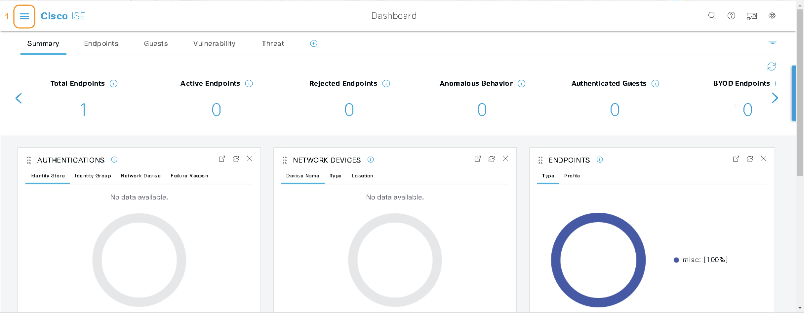

# ISE Integration with Catalyst Center

## Overview

Cisco Catalyst Center integrates with Cisco Identity Services Engine (ISE) to enable secure, policy-based network segmentation and access control within enterprise networks. Catalyst Center acts as a centralized controller and analytics platform that discovers network devices and shares this information securely with ISE. Through this integration, policies created in Catalyst Center, such as scalable group tags (SGTs) for access control and segmentation, are enforced by ISE, which activates the underlying infrastructure to implement zero-trust security. The integration uses pxGrid for secure data sharing and REST APIs for communication, allowing Catalyst Center to provision devices with AAA/RADIUS configurations and maintain synchronized policy enforcement across wired and wireless infrastructure. This collaboration enhances network visibility, automates device onboarding, and supports consistent policy application to reduce risk and improve compliance.

## General Information

While this lab module <b><u>is</u></b> in an "automation" lab - at the time of this writing (and the versions of code available to us in the lab), Cisco Catalyst Center and ISE cannot be integrated via API or other automated method.  This means we're going to have to do this piece via the web GUI of each system. 

>[!WARNING]
>You must have completed the following modules prior to continuing:

1. [**PKI Infrastructure**](../ise-automation-1-certificates/01-PKI-Infrastructure.md) from Lab 9 - Section 1 "Certificates"
2. [**Catalyst Center Certificate**](../ise-automation-1-certificates/02-Catatlyst-Center.md) from Lab 9 - Section 1 "Certificates"
3. [**ISE Certificates**](../ise-automation-1-certificates/03-ISE-Certificates.md) from Lab 9 - Section 1 "Certificates" (either via GUI or API)

>[!NOTE]
>:mega: If you have already completed the integration between Catalyst Center and ISE as part of the [Module 1 - PnP Prep](../../LAB-1-Wired-Automation/module1-pnpprep.md) from Lab 1, you may skip this module.  
>:mega: While many of these tasks can be completed with your own device, the screenshots taken (and many of the steps reference) using the Windows Jump Host.   

This module consists of the following tasks:

1. [**Prepare ISE for Catalyst Center Integration**](#prepare-ise-for-catalyst-center-integration)
2. [**Integrate ISE and Catalyst Center**](#integrate-ise-and-catalyst-center)

## Prepare ISE for Catalyst Center Integration

1. Open a web browser on the Windows Workstation Jump host. Open a connection to Identity Services Engine (ISE) and select the hamburger menu icon to open the system menu.

   

2. From the system menu under Administration select PxGrid Settings

   

3. On the PxGrid Settings page select both of the available options and click Save to allow Catalyst Center to integrate.

   
   

## Integrate ISE and Catalyst Center

1. Open a web browser on the Windows Workstation Jump host. Open a connection to Catalyst Center and select the hamburger menu icon and navigate to the System > Settings menu item.

   

2. Within the System Settings page navigate down the list on the left and select the Authentication and Policy Server section.

   

3. On the page select from the dropdown ISE to configure ISE integration.

   
   

4. Enter the information as seen on the page and click save.

   
   

5. A popup will appear as the ISE node is using an untrusted SelfSigned Certificate. For lab purposes Accept the certificate, this may appear a couple of times as shown.

   

6. You will see the the various stages of integration proceed and finally a success message as shown below.

   
   

