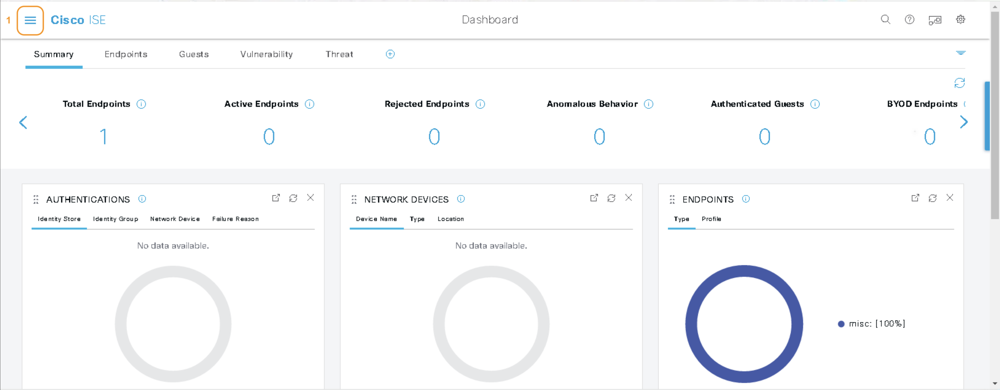

# ISE Integration with Catalyst Center (via GUI)

## Overview

In this lab we will integrate Catalyst Center and Identity Services Engine via their respective GUI interfaces.  While this is an effective setup for a small number of Catalyst Center/ISE nodes, for larger deployments it is recommended to automate this a programmatic approach and each system's respective APIs.

## General Information

Please ensure you have completed the pre-requisites detailed in the [**03-Catalyst-Center**](./03-Catalyst-Center.md) introductory module.

This module consists of the following tasks:

1. [**Prepare ISE for Catalyst Center Integration**](#prepare-ise-for-catalyst-center-integration)
2. [**Integrate ISE and Catalyst Center**](#integrate-ise-and-catalyst-center)

## Prepare ISE for Catalyst Center Integration

***Complete the following tasks:***

1. Open a web browser on the Windows Workstation Jump host. Open a connection to Identity Services Engine (ISE) and select the hamburger menu icon to open the system menu.

   

2. From the system menu under Administration select PxGrid Settings

   

3. On the PxGrid Settings page select both of the available options and click Save to allow Catalyst Center to integrate.

   
   

>[!TIP]
>These settings configure ISE to automatically approve any pxGrid client requests (based on either a certificate or a password).  In a production environment, you would likely consider leaving these settings unchecked, and instead either manually approve pxGrid join requests or do so programmatically.

## Integrate ISE and Catalyst Center

***Complete the following tasks***

1. Open a web browser on the Windows Workstation Jump host. Open a connection to Catalyst Center and select the hamburger menu icon and navigate to the System > Settings menu item.

   

2. Within the System Settings page navigate down the list on the left and select the Authentication and Policy Server section.

   

3. On the page select from the dropdown ISE to configure ISE integration.

   
   

4. Enter the information as seen on the page and click save.

   
   

5. A popup will appear as the ISE Certificate has not yet been trusted. For lab purposes Accept the certificate, this may appear a couple of times as shown.

   

6. You will see the the various stages of integration proceed and finally a success message as shown below.

   
   

Congrats!  Our ISE node is integrated with Catalyst Center, and ready to apply policy!

>[!IMPORTANT]
>**Feedback:** If you found this set of **labs** or **content** helpful, please fill in comments on this feedback form [give feedback](https://github.com/kebaldwi/DNAC-TEMPLATES/discussions/new?category=feedback-and-ideas).  
**Content Problems and Issues:** If you found an **issue** on the **lab** or **content** please fill in an [issue](https://github.com/kebaldwi/DNAC-TEMPLATES/issues/new) include what file, along with the issue you ran into. 

If you want to see how to do all of the above via API, continue to:

[**ISE Integration with Catalyst Center (via API)**](./03b-Catalyst-Center-API.md)

Otherwise, lets move on to developing our Policies!

> [**Next Section**](../ise-automation-3-policy/01-Lab-Client-Orientation.md)

> [**Return to ISE Automation Lab Overview**](../README.md)