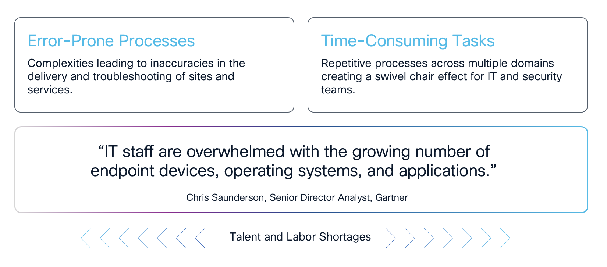
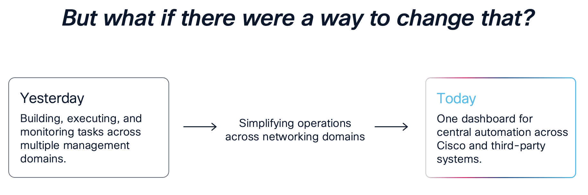
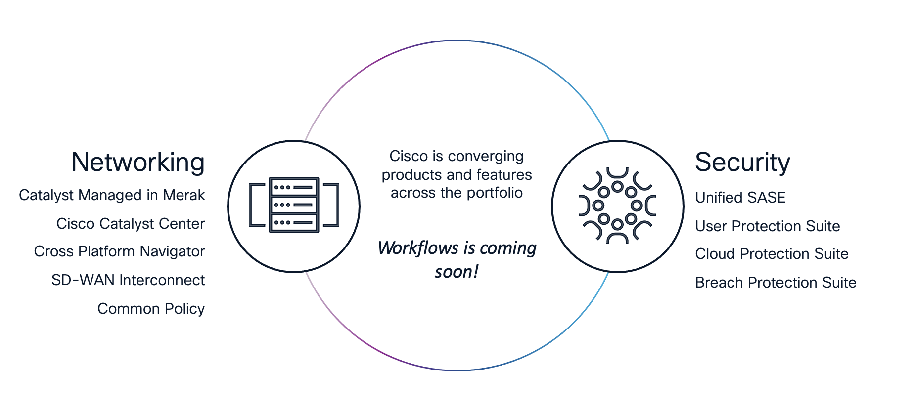
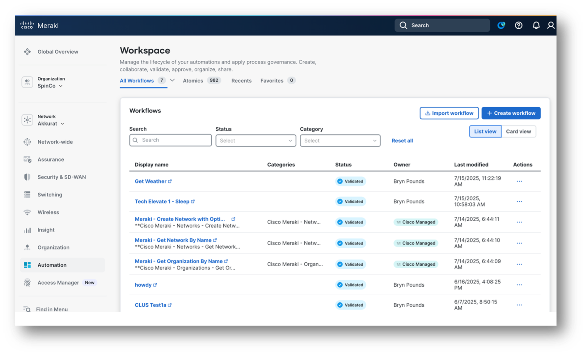
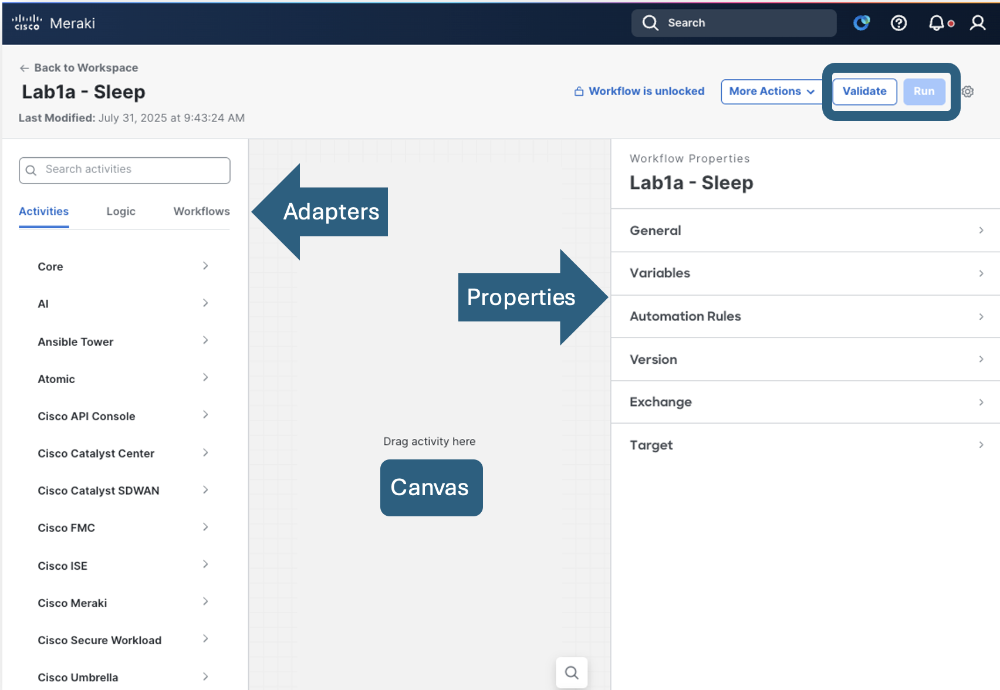

# Cisco Workflows

## Network management is far too complex

Complexities of network environments that involve multiple devices, configurations, and policies. These environments often include legacy systems, various hardware types, and differing compliance requirements, making management incredibly challenging. 

The Networking Landscape complexity is increased with islands of management planes, discontiguous implementation flows, especially where multiple controllers are involved.

Double administration at times for monitoring which leads to wasted time, and inability to track change across it all.

## Complexity creates challenges for network and security teams

Complexity leads to inaccuracy which leads to failures. Error prone processes and troubleshooting cause a loss in time due to Management Plane sprawl which is compounded by the growth and demand of the networks today.

* *What if it didn’t have to be that way.*
* *What if management planes could talk to one another, without fate sharing,
without complex integrations.*
* *What if this could somehow even be driven by events or even AI.*

## Cisco Workflows - *'What is it?'*

Meraki has added a well-established Cisco tool to the dashboard; Workflows. But let’s be very clear, it’s not just for Meraki. Customers can use this powerful automation and orchestration engine on pretty much anything. In addition to Meraki, it can be used for automating Cisco controllers like Catalyst Center, SD-WAN, ISE, ThousandEyes, ACI, Nexus Dashboard, Intersight, Webex, IOT, and anything Cisco or 3rd party that utilizes REST-API. If it has a REST API or an SSH adapter, Workflows can automate it.

If you can use Microsoft Visio, you can use Workflows.

## History Lesson

Workflows has been the resultant of many years of evolution. Originally there was an acquisition from **Clickr** of a product which was used in the service provider space called **Action Orchestrator**. This tool was utilized to give a low to no code method of interacting with various systems and was incorporated in a platform called **MSX**. **MSX** was deprecated in 2022 and some of the code was used in **Secure X** which became **XDR** within the security suite. 

It was determined that a cloud orchestration platform was still needed for cross domain automation a few years ago and thus **Workflows** came into existence. Initially, in intersight, but then it was quickly realized that it needed to be within one platform covering the enterprise network. 

**Cisco Workflows** was then attached to the dashboard which is the defacto cloud automation tool for the Enterprise Network.

## Components

### Workspace 

This is the main panel displaying all the workflows, and atomics which is where 95% of the work will be done. These are the orchestrations which will be used to automate or orchestrate many automation engines from Cisco and 3rd Party.

### Adapters

This panel contains the building blocks and individual functions you can add to a workflow. They are grouped under adapters representing the different controllers with which Workflows integrates, and the individual actions called “activities” are based on API calls to the integrated products, logic components, and other workflows. Think of an activity as an API call or function. Feel free to explore some of them by expanding and examining the activities that are provided “out of the box”. 

Notice how many non-Meraki activities are supported right now, and this list isn’t even the exhaustive collection of activities Cisco has (Catalyst Center, Catalyst SD-WAN, Cisco FMC, ISE). There are also non-networking activities, such as Ansible and Terraform and Python. Scroll all the way to the bottom and note the Web Service activity that provides a generic REST API activity. If you need to automate something with a REST API – that is your catch-all for all things REST. I won’t list them all here, however, the main takeaway is that Cisco Workflows is a very powerful multi-domain automation and orchestration tool that your customers will already have.

### Properties

This panel includes the properties of the workflow itself as well as those for each activity on the workflow canvas. With a blank palette, the properties panel is where all the details and specifics of your automation are entered. Right now, with a blank canvas, the Properties space is for the overall workflow general configuration.  You can define variables for the workflow, and various other details we will get to soon.

### Canvas

This panel is where you build the structure and set the actions, order, and logic for a workflow. Drag-and-drop items from the Activities panel, including other workflows, here to add them to a workflow. You can drag and drop items on the canvas to change their location and order in the workflow. This is your space to build anything you wish.  
Validate and Run

These are important concepts to pick up at the beginning of your Cisco Workflows journey.  Run executes your workflow, however, notice how it’s greyed out.  Cisco Workflows has a built in “gut check” that is required before a workflow is allowed to run.  For example, what if the workflow designer forgot to configure a required part of a function or the larger workflow itself – rather than attempt and fail, this screen requires the designer to validate the workflow.  When the gut check is complete the workflow is allowed to run.  

### More Actions

This drop-down menu in the upper left corner contains the following options:
*	View runs option allows the workflow designer to see the previous runs of the workflow and examine the input and output details of every activity
*	Duplicate option creates a copy and is useful when you have a working workflow that you would like to modify while also keeping the original workflow intact
*	Share option will allow you to export your workflow as a JSON file

## Lab Modules

Within the GitHub Repository are labs allow you to try out Cisco Workflows, and are split into modules to concentrate on specific tasks. Each is designed to build your knowledge in specific areas and they will call out any dependencies on previous modules:

1. [**Preparation**](./module1-preparation.md)
2. [**Orientation**](./module2-orientation.md)
3. [**Exercise 1**](./module3-exercise1.md)
4. [**Exercise 2**](./module4-aexercise1.md)
5. [**Exercise 3**](./module5-exercise1.md)
6. [**Advanced Information**](./module6-advanced.md)

> [!IMPORTANT]
> **Feedback:** If you found this set of **labs** or **content** helpful or have **suggestions**, please fill in comments on this feedback form [give feedback](https://github.com/kebaldwi/DNAC-TEMPLATES/discussions/new?category=feedback-and-ideas).  
**Content Problems and Issues:** If you found an **issue** on the **lab** or **content** please fill in an [issue](https://github.com/kebaldwi/DNAC-TEMPLATES/issues/new) include what file, along with the issue you ran into. 

> [**Return to Main Menu**](../README.md)
